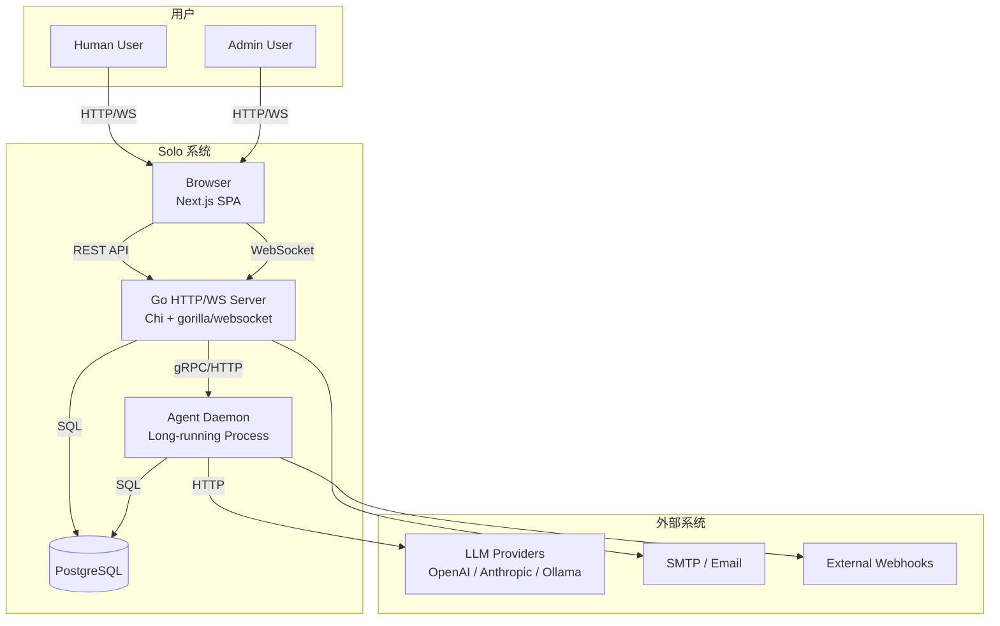
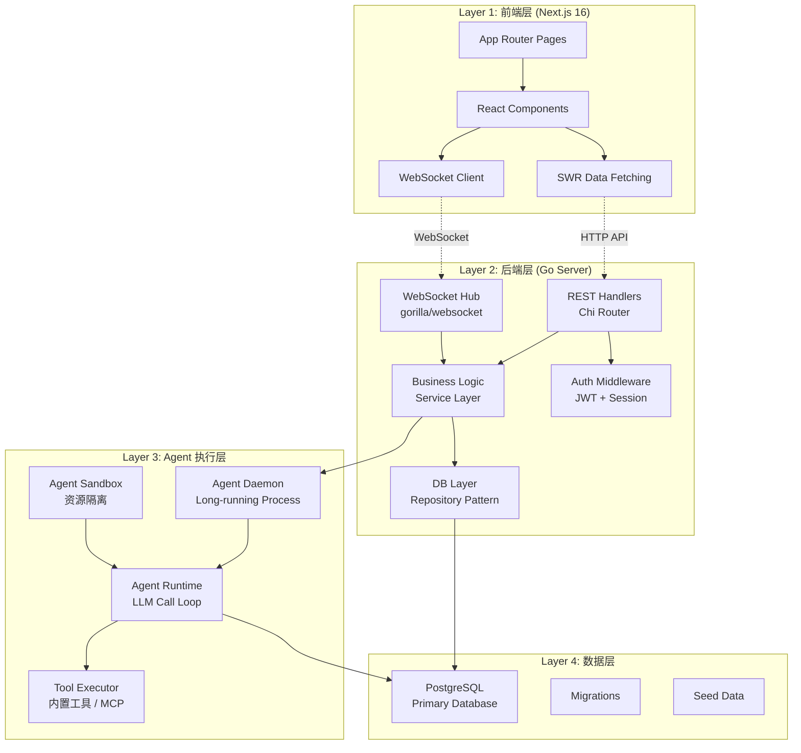
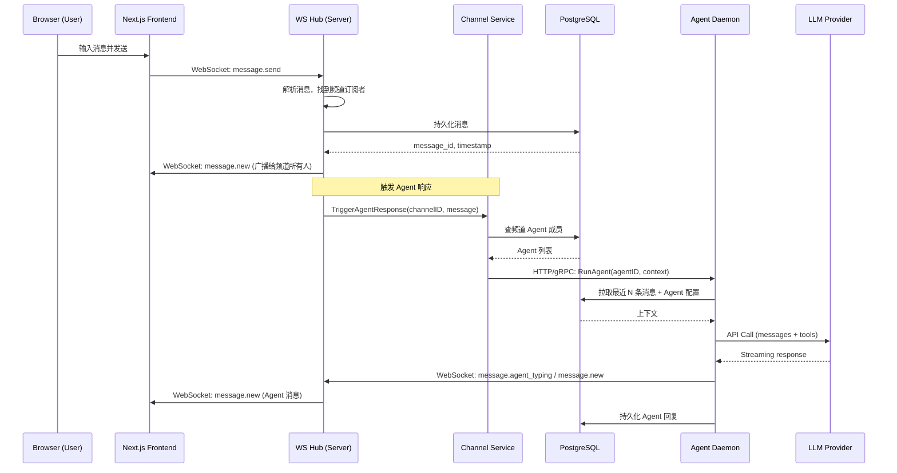
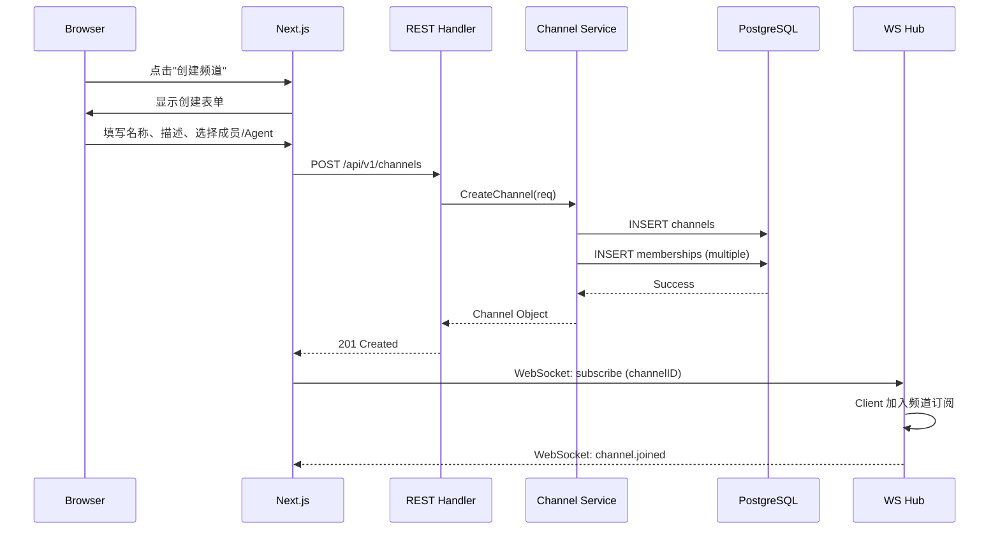
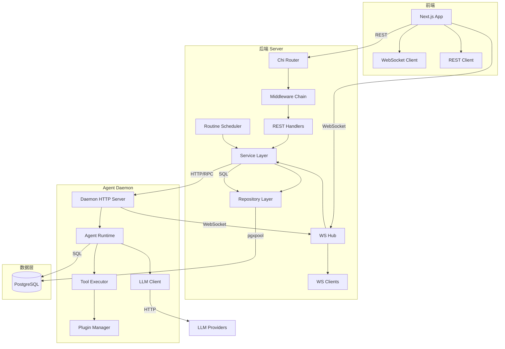
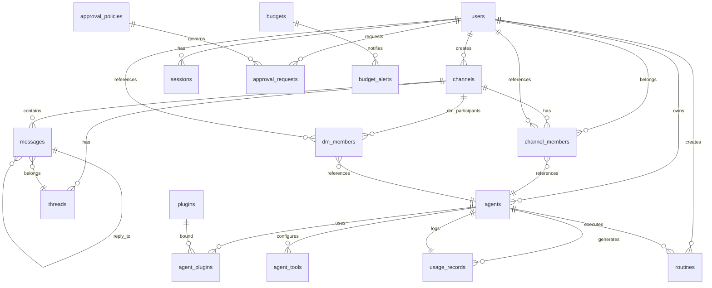
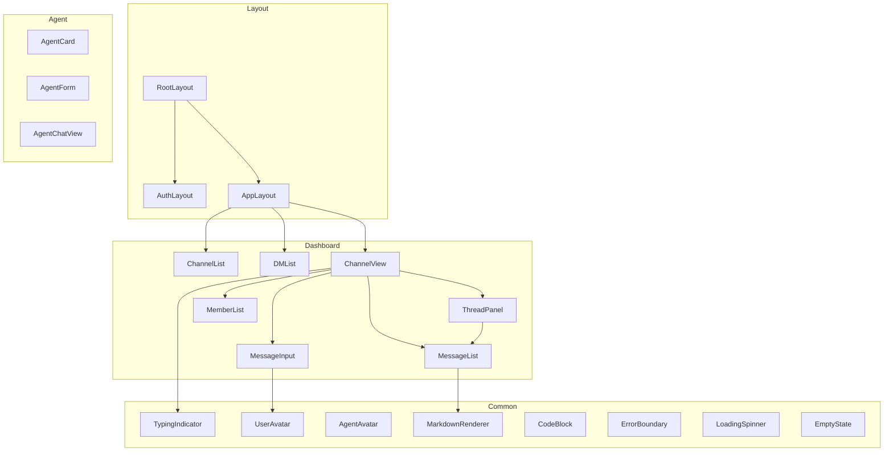
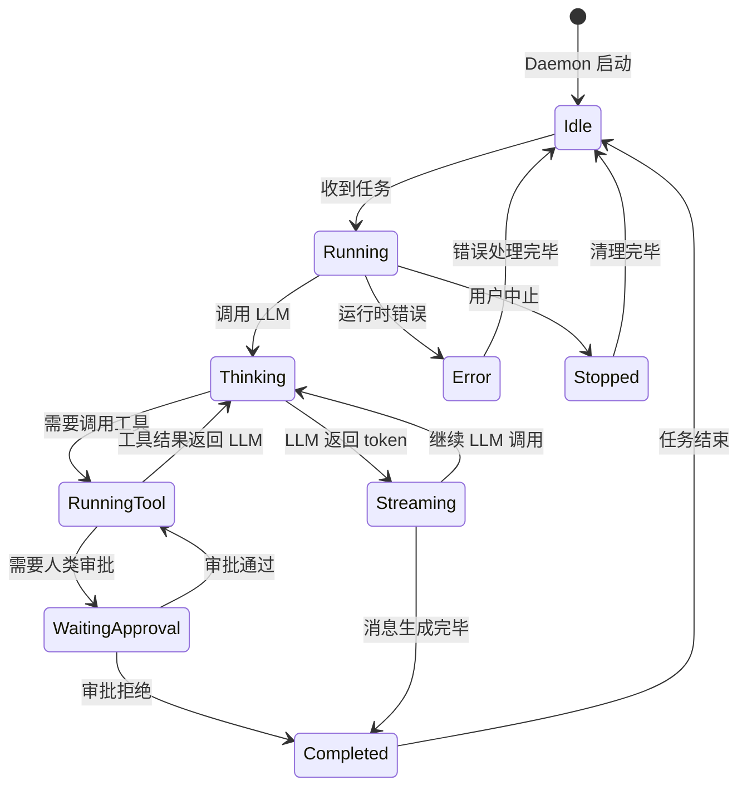
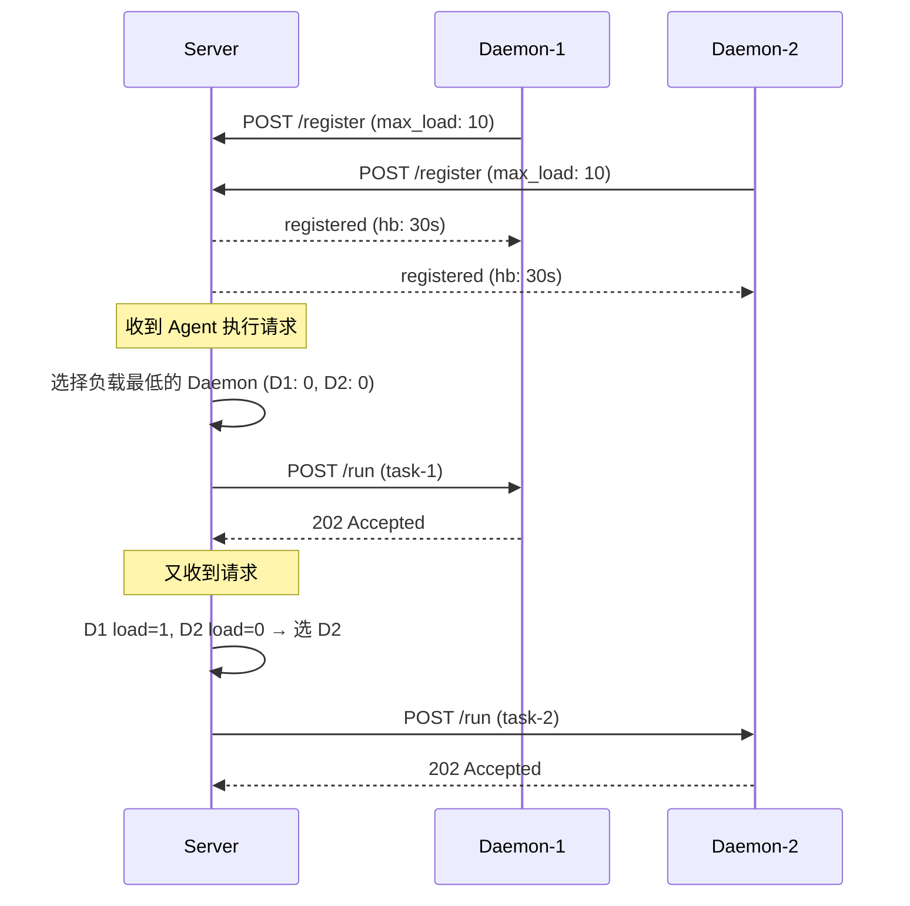

# Solo — 系统架构文档

> 版本: 1.2
> 最后更新: 2026-05-11
> 负责人: arc agent (架构师) / pm agent (产品经理)
> 对齐文档: PRD.md v1.1 — 本架构与 PRD 已双向对齐。线程回复(F-10)、@提及 Agent(F-11)、私信 DM(F-20) 已从 P1/P2 提升为 MVP(P0)

---

## 目录

1. [系统概述](#1-系统概述)
2. [技术栈决策](#2-技术栈决策)
3. [分层架构总览](#3-分层架构总览)
4. [核心模块与职责](#4-核心模块与职责)
5. [数据流与调用关系](#5-数据流与调用关系)
6. [API 设计概要](#6-api-设计概要)
7. [数据库核心表结构](#7-数据库核心表结构)
8. [前端路由与页面结构](#8-前端路由与页面结构)
9. [Agent Daemon 通信协议](#9-agent-daemon-通信协议)
10. [非功能性架构考量](#10-非功能性架构考量)
11. [范围边界](#11-范围边界)

---

## 1. 系统概述

Solo 是一个**频道式实时多 Agent 协作平台**。人类用户和 AI Agent 可以在频道（Channel）、私信（DM）和线程（Thread）中实时协作。系统允许用户创建/配置 AI Agent，将其加入频道参与对话，Agent 之间也可以相互协作完成复杂任务。

> **MVP 范围**: 本架构按 PRD.md v1.1 的优先级划分。MVP 聚焦于"频道消息 + Agent 自动回复 + 线程回复 + @提及 Agent + 私信(DM)"的核心闭环。预算、审批、定时任务、插件等模块为后续版本。详见第 11 章范围边界和 PRD.md 第 6 章 MVP 范围定义。
>
> **技术复用**: 后端优先复用 multica（Go + Chi + gorilla/websocket + Next.js 前端），包括 `realtime.Hub`、`pkg/agent`、`pkg/llm`、`internal/daemon`、认证中间件等。详见 PRD.md 第 4 章的完整复用映射表。

### 核心价值主张

- 人类和多个 AI Agent 在同一空间中实时协作
- Agent 可以"看到"频道上下文并主动参与
- 支持 Agent 之间的互相调用和任务编排
- 预算控制、审批流、定时任务等企业级能力（后续版本）

### 系统上下文图



---

## 2. 技术栈决策

### 2.1 后端：Go

| 决策 | 选择 | 理由 |
|------|------|------|
| 语言 | Go 1.22+ | 团队已有经验，良好的并发支持（goroutine），编译快，部署简单 |
| HTTP 路由 | Chi (go-chi/chi) | 轻量、兼容 net/http、中间件链支持好 |
| WebSocket | gorilla/websocket | 成熟稳定，已在 multica 中验证 |
| 数据库驱动 | pgx (jackc/pgx) | 高性能纯 Go PostgreSQL 驱动，支持连接池和 prepared statement |
| 数据库迁移 | golang-migrate/migrate | 社区标准，支持文件迁移和嵌入式迁移 |

### 2.2 前端：Next.js

| 决策 | 选择 | 理由 |
|------|------|------|
| 框架 | Next.js 16 App Router | 服务端渲染 + 客户端交互，App Router 是最新范式 |
| 状态管理 | React Context + SWR | 频道/消息这种实时数据通过 WebSocket 推送，无需 Redux |
| WebSocket 客户端 | 原生 WebSocket + 重连封装 | 轻量无依赖 |
| UI 组件 | Tailwind CSS + shadcn/ui | 开发效率高，主题定制灵活 |
| 表单 | react-hook-form + zod | 类型安全 + 校验 |

### 2.3 数据库：PostgreSQL

| 决策 | 选择 | 理由 |
|------|------|------|
| 数据库 | PostgreSQL 16 | 关系型数据为主，需要 JSONB、全文检索、事务 |
| 连接池 | pgxpool | Go 原生连接池 |
| 缓存策略 | 应用层 + PostgreSQL 物化视图 | 初期不引入独立缓存层，降低复杂度 |

---

## 3. 分层架构总览



### 3.1 各层职责

| 层 | 职责 | 关键约束 |
|------|--------|----------|
| **前端层** | UI 渲染、用户交互、WebSocket 消息收发、本地状态管理 | 与服务端保持乐观更新；WebSocket 断线重连 |
| **后端层** | REST API 提供、WebSocket 连接管理、业务逻辑编排、认证鉴权、数据持久化 | 无状态水平扩展；WebSocket 通过 Hub 模式管理连接 |
| **Agent 执行层** | Agent 生命周期管理、LLM 调用循环、工具执行、消息生成 | 每个 Agent 独立 goroutine/进程；可水平扩展执行节点 |
| **数据层** | 数据持久化、事务保证、查询优化、全文搜索 | 所有跨实体查询走 PostgreSQL |

---

## 4. 核心模块与职责

### 4.1 `cmd/server/` — HTTP/WebSocket 服务器入口

启动 Chi HTTP 服务器，注册所有路由和中间件，初始化 WebSocket Hub。

```
cmd/server/
└── main.go               # 入口：初始化 DB、Hub、Router，启动 HTTP 服务
```

### 4.2 `internal/server/` — 后端核心逻辑

```
internal/server/
├── router.go             # Chi 路由注册
├── middleware/
│   ├── auth.go           # JWT 鉴权中间件
│   ├── cors.go           # CORS 配置
│   ├── logging.go        # 请求日志
│   └── ratelimit.go      # 限流
├── handler/
│   ├── auth.go           # 登录/注册/登出 [MVP]
│   ├── channel.go        # 频道 CRUD [MVP]
│   ├── message.go        # 消息 CRUD + @提及解析 [MVP]
│   ├── agent.go          # Agent 配置 CRUD [MVP]
│   ├── member.go         # 频道成员管理 [MVP]
│   ├── thread.go         # 线程管理 [MVP]
│   ├── dm.go             # 私信 DM 管理 [MVP]
│   ├── budget.go         # 预算管理 [P3 — MVP 不实现]
│   ├── approval.go       # 审批流 [P3 — MVP 不实现]
│   ├── routine.go        # 定时任务 [P3 — MVP 不实现]
│   ├── plugin.go         # 插件管理 [P3 — MVP 不实现]
│   └── user.go           # 用户信息 [MVP]
├── ws/
│   ├── hub.go            # WebSocket Hub（复用 multica 架构）
│   ├── client.go         # WebSocket 客户端连接
│   └── message.go        # 消息类型定义
└── service/
    ├── channel.go        # 频道业务逻辑
    ├── message.go        # 消息业务逻辑（含 @提及 解析）
    ├── agent.go          # Agent 调度逻辑
    ├── dm.go             # DM 业务逻辑 [MVP]
    └── daemon.go         # Daemon 通信管理
```

**模块职责矩阵:**

| 模块 | 职责 | 依赖 |
|------|------|------|
| `router.go` | 定义路由 -> handler 映射，挂载中间件 | 所有 handler |
| `middleware/` | 请求预处理（鉴权、日志、限流、CORS） | 无 |
| `handler/` | 解析 HTTP 请求、调用 service、序列化响应 | `service/`, `auth/` |
| `ws/hub.go` | 管理 WebSocket 连接池，消息广播 | `model/` |
| `ws/client.go` | 单个 WebSocket 连接的读写 goroutine | `ws/hub.go` |
| `service/` | 核心业务逻辑编排 | `db/`, `model/`, `realtime/` |

### 4.3 `internal/realtime/` — 实时消息系统

复用 multica `realtime.Hub` 架构，提供频道级别的消息广播。

```go
// 核心类型（Go 原型）
type Hub struct {
    channels   map[string]map[*Client]bool  // channelID -> clients
    register   chan *Client
    unregister chan *Client
    broadcast  chan *Message
}

type Client struct {
    hub    *Hub
    conn   *websocket.Conn
    send   chan []byte
    userID string
    channelIDs map[string]bool  // 订阅的频道
}

type Message struct {
    Type      string      `json:"type"`
    ChannelID string      `json:"channel_id"`
    Payload   interface{} `json:"payload"`
    SenderID  string      `json:"sender_id"`
    Timestamp int64       `json:"timestamp"`
}
```

### 4.4 `internal/channel/` — 频道核心域

频道是 Solo 的核心协作单元。

| 实体 | 描述 |
|------|------|
| Channel | 协作空间，包含人类和 Agent 成员 |
| Membership | 频道成员关系（人/Agent + 角色） |
| Message | 频道中的消息（人类发送 / Agent 发送） |
| Thread | 消息的回复线程（Slack 风格） |
| Reaction | 消息表情反应 |

### 4.5 `internal/agent/` — Agent 管理

Agent 是 Solo 中的 AI 参与者。

| 子模块 | 描述 |
|--------|------|
| `model.go` | Agent 实体定义（ID, name, model, system_prompt, tools） |
| `config.go` | Agent 配置管理（LLM 参数、工具列表、知识库绑定） |
| `schedule.go` | Agent 调度（Daemon 通信、任务下发） |

### 4.6 `internal/budget/` , `internal/approval/` , `internal/routine/` , `internal/plugin/` 【非 MVP】

> 注意: 以下模块在架构上被定义，但按 PRD.md 优先级划分，**MVP (v0.1) 不实现**。这些目录在 MVP 阶段可以不存在。表结构定义见第 7 章，但 MVP 迁移脚本不包含这些表。

| 模块 | 核心实体 | 说明 | PRD 优先级 |
|------|----------|------|-----------|
| `budget/` | Budget, BudgetAlert, UsageRecord | 按 Agent/频道/用户跟踪 LLM API 消耗 | P3 (v1.0) |
| `approval/` | ApprovalPolicy, ApprovalRequest, ApprovalStep | Agent 执行敏感操作前请求人类审批 | P3 (v1.0) |
| `routine/` | Routine, RoutineTrigger, RoutineAction | 定时/事件触发的 Agent 任务 | P3 (v1.0) |
| `plugin/` | Plugin, PluginInstance, PluginAuth | 可插拔工具扩展系统 | P3 (v1.0+) |

### 4.7 `pkg/agent/` — Agent 接口抽象

复用 multica 的 `pkg/agent/` 设计，定义 Agent 的核心接口。

```go
// Agent 运行时接口
type AgentRuntime interface {
    Run(ctx context.Context, req *RunRequest) (*RunResponse, error)
    Stream(ctx context.Context, req *RunRequest) (<-chan StreamEvent, error)
    Stop(agentID string) error
}

type RunRequest struct {
    AgentID    string
    ChannelID  string
    ThreadID   string
    Messages   []Message     // 上下文消息
    Tools      []Tool
    SystemPrompt string
    MaxTokens  int
    Temperature float64
}

type StreamEvent struct {
    Type    StreamEventType // "token" | "tool_call" | "error" | "done"
    Content interface{}
}
```

### 4.8 `pkg/llm/` — LLM Provider 封装

```go
type LLMProvider interface {
    Complete(ctx context.Context, req *CompletionRequest) (*CompletionResponse, error)
    CompleteStream(ctx context.Context, req *CompletionRequest) (<-chan StreamChunk, error)
    Models() []ModelInfo
}
```

实现：
- `openai.go` — OpenAI / Azure OpenAI
- `anthropic.go` — Anthropic Claude
- `ollama.go` — 本地 Ollama

---

## 5. 数据流与调用关系

### 5.1 用户发送消息 -> Agent 响应



### 5.2 频道创建流程



### 5.3 模块间调用关系图



---

## 6. API 设计概要

### 6.1 REST API 端点

所有 REST API 以 `/api/v1/` 为前缀。认证通过 `Authorization: Bearer <jwt>` 头传递。

#### 认证

| 方法 | 路径 | 描述 | 认证 |
|------|------|------|------|
| POST | `/api/v1/auth/register` | 注册 | 无 |
| POST | `/api/v1/auth/login` | 登录 | 无 |
| POST | `/api/v1/auth/logout` | 登出 | 必需 |
| POST | `/api/v1/auth/refresh` | 刷新 Token | 必需 |

#### 用户

| 方法 | 路径 | 描述 | 认证 |
|------|------|------|------|
| GET | `/api/v1/users/me` | 当前用户信息 | 必需 |
| PATCH | `/api/v1/users/me` | 更新个人信息 | 必需 |
| GET | `/api/v1/users/{userID}` | 查看用户资料 | 必需 |

#### 频道

| 方法 | 路径 | 描述 | 认证 |
|------|------|------|------|
| GET | `/api/v1/channels` | 用户频道列表 | 必需 |
| POST | `/api/v1/channels` | 创建频道 | 必需 |
| GET | `/api/v1/channels/{channelID}` | 频道详情 | 必需 |
| PATCH | `/api/v1/channels/{channelID}` | 更新频道 | 必需 |
| DELETE | `/api/v1/channels/{channelID}` | 删除频道 | 必需 |
| GET | `/api/v1/channels/{channelID}/members` | 频道成员列表 | 必需 |
| POST | `/api/v1/channels/{channelID}/members` | 添加成员 | 必需 |
| DELETE | `/api/v1/channels/{channelID}/members/{userID}` | 移除成员 | 必需 |

#### 消息

| 方法 | 路径 | 描述 | 认证 |
|------|------|------|------|
| GET | `/api/v1/channels/{channelID}/messages` | 获取消息历史（分页 + 游标） | 必需 |
| POST | `/api/v1/channels/{channelID}/messages` | 发送消息（非实时场景下的后备） | 必需 |
| PATCH | `/api/v1/channels/{channelID}/messages/{messageID}` | 编辑消息 | 必需 |
| DELETE | `/api/v1/channels/{channelID}/messages/{messageID}` | 删除消息 | 必需 |

#### 线程

| 方法 | 路径 | 描述 | 认证 |
|------|------|------|------|
| GET | `/api/v1/channels/{channelID}/threads` | 线程列表 | 必需 |
| POST | `/api/v1/channels/{channelID}/messages/{messageID}/thread` | 创建线程回复 | 必需 |
| GET | `/api/v1/channels/{channelID}/threads/{threadID}` | 线程消息列表 | 必需 |

#### 私信 (DM)

| 方法 | 路径 | 描述 | 认证 |
|------|------|------|------|
| GET | `/api/v1/dm` | 获取 DM 列表 | 必需 |
| POST | `/api/v1/dm` | 创建/获取 DM 频道 | 必需 |
| GET | `/api/v1/dm/{dmID}` | DM 频道详情 | 必需 |
| GET | `/api/v1/dm/{dmID}/messages` | 获取 DM 消息历史（分页 + 游标） | 必需 |
| POST | `/api/v1/dm/{dmID}/messages` | 发送 DM 消息 | 必需 |

#### Agent

| 方法 | 路径 | 描述 | 认证 |
|------|------|------|------|
| GET | `/api/v1/agents` | Agent 列表 | 必需 |
| POST | `/api/v1/agents` | 创建 Agent | 必需 |
| GET | `/api/v1/agents/{agentID}` | Agent 详情 | 必需 |
| PATCH | `/api/v1/agents/{agentID}` | 更新 Agent 配置 | 必需 |
| DELETE | `/api/v1/agents/{agentID}` | 删除 Agent | 必需 |
| POST | `/api/v1/agents/{agentID}/invoke` | 手动触发 Agent | 必需 |

#### 预算

| 方法 | 路径 | 描述 | 认证 |
|------|------|------|------|
| GET | `/api/v1/budgets` | 预算列表 | 必需 |
| POST | `/api/v1/budgets` | 创建预算 | 必需 |
| GET | `/api/v1/budgets/{budgetID}` | 预算详情与使用量 | 必需 |
| GET | `/api/v1/budgets/usage` | 用量报表 | 必需 |

#### 审批

| 方法 | 路径 | 描述 | 认证 |
|------|------|------|------|
| GET | `/api/v1/approvals` | 待审批列表 | 必需 |
| POST | `/api/v1/approvals/{approvalID}/approve` | 批准 | 必需 |
| POST | `/api/v1/approvals/{approvalID}/reject` | 拒绝 | 必需 |

#### 定时任务

| 方法 | 路径 | 描述 | 认证 |
|------|------|------|------|
| GET | `/api/v1/routines` | 定时任务列表 | 必需 |
| POST | `/api/v1/routines` | 创建定时任务 | 必需 |
| PATCH | `/api/v1/routines/{routineID}` | 更新定时任务 | 必需 |
| DELETE | `/api/v1/routines/{routineID}` | 删除定时任务 | 必需 |

#### 插件

| 方法 | 路径 | 描述 | 认证 |
|------|------|------|------|
| GET | `/api/v1/plugins` | 插件列表 | 必需 |
| POST | `/api/v1/agents/{agentID}/plugins` | 给 Agent 绑定插件 | 必需 |
| DELETE | `/api/v1/agents/{agentID}/plugins/{pluginID}` | 解绑插件 | 必需 |

### 6.2 WebSocket 事件类型

连接端点: `GET /api/v1/ws?token=<jwt>`

#### 客户端 -> 服务端

| 事件类型 | 载荷 | 描述 |
|----------|------|------|
| `subscribe` | `{channel_id: string}` | 订阅频道消息 |
| `unsubscribe` | `{channel_id: string}` | 取消订阅 |
| `message.send` | `{channel_id, content, reply_to?, mentioned_agent_ids?}` | 发送消息（含 @提及 Agent ID 列表） |
| `message.edit` | `{channel_id, message_id, content}` | 编辑消息 |
| `message.delete` | `{channel_id, message_id}` | 删除消息 |
| `thread.reply` | `{channel_id, thread_id, content}` | 线程回复 |
| `thread.subscribe` | `{channel_id, thread_id}` | 订阅线程消息 |
| `thread.unsubscribe` | `{channel_id, thread_id}` | 取消订阅线程 |
| `dm.subscribe` | `{dm_channel_id}` | 订阅 DM 频道 |
| `dm.unsubscribe` | `{dm_channel_id}` | 取消订阅 DM |
| `typing.start` | `{channel_id}` | 开始输入 |
| `typing.stop` | `{channel_id}` | 停止输入 |
| `agent.invoke` | `{channel_id, agent_id, message?}` | 手动调用 Agent |
| `channel.join` | `{channel_id}` | 加入频道 |
| `channel.leave` | `{channel_id}` | 离开频道 |

#### 服务端 -> 客户端

| 事件类型 | 载荷 | 描述 |
|----------|------|------|
| `message.new` | `{channel_id, message}` | 新消息（人类或 Agent） |
| `message.edited` | `{channel_id, message_id, content, edited_at}` | 消息已编辑 |
| `message.deleted` | `{channel_id, message_id}` | 消息已删除 |
| `message.agent_typing` | `{channel_id, agent_id}` | Agent 正在生成回复 |
| `agent.thinking` | `{channel_id, agent_id, thought?}` | Agent 思考中（可选展示推理过程） |
| `agent.tool_call` | `{channel_id, agent_id, tool_name, args}` | Agent 调用工具 |
| `agent.tool_result` | `{channel_id, agent_id, tool_name, result}` | 工具调用结果 |
| `agent.error` | `{channel_id, agent_id, error}` | Agent 执行出错 |
| `typing` | `{channel_id, user_id}` | 有人在输入 |
| `channel.updated` | `{channel_id, channel}` | 频道信息变更 |
| `member.joined` | `{channel_id, user}` | 新成员加入 |
| `member.left` | `{channel_id, user_id}` | 成员离开 |
| `thread.message.new` | `{channel_id, thread_id, message}` | 线程中的新消息 |
| `mention.agent` | `{channel_id, message, mentioned_agent_ids}` | 用户 @提及 Agent 时触发 |
| `dm.message.new` | `{dm_channel_id, message}` | DM 中的新消息 |
| `error` | `{code, message}` | 通用错误 |

### 6.3 错误码规范

| 状态码 | 错误码 | 含义 |
|--------|--------|------|
| 400 | `INVALID_INPUT` | 请求参数校验失败 |
| 401 | `UNAUTHORIZED` | 未认证或 Token 过期 |
| 403 | `FORBIDDEN` | 无权限 |
| 404 | `NOT_FOUND` | 资源不存在 |
| 409 | `CONFLICT` | 资源冲突（如名称重复） |
| 429 | `RATE_LIMITED` | 请求过于频繁 |
| 500 | `INTERNAL_ERROR` | 服务端内部错误 |

---

## 7. 数据库核心表结构

### 7.1 用户与认证

```sql
-- 用户表
CREATE TABLE users (
    id              UUID PRIMARY KEY DEFAULT gen_random_uuid(),
    email           VARCHAR(255) UNIQUE NOT NULL,
    display_name    VARCHAR(100) NOT NULL,
    avatar_url      TEXT,
    password_hash   VARCHAR(255) NOT NULL,
    role            VARCHAR(20) NOT NULL DEFAULT 'member',  -- 'admin', 'member'
    is_active       BOOLEAN NOT NULL DEFAULT true,
    created_at      TIMESTAMPTZ NOT NULL DEFAULT now(),
    updated_at      TIMESTAMPTZ NOT NULL DEFAULT now()
);

CREATE INDEX idx_users_email ON users(email);

-- 会话 / Token 黑名单
CREATE TABLE sessions (
    id              UUID PRIMARY KEY DEFAULT gen_random_uuid(),
    user_id         UUID NOT NULL REFERENCES users(id) ON DELETE CASCADE,
    token_hash      VARCHAR(64) UNIQUE NOT NULL,
    expires_at      TIMESTAMPTZ NOT NULL,
    created_at      TIMESTAMPTZ NOT NULL DEFAULT now()
);

CREATE INDEX idx_sessions_user_id ON sessions(user_id);
CREATE INDEX idx_sessions_expires ON sessions(expires_at) WHERE expires_at > now();
```

### 7.2 频道

```sql
CREATE TABLE channels (
    id              UUID PRIMARY KEY DEFAULT gen_random_uuid(),
    name            VARCHAR(100) NOT NULL,
    description     TEXT,
    type            VARCHAR(20) NOT NULL DEFAULT 'channel',  -- 'channel', 'dm'
    created_by      UUID NOT NULL REFERENCES users(id),
    is_archived     BOOLEAN NOT NULL DEFAULT false,
    created_at      TIMESTAMPTZ NOT NULL DEFAULT now(),
    updated_at      TIMESTAMPTZ NOT NULL DEFAULT now()
);

CREATE INDEX idx_channels_type ON channels(type);
CREATE INDEX idx_channels_created_at ON channels(created_at DESC);

-- 频道成员
CREATE TABLE channel_members (
    channel_id      UUID NOT NULL REFERENCES channels(id) ON DELETE CASCADE,
    member_type     VARCHAR(20) NOT NULL,  -- 'user', 'agent'
    member_id       UUID NOT NULL,          -- references users(id) or agents(id)
    role            VARCHAR(20) NOT NULL DEFAULT 'member',  -- 'owner', 'admin', 'member'
    joined_at       TIMESTAMPTZ NOT NULL DEFAULT now(),
    PRIMARY KEY (channel_id, member_type, member_id)
);

CREATE INDEX idx_channel_members_member ON channel_members(member_type, member_id);
```

### 7.3 消息

```sql
CREATE TABLE messages (
    id              UUID PRIMARY KEY DEFAULT gen_random_uuid(),
    channel_id      UUID NOT NULL REFERENCES channels(id) ON DELETE CASCADE,
    sender_type     VARCHAR(20) NOT NULL,  -- 'user', 'agent'
    sender_id       UUID NOT NULL,
    content         TEXT NOT NULL,
    content_type    VARCHAR(20) NOT NULL DEFAULT 'text',  -- 'text', 'markdown', 'code'
    reply_to        UUID REFERENCES messages(id) ON DELETE SET NULL,
    thread_id       UUID REFERENCES threads(id) ON DELETE SET NULL,
    mentioned_agent_ids UUID[] DEFAULT '{}',  -- @提及的 Agent ID 列表（用于 F-11 @提及触发）
    is_edited       BOOLEAN NOT NULL DEFAULT false,
    created_at      TIMESTAMPTZ NOT NULL DEFAULT now(),
    updated_at      TIMESTAMPTZ NOT NULL DEFAULT now()
);

CREATE INDEX idx_messages_channel_id ON messages(channel_id, created_at DESC);
CREATE INDEX idx_messages_sender ON messages(sender_type, sender_id);
CREATE INDEX idx_messages_thread ON messages(thread_id);

-- 消息全文搜索
CREATE INDEX idx_messages_content_fts ON messages USING gin(to_tsvector('english', content));
```

### 7.4 线程

```sql
CREATE TABLE threads (
    id              UUID PRIMARY KEY DEFAULT gen_random_uuid(),
    channel_id      UUID NOT NULL REFERENCES channels(id) ON DELETE CASCADE,
    root_message_id UUID NOT NULL REFERENCES messages(id) ON DELETE CASCADE,
    title           VARCHAR(200),
    reply_count     INT NOT NULL DEFAULT 0,
    last_reply_at   TIMESTAMPTZ,
    created_at      TIMESTAMPTZ NOT NULL DEFAULT now()
);

CREATE INDEX idx_threads_channel ON threads(channel_id, last_reply_at DESC NULLS LAST);
```

### 7.4a DM 参与者

DM（私信）复用 `channels` 表（`type='dm'`），通过 `dm_members` 表记录参与关系。DM 固定为 2 人（用户 <-> 用户 或 用户 <-> Agent）。

```sql
-- DM 参与者关系表
CREATE TABLE dm_members (
    channel_id      UUID NOT NULL REFERENCES channels(id) ON DELETE CASCADE,
    member_type     VARCHAR(20) NOT NULL,  -- 'user', 'agent'
    member_id       UUID NOT NULL,          -- references users(id) or agents(id)
    joined_at       TIMESTAMPTZ NOT NULL DEFAULT now(),
    PRIMARY KEY (channel_id, member_type, member_id)
);

CREATE INDEX idx_dm_members_member ON dm_members(member_type, member_id);
```

### 7.5 Agent

```sql
CREATE TABLE agents (
    id              UUID PRIMARY KEY DEFAULT gen_random_uuid(),
    name            VARCHAR(100) NOT NULL,
    description     TEXT,
    owner_id        UUID NOT NULL REFERENCES users(id) ON DELETE CASCADE,
    model_provider  VARCHAR(50) NOT NULL DEFAULT 'anthropic',   -- 'openai', 'anthropic', 'ollama'
    model_name      VARCHAR(100) NOT NULL,
    system_prompt   TEXT NOT NULL DEFAULT '',
    temperature     FLOAT NOT NULL DEFAULT 0.7,
    max_tokens      INT NOT NULL DEFAULT 4096,
    is_active       BOOLEAN NOT NULL DEFAULT true,
    auto_join       BOOLEAN NOT NULL DEFAULT false,  -- 是否自动加入频道
    avatar_url      TEXT,
    created_at      TIMESTAMPTZ NOT NULL DEFAULT now(),
    updated_at      TIMESTAMPTZ NOT NULL DEFAULT now()
);

CREATE INDEX idx_agents_owner ON agents(owner_id);

-- Agent 工具/插件绑定
CREATE TABLE agent_tools (
    agent_id        UUID NOT NULL REFERENCES agents(id) ON DELETE CASCADE,
    tool_name       VARCHAR(100) NOT NULL,
    tool_config     JSONB,
    enabled         BOOLEAN NOT NULL DEFAULT true,
    PRIMARY KEY (agent_id, tool_name)
);
```

### 7.6 预算（继承自 paperclip）

```sql
CREATE TABLE budgets (
    id              UUID PRIMARY KEY DEFAULT gen_random_uuid(),
    name            VARCHAR(200) NOT NULL,
    scope_type      VARCHAR(20) NOT NULL,  -- 'global', 'agent', 'channel', 'user'
    scope_id        UUID,
    limit_amount    DECIMAL(12,4) NOT NULL,     -- 金额上限（单位：美元）
    limit_tokens    BIGINT,                      -- Token 上限
    period          VARCHAR(20) NOT NULL DEFAULT 'monthly',  -- 'daily', 'weekly', 'monthly'
    is_active       BOOLEAN NOT NULL DEFAULT true,
    created_at      TIMESTAMPTZ NOT NULL DEFAULT now(),
    updated_at      TIMESTAMPTZ NOT NULL DEFAULT now()
);

CREATE TABLE usage_records (
    id              UUID PRIMARY KEY DEFAULT gen_random_uuid(),
    agent_id        UUID NOT NULL REFERENCES agents(id) ON DELETE CASCADE,
    channel_id      UUID REFERENCES channels(id),
    user_id         UUID REFERENCES users(id),
    model_name      VARCHAR(100) NOT NULL,
    tokens_input    INT NOT NULL DEFAULT 0,
    tokens_output   INT NOT NULL DEFAULT 0,
    cost            DECIMAL(12,6) NOT NULL DEFAULT 0,
    created_at      TIMESTAMPTZ NOT NULL DEFAULT now()
);

CREATE INDEX idx_usage_records_agent ON usage_records(agent_id, created_at DESC);
CREATE INDEX idx_usage_records_date ON usage_records(created_at);

CREATE TABLE budget_alerts (
    id              UUID PRIMARY KEY DEFAULT gen_random_uuid(),
    budget_id       UUID NOT NULL REFERENCES budgets(id) ON DELETE CASCADE,
    threshold_pct   INT NOT NULL,  -- 50, 80, 90, 100 (%)
    notified_at     TIMESTAMPTZ,
    created_at      TIMESTAMPTZ NOT NULL DEFAULT now()
);
```

### 7.7 审批（继承自 paperclip）

```sql
CREATE TABLE approval_policies (
    id              UUID PRIMARY KEY DEFAULT gen_random_uuid(),
    name            VARCHAR(200) NOT NULL,
    description     TEXT,
    trigger_event   VARCHAR(100) NOT NULL,  -- 'agent.tool_call', 'agent.message', 'channel.create'
    conditions      JSONB,                   -- 触发条件（如工具名称匹配、金额超过阈值）
    required_approvers INT NOT NULL DEFAULT 1,
    is_active       BOOLEAN NOT NULL DEFAULT true,
    created_at      TIMESTAMPTZ NOT NULL DEFAULT now()
);

CREATE TABLE approval_requests (
    id              UUID PRIMARY KEY DEFAULT gen_random_uuid(),
    policy_id       UUID REFERENCES approval_policies(id),
    request_type    VARCHAR(50) NOT NULL,
    requester_type  VARCHAR(20) NOT NULL,  -- 'user', 'agent'
    requester_id    UUID NOT NULL,
    channel_id      UUID REFERENCES channels(id),
    status          VARCHAR(20) NOT NULL DEFAULT 'pending',  -- 'pending', 'approved', 'rejected', 'expired'
    payload         JSONB NOT NULL,         -- 请求上下文（Agent 想做什么）
    decision        JSONB,                   -- 审批结果
    expires_at      TIMESTAMPTZ,
    created_at      TIMESTAMPTZ NOT NULL DEFAULT now(),
    resolved_at     TIMESTAMPTZ
);

CREATE INDEX idx_approval_requests_status ON approval_requests(status, created_at DESC);
```

### 7.8 定时任务（继承自 paperclip）

```sql
CREATE TABLE routines (
    id              UUID PRIMARY KEY DEFAULT gen_random_uuid(),
    name            VARCHAR(200) NOT NULL,
    agent_id        UUID NOT NULL REFERENCES agents(id) ON DELETE CASCADE,
    channel_id      UUID REFERENCES channels(id),
    cron_expression VARCHAR(100) NOT NULL,
    action          JSONB NOT NULL,         -- 要执行的动作（发送消息、调用工具等）
    is_active       BOOLEAN NOT NULL DEFAULT true,
    last_run_at     TIMESTAMPTZ,
    next_run_at     TIMESTAMPTZ,
    created_by      UUID NOT NULL REFERENCES users(id),
    created_at      TIMESTAMPTZ NOT NULL DEFAULT now(),
    updated_at      TIMESTAMPTZ NOT NULL DEFAULT now()
);

CREATE INDEX idx_routines_next_run ON routines(next_run_at) WHERE is_active = true;
```

### 7.9 插件（继承自 paperclip）

```sql
CREATE TABLE plugins (
    id              UUID PRIMARY KEY DEFAULT gen_random_uuid(),
    name            VARCHAR(100) UNIQUE NOT NULL,
    description     TEXT,
    type            VARCHAR(50) NOT NULL,    -- 'mcp', 'webhook', 'builtin', 'custom'
    manifest        JSONB NOT NULL,           -- OpenAPI / MCP 协议描述
    icon_url        TEXT,
    is_global       BOOLEAN NOT NULL DEFAULT false,
    created_at      TIMESTAMPTZ NOT NULL DEFAULT now()
);

CREATE TABLE agent_plugins (
    agent_id        UUID NOT NULL REFERENCES agents(id) ON DELETE CASCADE,
    plugin_id       UUID NOT NULL REFERENCES plugins(id) ON DELETE CASCADE,
    config          JSONB,                    -- 插件实例级配置
    auth_config     JSONB,                    -- 认证信息（加密存储）
    enabled         BOOLEAN NOT NULL DEFAULT true,
    created_at      TIMESTAMPTZ NOT NULL DEFAULT now(),
    PRIMARY KEY (agent_id, plugin_id)
);
```

### 7.10 ER 关系总览



---

## 8. 前端路由与页面结构

### 8.1 路由设计

```
/                                   → 登录页（未认证时重定向）
/auth/login                         → 登录
/auth/register                      → 注册
/auth/callback                      → OAuth 回调

/dashboard                          → 主工作台（频道列表 + 当前频道）
  /dashboard?channel=<channelID>    → 指定频道

/channels                           → 频道列表页
/channels/new                       → 创建频道
/channels/<channelID>               → 频道内视图（消息列表 + 输入框）
/channels/<channelID>/settings      → 频道设置
/channels/<channelID>/members       → 频道成员管理
/channels/<channelID>/thread/<threadID>  → 线程视图

/dm                                 → DM 列表
/dm/<dmID>                          → DM 对话视图
/dm/<dmID>?user=<userID>            → 与指定用户的 DM 对话

/agents                             → Agent 列表
/agents/new                         → 创建 Agent
/agents/<agentID>                   → Agent 详情/配置
/agents/<agentID>/edit              → 编辑 Agent

/settings                           → 用户设置
/settings/profile                   → 个人信息
/settings/preferences               → 偏好设置

/budgets                            → 预算管理
/approvals                          → 审批管理
/routines                           → 定时任务管理
/plugins                            → 插件市场
```

### 8.2 组件结构



### 8.3 关键页面交互状态

| 页面 | 加载态 | 空态 | 错误态 | 边缘情况 |
|------|--------|------|--------|----------|
| `/dashboard` | Skeleton 频道列表 + 骨架屏消息 | 无频道时的引导页 | 断网提示 + 重连按钮 | WebSocket 断线后显示"重新连接中" |
| `/channels/<id>` | 消息列表骨架屏 | "这是频道的开始"空白提示 | 频道不存在 404 | 权限不足 403 提示 |
| `/agents` | Agent 卡片骨架网格 | "还没有 Agent，创建第一个" | 加载失败重试 | 空列表 CTA |
| `/agents/new` | - | - | 表单校验失败 inline 提示 | 名称重复 409 处理 |

---

## 9. Agent Daemon 通信协议

### 9.1 架构概览

Agent Daemon 是一个独立进程，与 Server 通过 HTTP 通信。Daemon 负责任何需要长时间运行或 LLM 调用的工作：Agent 消息生成、工具执行、定时任务触发。

```
┌─────────────┐      HTTP/SSE       ┌─────────────────┐
│  Go Server  │ ◄─────────────────► │  Agent Daemon    │
│  (Chi + WS) │      daemon         │  (Long-running)  │
└─────────────┘    discovery         └─────────────────┘
       │                                    │
       │ WebSocket                           │ LLM API
       ▼                                    ▼
┌─────────────┐                    ┌─────────────────┐
│  Browser    │                    │  OpenAI/Claude   │
└─────────────┘                    └─────────────────┘
```

### 9.2 Daemon 注册与发现

Daemon 启动时向 Server 注册自身：

```http
POST /internal/daemon/register
Content-Type: application/json
Authorization: Internal-Token <shared-secret>

{
    "daemon_id": "daemon-01",
    "host": "localhost",
    "port": 9090,
    "capabilities": ["llm", "tools", "routines"],
    "max_concurrent": 10,
    "current_load": 0,
    "agent_types": ["anthropic", "openai"]
}

Response: 200 OK
{
    "status": "registered",
    "heartbeat_interval": 30
}
```

### 9.3 Agent 任务执行

Server 通过 HTTP 向 Daemon 下发 Agent 执行任务：

```http
POST /internal/daemon/run
Content-Type: application/json
Authorization: Internal-Token <shared-secret>

{
    "task_id": "task-uuid",
    "agent_id": "agent-uuid",
    "channel_id": "channel-uuid",
    "thread_id": "thread-uuid (optional)",
    "messages": [
        {"role": "user", "content": "Hello!", "sender_id": "user-uuid"},
        {"role": "assistant", "content": "Hi!", "sender_id": "agent-uuid"}
    ],
    "system_prompt": "You are a helpful assistant...",
    "tools": [
        {
            "name": "web_search",
            "description": "Search the web",
            "parameters": {"type": "object", ...}
        }
    ],
    "model_config": {
        "provider": "anthropic",
        "model": "claude-sonnet-4-20250514",
        "temperature": 0.7,
        "max_tokens": 4096
    }
}

Response: 202 Accepted
{
    "task_id": "task-uuid",
    "status": "running"
}
```

### 9.4 SSE 事件流（Daemon -> Server）

Daemon 通过 Server-Sent Events 将执行过程推送给 Server，Server 再通过 WebSocket 广播给前端：

```http
GET /internal/daemon/tasks/{task_id}/events
Authorization: Internal-Token <shared-secret>
Accept: text/event-stream

event: thinking
data: {"agent_id": "...", "thought": "I need to search for..."}

event: token
data: {"agent_id": "...", "content": "Let me"}

event: tool_call
data: {"agent_id": "...", "tool_name": "web_search", "args": {"query": "..."}}

event: tool_result
data: {"agent_id": "...", "tool_name": "web_search", "result": "..."}

event: complete
data: {"agent_id": "...", "content": "Here's the answer...", "usage": {"input_tokens": 500, "output_tokens": 200}}

event: error
data: {"agent_id": "...", "error": "Rate limit exceeded", "retryable": true}
```

### 9.5 Agent 生命周期状态图



### 9.6 Daemon 心跳监控

Daemon 每隔 30 秒发送心跳：

```http
POST /internal/daemon/heartbeat
Content-Type: application/json
Authorization: Internal-Token <shared-secret>

{
    "daemon_id": "daemon-01",
    "load": 3,           // 当前运行任务数
    "max_load": 10,
    "uptime_seconds": 3600,
    "active_tasks": ["task-1", "task-2", "task-3"]
}

Response: 200 OK
{
    "status": "ok",
    "pending_tasks": ["task-4"]
}
```

如果 Server 连续 3 次心跳（90 秒）未收到某个 Daemon 的响应，标记其为离线，将其任务重新分配给其他 Daemon。

### 9.7 Daemon 发现（多 Daemon 场景）



---

## 10. 非功能性架构考量

### 10.1 性能

| 场景 | 目标 | 策略 |
|------|------|------|
| 消息延迟（端到端） | < 500ms P95 | WebSocket 直推，不用轮询 |
| Agent 首 token 延迟 | < 2s | LLM 流式输出，分块发送 |
| API 响应时间 | < 200ms P95 | 数据库索引覆盖，避免 N+1 |
| 并发连接数 | 10k WebSocket | goroutine-per-connection 模型 |
| 消息历史查询 | < 1s | 游标分页 + 复合索引 |

### 10.2 安全

| 维度 | 策略 |
|------|------|
| 认证 | JWT（access + refresh token），短期 access token（15min） |
| 授权 | 中间件逐请求检查；频道级别 RBAC（owner/admin/member） |
| API 安全 | Rate limiting (token bucket)；CORS 白名单；请求体大小限制 |
| 数据安全 | 密码 bcrypt；敏感配置加密存储（plugin auth）；所有输入 sanitize |
| Agent 安全 | 审批流拦截危险操作；工具调用 sandbox；预算上限兜底 |
| WebSocket 安全 | 连接时验证 JWT；消息来源校验（不能伪造 sender_id） |

### 10.3 可扩展性

| 维度 | 策略 |
|------|------|
| Server 水平扩展 | 无状态设计，WebSocket 通过 Hub + Redis Pub/Sub 跨实例广播（后续迭代） |
| Daemon 水平扩展 | 多 Daemon 实例注册 + 负载均衡调度 |
| 数据库 | 读写分离（后续），垂直分区（按租户，后续） |

### 10.4 可观测性

| 维度 | 工具/方案 |
|------|-----------|
| 结构化日志 | `slog` + JSON 输出 |
| 指标 | Prometheus + `promhttp`（请求数、延迟、错误率、WebSocket 连接数） |
| 健康检查 | `GET /healthz`（liveness）、`GET /readyz`（readiness） |
| 链路追踪 | OpenTelemetry（后续迭代） |

---

## 11. 范围边界

### 说明

本架构文档按 PRD.md v1.1 的优先级划分，明确标注 MVP（P0）和后续版本的范围。所有模块按交付阶段组织，避免过度设计。

### MVP（v0.1，第 1-8 周）— 当前实现范围

- **频道 CRUD** — 创建、查看、编辑、删除频道
- **消息发送与实时推送** — WebSocket 实时消息广播（Hub 模式）
- **消息历史** — 游标分页，最近 50 条消息起始
- **线程回复** — 对消息进行线程化回复（Slack 风格）
- **@提及 Agent** — 在消息中 @Agent 手动触发响应（F-11）
- **私信 (DM)** — 1对1 私密对话（F-20），复用 channels 表（type='dm'）
- **认证系统** — 邮箱注册/密码登录、JWT access + refresh token
- **用户基本资料** — 姓名展示（无头像上传）
- **Agent 管理** — 创建/编辑/删除 Agent（名称、system prompt、模型选择）
- **Agent 频道集成** — 将 Agent 加入/移出频道
- **Agent 自动响应** — Agent 监听频道消息并通过 LLM 生成回复
- **Agent 流式输出** — 通过 WebSocket 逐块推送 LLM 生成内容
- **Agent Daemon** — 单实例独立进程，HTTP/SSE 通信
- **前端** — 左栏频道列表 + DM 列表 + 右栏消息视图的基本布局

### MVP 不实现（但在架构层面预留）

以下模块在架构上已定义（表结构、接口），但 MVP 阶段不实现、不创建迁移、不注册路由：

| 模块 | 对应 PRD 优先级 | 计划版本 |
|------|----------------|----------|
| 消息编辑/删除 | P1 | v0.2 |
| 多模型切换 UI | P1 | v0.2 |
| Agent 工具 | P1 | v0.2 |
| 文件上传 | P2 | v0.3 |
| 消息搜索 | P2 | v0.3 |
| 使用量统计 | P2 | v0.3 |
| 预算追踪与告警 | P3 | v1.0 |
| Agent 操作审批流 | P3 | v1.0 |
| 定时任务 | P3 | v1.0 |
| 插件系统 | P3 | v1.0+ |
| Agent 记忆/知识库 (RAG) | P3 | v1.0+ |

### 本次架构设计不涵盖（远期版本）

- 多租户 / Workspace（当前按单用户/SaaS 设计）
- 跨 Server 实例的 WebSocket 广播（Redis Pub/Sub，预留扩展点）
- 第三方 OAuth 登录（Google/GitHub，预留扩展点）
- 移动端适配
- 离线消息推送（Push Notification）
- 联邦 Agent（跨实例 Agent 协作）

---

## 附录 A: 项目目录结构

> 标注说明: [MVP] = v0.1 实现（已包含线程F-10、@提及F-11、DM F-20），[P1] = v0.2，[P2] = v0.3，[P3] = v1.0+，[DEFER] = 远期不排期

```
solo/
├── ARCHITECTURE.md              # 本文件
├── PRD.md                       # 产品需求文档（pm agent 产物）
├── README.md                    # 项目简介
├── docker-compose.yml           # 本地开发环境（PostgreSQL + Daemon）
├── go.mod / go.sum              # Go 依赖
│
├── cmd/
│   ├── server/main.go           # HTTP/WS Server 入口 [MVP]
│   └── daemon/main.go           # Agent Daemon 入口 [MVP]
│
├── internal/
│   ├── server/
│   │   ├── router.go            # Chi 路由注册 [MVP]
│   │   ├── middleware/          # auth, cors, logging, ratelimit [MVP]
│   │   ├── handler/             # REST handler [MVP]
│   │   ├── ws/                  # WebSocket hub, client, message [MVP]
│   │   └── service/             # 业务逻辑层 [MVP]
│   ├── agent/                   # Agent 管理（model, config, schedule）[MVP]
│   ├── realtime/                # 实时消息系统，复用 multica 架构 [MVP]
│   ├── channel/                 # 频道领域逻辑 [MVP]
│   ├── auth/                    # JWT 认证 [MVP]
│   ├── db/                      # DB 连接、迁移、查询 [MVP]
│   ├── budget/                  # 预算管理 [P3 — MVP 不实现]
│   ├── approval/                # 审批流 [P3 — MVP 不实现]
│   ├── routine/                 # 定时任务 [P3 — MVP 不实现]
│   ├── plugin/                  # 插件系统 [P3 — MVP 不实现]
│   └── model/                   # 共享领域模型 [MVP]
│
├── pkg/
│   ├── agent/                   # Agent 接口定义，复用 multica [MVP]
│   ├── llm/                     # LLM Provider 封装 [MVP]
│   └── config/                  # 配置加载 [MVP]
│
├── frontend/
│   ├── app/                     # Next.js 16 App Router 页面 [MVP]
│   ├── components/              # React 组件 [MVP]
│   ├── lib/                     # 通用工具 [MVP]
│   ├── hooks/                   # 自定义 hooks [MVP]
│   ├── public/                  # 静态资源 [MVP]
│   └── package.json
│
├── migrations/                  # golang-migrate 数据库迁移
│   ├── 000001_create_users.up.sql       # [MVP]
│   ├── 000002_create_channels.up.sql    # [MVP]
│   ├── 000003_create_messages.up.sql    # [MVP]
│   ├── 000004_create_agents.up.sql      # [MVP]
│   ├── 000005_create_threads.up.sql     # [MVP] — 线程表（F-10）
│   ├── 000006_create_dm_members.up.sql  # [MVP] — DM 参与者表（F-20）
│   └── ... (后续版本迁移)
│
└── scripts/                     # 开发/构建脚本
    ├── dev.sh                   # [MVP]
    ├── migrate.sh               # [MVP]
    └── seed.sh                  # [MVP]
```

## 附录 B: 技术选型 ADR (Architecture Decision Records)

### ADR-001: 使用 Chi 而非 Gin / Echo

- **背景**: 需要 HTTP 路由框架
- **决策**: Chi -- 因为它兼容 net/http 标准库接口，中间件链优雅，同时轻量无魔法
- **后果**: Chi 的社区生态小于 Gin，但标准库兼容性意味着更容易测试和替换
- **备选方案**: Gin（性能稍好但有自定义 Context，破坏标准库兼容）

### ADR-002: WebSocket 使用 gorilla/websocket 而非 nhooyr.io/websocket

- **背景**: 需要可靠的双向通信
- **决策**: gorilla/websocket -- 已在 multica 的 realtime.Hub 架构中验证过
- **后果**: gorilla/websocket 已归档但稳定，不需要新特性
- **备选方案**: nhooyr.io/websocket（支持 context，但需要额外适配）

### ADR-003: Agent Daemon 独立进程而非内嵌

- **背景**: Agent 执行需要长时间运行，且可能消耗大量资源
- **决策**: 独立进程 -- 可以与 Server 独立的资源限制、独立扩缩容、独立故障域
- **后果**: 引入跨进程通信开销，但带来了故障隔离和独立扩缩容的好处
- **备选方案**: Server 内嵌 goroutine（简单但无隔离）；Sidecar 模式（多一个运维组件）

### ADR-004: 不使用独立缓存层（Redis）

- **背景**: 需要降低架构复杂度
- **决策**: 初期不引入 Redis，WebSocket 连接状态直接在 Hub 内存中管理
- **后果**: 跨 Server 实例的 WebSocket 广播无法实现；需要后续迭代引入 Redis Pub/Sub
- **备选方案**: 初期直接上 Redis（增加运维复杂度）
