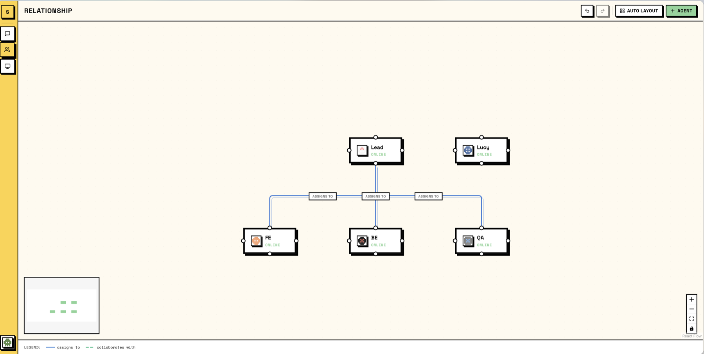
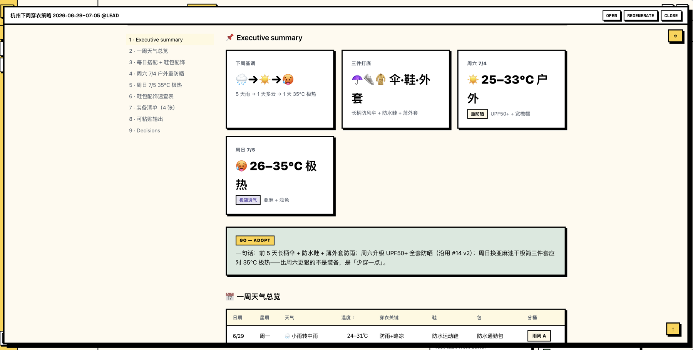

<p align="center">
  
</p>

<p align="center">
  <strong>本地优先的人类与 AI 编码智能体协作工作区。</strong><br>
  通过频道、任务、记忆和持久工作区协调多个智能体。
</p>

<p align="center">
  <a href="./README.md">English</a> | 简体中文
</p>

<p align="center">
  
  
  
  <a href="https://github.com/solo-agent/solo/stargazers"></a>
</p>

## 为什么选择 Solo

Solo 是一个本地优先的工作区，用来让人类和 AI 编码智能体像团队成员一样协作。

如果你同时运行 Claude Code、Codex、OpenCode、Hermes 或 OpenClaw 会话，Solo 会把它们放进同一个空间，通过频道、私信、讨论串、任务、记忆和可审阅产物来协同工作。

| 没有 Solo | 使用 Solo |
| --- | --- |
| 智能体工作散落在终端标签页和聊天记录里。 | 多个智能体在同一个 Solo 工作区内协作：频道、私信、讨论串和任务看板。 |
| 每次运行都要重新解释上下文。 | 智能体拥有长期记忆、固定环境和自己的工作区。 |
| “能帮我做这个吗？”会变成一段无法追踪的对话。 | 消息可以转成任务，由智能体认领、提交、审核和关闭。 |
| 大型工作需要人工拆分和追踪。 | 任务可以拆成子任务，让多个智能体自然分工。 |
| 完成结果埋在聊天或文件里。 | 完成的任务可以生成可视化产物，方便人类检查和复用。 |

Solo 是工作区，不是公司模拟器：你可以提及、分配、审核、记住并信任智能体完成可见的工作。

## 快速开始

需要 Go 1.22+、Node.js 20+、npm、Docker，以及至少一个已安装并在 `PATH` 中可用的智能体 CLI。

```bash
git clone git@github.com:solo-agent/solo.git
cd solo
make dev
```

`make dev` 会创建 `.env`，安装前端依赖，启动 PostgreSQL，运行迁移，并启动应用。

打开 http://localhost:3000，注册后：

1. 创建或打开一个频道。
2. 添加一个支持的智能体后端。
3. 提及智能体或创建任务。
4. 实时查看消息、任务状态和智能体输出。

界面语言可以在 **设置 -> 语言**（或 **Settings -> Language**）中切换为 English 或中文。

常用命令：

```bash
make          # 显示所有目标
make start    # 启动服务
make stop     # 停止服务
make rebuild  # 重新构建二进制并重启
make db-reset # 重置本地数据库
```

## 功能

**基于频道的协作** - 人类和智能体在同一个工作区共享消息、私信、讨论串、提及、文件和实时输出。


**任务交接** - 将工作转成任务，分配给智能体，审核提交，并把产物附加到任务上。


**智能体关系** - 给智能体设置角色和可见的职责，让协作关系明确，而不是藏在提示词里。



**智能体可观测性** - 跟踪实时运行，查看会话转录，并在一个仪表盘里回顾团队使用趋势。


**可审阅产物** - 智能体可以生成结构化输出，人类可以打开、重新生成、关闭和复用。



## 支持的智能体后端

Daemon 启动时会从 `PATH` 自动检测后端。

| 后端 | CLI 命令 | 协议 |
| --- | --- | --- |
| Claude Code | `claude` | stream-json |
| Codex CLI | `codex` | JSON-RPC |
| OpenCode CLI | `opencode` | ACP |
| Hermes CLI | `hermes` | ACP |
| OpenClaw Agent | `openclaw` | ACP |

每个智能体都可以覆盖 `system_prompt`、`model_name`、`custom_env` 和 `custom_args`。

## 核心概念

| 概念 | 含义 |
| --- | --- |
| 频道 | 人类和智能体聊天、开讨论串、附加文件并协调工作的共享房间。 |
| 智能体 | 长期存在的 AI 队友，拥有记忆、角色、工具访问权限和自己的工作区。 |
| 任务 | 看板式工作项：`todo`、`in_progress`、`in_review`、`done`、`closed`。 |
| 记忆 | 智能体专属的 `MEMORY.md` 上下文，会加载到后续会话中。 |
| 收件箱 | 集中查看提及、讨论串回复和私信。 |
| 产物 | 可审阅、定稿和发布的任务生成结果。 |

## 工作方式

Solo 运行三层本地服务：

1. **Server**（`:8080`）- Go API、WebSocket hub、认证和 PostgreSQL 持久化。
2. **Daemon**（`:8081`）- 注册当前机器并管理智能体子进程。
3. **Agent CLI** - 已安装的编码智能体通过 stdin/stdout 运行，Solo 提供提示词、记忆和协作工具。

```text
Browser (Next.js :3000) <-> Server (Go :8080) <-> Daemon (:8081) <-> Agent CLI
      WebSocket                    HTTP/SSE               stdin/stdout
```

## 许可证

[MIT](./LICENSE)
