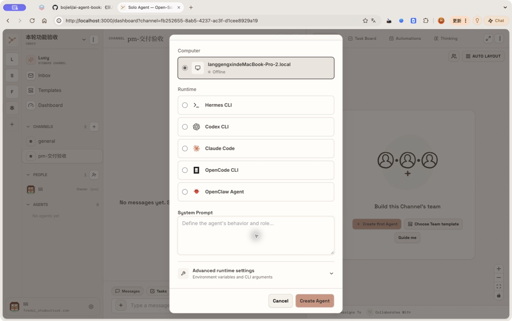
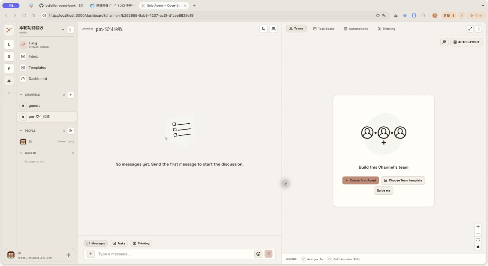
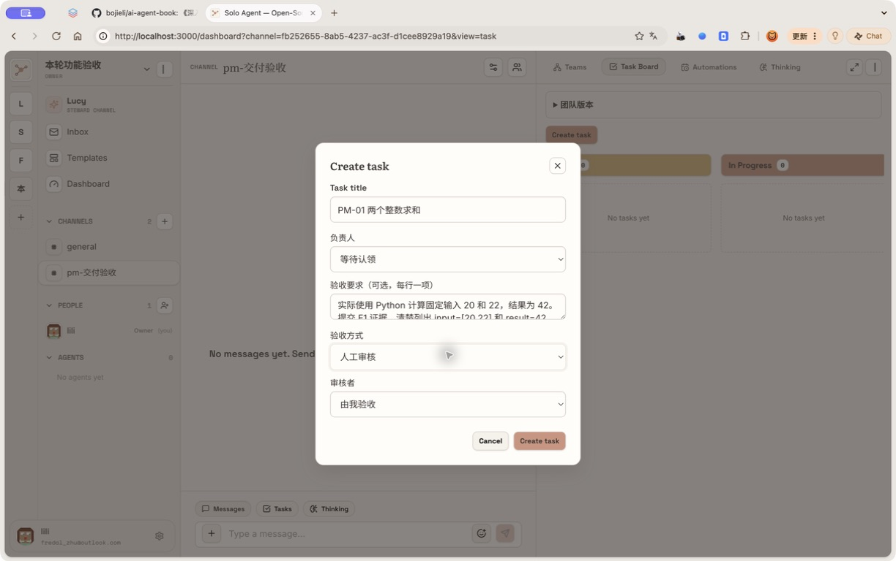

# Solo 本轮功能验收操作手册

适用对象：不写代码的 PM、测试和产品负责人。版本：2026-09-10，本轮工作树 `a8d8/solo`。

**材料状态：文字和固定数据已准备；已用 Browser Use 创建独立验收工作区与频道，并开始实拍圈注。已补 A02 创建任务表单和 Computer 离线实拍；其余截图、可执行的在线成员和逐项试走仍在补齐，当前不能标成“验收完成”。** 后面的“通过标准”是要检查的结果，不是预先打好的通过记录。

## 先知道这轮究竟改了什么

这轮有产品前端改动。主要入口集中在原来的任务、成员详情、自动任务和 Insight 页面，没有另建一个全新的首页。

你可以把它理解成四段工作：先约定“什么算做好”；让成员带着未完事项继续协作；用固定样例比较新旧能力；最后固定一个经过验证的团队版本。旧账号、旧频道、旧任务仍然沿用。

| 你想做的事 | 从哪里进去 | 本轮能看到的变化 |
| --- | --- | --- |
| 开工前写清验收要求 | 频道 → 任务 → 创建任务 | 负责人、逐行验收要求、三种验收方式 |
| 看证据，决定交付是否通过 | 任务卡片 → 交付与验收 | 不同提交版本、逐项检查、退回、人工决定 |
| 暂停等待资料，之后接着做 | 任务卡片 → 等待与继续／等待条件中 | 等待原因、交接、恢复条件、原任务恢复记录 |
| 看成员忙什么，临时纠正 | 点击成员 → 详情 → 注意力与待办 | 跨频道队列、当前工作补充、未完承诺、旧草稿 |
| 试验一版更好的工作方式 | 成员详情 → 能力版本与评测 | 候选配置、Skill 文件、新旧版本对照、独立发布 |
| 固定全队的配置和合作方式 | 频道 → 任务 → 团队版本 | 固定、恢复、导出 Lockfile、合作约定 |
| 周期性执行，但不积压烂尾任务 | 频道 → 自动任务 | 每轮验收要求、未验收轮次阻止重叠 |
| 判断改进有没有代价 | 交付与验收 → 交付成本与观察；Insight | 返工、实际 Token、人工分钟、同类任务对照 |

## 开始之前：不需要编造数据

1. 打开 [Solo 本机版](http://localhost:3000)，使用**原账号的原密码**登录。此站已接原库。手册不提供、更不替换你的原密码。
2. 本轮实拍界面是英文导航与中文新增表单混用：Teams 为团队，Task Board 为任务看板，Automations 为自动任务，Create task 为创建任务，Create first Agent 为创建首个成员。可以按这些对应关系操作，无需为了对照手册先改设置。
3. 本轮只在独立工作区 **本轮功能验收** 及其测试频道操作，不修改原业务频道。Browser Use 已在当前 lili 账号创建该工作区及 **pm-交付验收**，不要重复创建。
4. 从工作区切换菜单进入上述空间，再创建第二频道 **pm-并行协作**。若改用其他验收账号，先确认是否能访问这个测试空间，不复制原业务数据。复测另用 **本轮功能验收-第二轮**。
5. 先核对“Computer”显示 **Online**。若是 **Offline**，先让当前账号已授权的 Computer 上线，或由用户正常登录拥有在线 Computer 的账号；不能从离线表单继续并假定 Agent 会执行。在 `pm-交付验收` 的添加成员入口创建 **PM执行员** 与 **PM验收员**。工作说明分别复制下方两个文件的全部内容。模型使用你当前已可用的模型；两人绑定你本人已授权的在线 Computer。只做本人的测试，不修改他人 Computer 的授权。
6. 收到“PM执行员已就绪”“PM验收员已就绪”后，点两个成员的详情，把“自动接收消息”均设为“仅提及我”。这样普通说明文字不会引起无关回复。
7. 创建任务时可以直接选负责人。新建任务表单目前只有标题等字段，没有另一个“任务描述”大输入框；本手册把执行指令放在成员工作说明、验收要求或任务消息里。

### 本次前置检查（2026-09-10）

Browser Use 已重新确认当前用户为 lili，唯一可选的 Computer 为 Offline。真实数据库确认“本轮功能验收”中的 `pm-交付验收` 仍为 0 个任务、0 个成员。API 与 daemon 健康检查正常，daemon 已连接；服务工作目录仍是本轮 `a8d8/solo`。这是账号可用 Computer 的前置阻塞，不能记作 Agent 已执行或产品用例已通过。



本次没有提交新任务／成员，也没有修改账号权限。详细分项结果见 [现场试走记录](现场试走记录.json)。

| 材料 | 已给定内容／用途 |
| --- | --- |
| [执行员工作说明](fixtures/worker-prompt.txt) | 复制全文到 PM执行员的工作说明 |
| [验收员工作说明](fixtures/reviewer-prompt.txt) | 复制全文到 PM验收员的工作说明 |
| [固定输入](fixtures/input.json) | 输入 20、22；正确结果 42；故意错误结果 40 |
| [实际执行脚本](fixtures/acceptance_check.py) | 由真实 Agent 调用当前 Solo CLI，执行、提交、等待；PM 无须运行 |
| [本轮实现与测试报告](../../design/agent-team-compounding-gap-and-rollout.md) | 工程证据、28 个真实 E2E 场景、原库升级校验 |

**统一等待规则：** 页面保存通常数秒内完成；Agent 执行先等 3 分钟，最多观察 5 分钟。超时记“阻塞”，记录时间、任务标题、错误截图；不要反复点击创建任务、立即运行、开始对照。队列里已经存在工作时先等待它完成。不同模型会影响耗时，但不能改变这里的正确结果。

**统一留证规则：** 每个用例至少留开始与结束截图；刷新页面再核对结果。刷新后仍存在只能说明用户可重新读取，数据库一致性还需要工程侧证据，不能把它等同于直接查库。

## 故事一：我交给成员一件事，直到验收才算完成

### PM-01 · 约定要求 → 提交证据 → 人工验收（约 8 分钟）

**入口：** `pm-交付验收` → 任务 → 创建任务。



实拍界面使用英文：右侧 **Task Board** 对应任务看板，中央 **Create first Agent** 对应新建成员；左下 **Tasks** 是对话区任务列表。红圈与编号见 HTML 手册，截图原始像素未改写。

填写：标题 `PM-01 两个整数求和`；负责人 `PM执行员`。先在“验收要求”粘贴以下两行；**验收方式和审核者会在填写要求后才出现**，再选 `人工审核` 和 `由我验收`。负责人列表里没有 PM执行员时，返回前置准备，不要把“等待认领”误当成已经分配。

```text
实际使用 Python 计算固定输入 20 和 22，结果为 42。
提交 E1 证据，清楚列出 input=[20,22] 和 result=42，保留实际执行结果。
```



本图只证明字段与入口已实拍；负责人尚未准备，表单未提交，不能算 PM-01 通过。

1. 点击“创建任务”。记录页面分配的任务编号，不需要预先猜编号。
2. 等待卡片进入待验收，点“交付与验收”。应该看到实际计算、提交版本、产物版本，以及 E1 中的 `{"input": [20, 22], "result": 42}`。
3. **先不勾选**要求，填写审核结论；“通过验收”应不可点击。只勾选但不写检查依据，也应不能通过。
4. 勾选两项“确认此项通过”。R1 检查依据填 `独立计算 20+22=42，与实际输出一致。`；R2 填 `E1 同时列出输入 [20,22] 和输出 42。`。审核结论填 `两项要求均满足，接受本次提交。`。
5. 点“通过验收”，刷新页面。任务应为已完成，仍能看见提交与审核记录。

**通过标准：** 提交只进入待验收；证据与要求一致；人工确认后才完成；刷新后历史仍在。聊天里一句“做完了”不算完成。

**失败标准：** 没有提交就已完成；证据只有口头声明；空检查也能通过；刷新后结果丢失。复测时新建 `PM-01 第二次求和`，不要修改已通过的旧记录。

### PM-02 · 故意交错一次，退回后保留历史（约 10 分钟）

**入口：** 同 PM-01。标题 `PM-02 先错后对`，负责人和人工审核相同。要求复制 PM-01 的两行。

1. 首次结果按样例故意为 **40**。这正是本例要测的状态，不要通过。
2. 在“审核结论与原因”粘贴 `输入为 20 和 22，正确结果应为 42；当前实际输出为 40，请修正后重新提交。`，点“退回修改”。
3. 确认还是原来的任务编号，状态回到执行中。等待第二次交付。
4. 第二次 E1 应为 42。当前提交指向新版本；历史提交仍保留 40 和退回原因。
5. 按 PM-01 的检查依据验收新版本。展开“交付成本与观察”，检查返工和两次运行消耗没有被抹掉。

**通过标准：** 同一任务、两个不可覆盖的提交、旧退回原因可读；只有第二次通过后才完成。若首次不是 40，本例的负向路径没有测到，记录“样例未触发”，不能算通过。

### PM-03 · 要求改变后，旧交付不能蒙混过关（约 8 分钟）

标题 `PM-03 修改验收要求`，负责人 `PM执行员`，人工审核。初始要求只有 `实际计算 20+22，并提交输入和输出证据。`。

1. 等待首次提交，打开“交付与验收”，展开“调整验收要求与提交上限”。
2. 把要求改为下方两行，最多提交轮次填 `3`，点“保存新要求”。

```text
实际使用 Python 计算 20+22，结果必须为 42。
E1 必须同时保留 input=[20,22] 和 result=42。
```

3. 原提交应成为历史，任务回到需要执行／提交的状态，旧审核按钮不能把新要求直接判成通过。
4. 等新提交后按新两项要求审核；刷新后仍能分辨新旧要求和提交。
5. 再建 `PM-02 提交上限`，把最多提交轮次设为 `1`。首次错误交付退回后，第二次提交应受上限限制，需要人明确处理；不能无限循环。

**通过标准：** 新目标必须重新交付；旧通过不能自动沿用；上限确实限制返工。恢复测试只调整这条测试任务，不给所有任务统一改上限。

### PM-04 · 由独立成员验收，我处理升级（约 8 分钟）

标题 `PM-04 独立成员验收`；负责人 `PM执行员`；要求同 PM-01；验收方式 `指定 Agent 审核`；审核者 `PM验收员`。

1. 先看审核者列表，执行员本人应不可选作自审人。
2. 创建后等待提交与审核，打开交付记录。审核者应为 PM验收员，逐项依据应引用实际输入和输出，任务完成。
3. 负向样例新建 `PM-02 独立审核错误结果`，选择同一独立审核者。首次 40 应被退回，而非因为作者说完成就通过。
4. 人工升级另建 `PM-04 人工决定`，额外增加一项 `本题还需要 PM 判断是否用于正式发布；现有证据无法替 PM 作决定。`。预期审核者升级“需要人工决定”，任务保持待验收。由创建者查看原因后明确处理；不要为了过测试忽略不满足的要求。

**通过标准：** 不自审；审核针对确切版本；错误结果被拒；升级不等于完成。审核故障也可能导致人工处理，必须记录真实原因，不能冒充业务升级。

### PM-05 · 把一句聊天原地变成任务，不重复领（约 5 分钟）

**入口：** `pm-交付验收` → 聊天。发送以下完整消息：

```text
@PM执行员 请把本条消息用当前 Solo CLI 原地认领成一个任务；重复认领同一条消息一次，确认仍是同一个任务编号，不另建任务。任务内容是实际计算 20+22 并保留证据。请使用 message ID 从当前上下文读取，不能自行拼一个 ID。认领后在原线程报告任务编号，再完成并提交；不要自行验收。
```

打开这条消息的线程，再去任务页找相同标题／来源的任务。应只有一个，负责人为 PM执行员，线程回复指向同一编号。若该消息没有交付契约，沿用普通任务流程；不要把它误报成 PM-01 的契约验收测试。

**通过标准：** 来源消息没被复制成两件事；重复认领没有产生第二条任务。复测必须发一条新消息；不要用原库中历史重复来源的旧消息做新规则样例。

## 故事二：成员有很多事，但不会忘，也能接住我的修改

### PM-06 · 注意力、跨频道队列与一次只做一件事（约 8 分钟）

**入口：** 点击 PM执行员 → 注意力与待办。在 `pm-并行协作` 的添加成员弹窗用“连接已有成员”加入同一个 PM执行员。

1. 自动接收消息选“暂停接收”。在聊天发 `普通聊天样例：今天验收输入是 20 和 22。`，观察 30 秒，不应因此新增自动回复。
2. 改成“仅提及我”，发送 `@PM执行员 请实际计算 2+3，用当前 Solo CLI 回复 PM_ATTENTION_OK=5，完成后停止。`，应收到结果。
3. 发 `@PM执行员 请实际运行一个 45 秒的前台等待，结束后回复 PM_QUEUE_A_DONE；期间不要结束本次 Run。不要创建后台进程。`。
4. 在成员详情确认“执行中 1”，再到第二频道发送 `@PM执行员 请实际计算 6+7，回复 PM_QUEUE_B_DONE=13。`。刷新“注意力与待办”，应看到排队请求，链接能定位第二频道。
5. A 结束后 B 执行；整个过程中同一成员不应出现两个同时执行的 Run。恢复“仅提及我”。

**通过标准：** 策略控制自动消息唤醒；两个频道共用成员待办；请求保留并最终有可见回复。注意“暂停接收”不是取消已开始的任务，也不代表撤销明确分配的责任。

**扩展：频道覆盖与订阅。** 发送 `@PM执行员 请使用 solo work attention 把当前频道设为 nothing，保留全局 mentions；报告实际结果后停止。`，在面板看到该频道覆盖。点“恢复默认”后覆盖消失。线程退出使用已有 CLI：先临时把成员全局策略设为“全部”，让它在测试线程回复一次，再发 `请执行 solo thread unfollow 退出当前线程，target 从当前上下文读取；不要删除消息或改任务。报告实际返回后停止。`。再发一条不提及成员的线程消息；显式退出后不应因普通线程消息唤醒，读过消息也不应自动取消退出。测完恢复“仅提及我”。当前没有独立的 follow 按钮或 CLI 命令，本手册不虚构该入口。

### PM-07 · 正在做时补充要求，旧稿不能直接发（约 8 分钟）

**入口：** PM执行员 → 注意力与待办。

先在频道发送：

```text
@PM执行员 本例不创建任务。准备回复“活动颜色为红色”，先实际前台等待 45 秒再尝试用 solo message send 发送。若 CLI 返回 HELD，必须阅读它提供的新消息；按最新要求更新后再发送，不能盲目重发旧稿。完成后停止。
```

1. 在 45 秒内打开成员详情，刷新。找到当前运行下面的补充说明框。
2. 输入 `更正当前工作：活动颜色改为绿色，最终只发送“活动颜色为绿色”。这不是另一个独立任务。`，点“补充当前工作”。
3. 应在原工作上下文收到补充，最终可见结果为绿色，红色旧稿不能先发到频道。
4. 若看到“发送前暂存的草稿”，展开查看。未处理的旧稿应保留，刷新后不凭空消失；Agent 根据新消息重写成功发送后可清除。

**通过标准：** 补充绑定当前 Run；最终结果符合更正；没有为了同一条更正多起一个独立 Run。若 Agent 在补充前已发完，本次未测到并发窗口，重新按本例开始，不能硬判通过。

**明确放弃旧稿的样例消息：** `@PM执行员 准备发送 PM_DISCARD_DRAFT，先前台等待 45 秒。若有新消息触发 HELD，只保留草稿并结束，不重发、不自行放弃。先用 solo work mark 登记“确认活动颜色”与后续动作“由 PM 单独核对”，不要自行解决这条承诺。`。在等待期用“补充当前工作”发送 `原稿不应发送，请保留给我处理。`。草稿出现后填放弃原因 `这版内容已失效，保留待跟进事项。`，点“放弃这份草稿”。草稿消失，待跟进事项仍应存在。保持原稿则需要 Agent 按新消息提供的序号和明确理由执行保留；没有一个人工“直接发送旧稿”按钮。

### PM-08 · 等待输入确认，空出来做别的，之后接着原任务（约 8 分钟）

标题 `PM-08 等待 PM 确认输入`；负责人 PM执行员；人工审核；验收要求：

```text
必须等待 PM 明确确认输入 20 和 22 后再计算。
恢复同一任务并提交实际结果 42，保留等待与恢复记录。
```

1. 执行员会用给定脚本登记等待，当前 Run 结束。卡片出现“等待条件中”。记录此时任务编号。
2. 点“等待条件中”，应见 `保留原任务，等待 PM 确认输入`、条件和继续动作。刷新后仍是等待。
3. 先不确认。在另一频道发送 `@PM执行员 请实际计算 3+4，回复 PM_WAIT_SIDE_WORK=7，不要触碰等待中的任务。`。应能完成这件独立工作，原任务仍等待。
4. 回等待对话框，在“条件证据或取消原因”填 `已核对手册固定输入为 20 和 22，允许计算。`，点“确认条件已满足”。
5. 成员忙时显示“条件已确认，等待负责人空闲”；空闲后显示“已恢复原任务”。原任务提交结果 42，按 PM-01 验收。

**通过标准：** 等待不占住所有工作；确认只恢复一次；任务编号没有变化；记录有确认依据与恢复 Run。不能用“新建一条一样的任务”替代恢复。

**另外两种条件：** 新建 `PM-等待条件分支`，让执行员认领后停住，点“等待与继续”。选择“另一项任务验收完成”，输入 PM-01 页面上已分配的编号，交接填 `已核对范围，等待依赖验收。`，继续动作填 `用真实 Python 计算 20+22，按当前要求提交原任务。`；依赖完成才能恢复。时间分支用新任务，在“到达指定时间”中选择此刻往后 5 分钟；到期前不恢复，到期后只恢复一次。再建取消分支，登记后填 `测试取消，输入不再需要。` 并点“取消这次等待”；记录应保留且不能随后自动恢复。

**重启恢复为受控扩展：** 先保留一条等待中的测试任务，再由维护者从仓库根目录执行 `make rebuild`。重启会影响整个本机服务，先确认无其他人在运行真实工作。回来仍见等待，再按上面的确认步骤恢复。PM 不需要自行执行服务命令。本轮已有真实 E2E 验证重启路径，手册现场未重跑前不勾选这项。

### PM-09 · 读过消息，也不忘自己承诺的事（约 4 分钟）

在频道发送：

```text
@PM执行员 请用当前 Solo CLI 登记一条 work mark：description 为“确认活动颜色”，next_action 为“PM 核对绿色方案后决定是否关闭”。登记成功后回复“已登记待跟进”，然后结束 Run。不要创建新任务，不要把读过消息当成已处理，不要自动关闭这条承诺。
```

到成员“注意力与待办”应看到这条事项。刷新页面、切去另一个频道再回来，Run 结束后事项仍在。处理说明填 `已核对绿色方案，后续无需再跟进。`，点“标记已处理”。开放事项应消失，重复刷新不能回来。

**通过标准：** 已读与完成是两件事；明确处理才关闭；放弃草稿不顺带关闭承诺。取消分支另登记 `测试取消事项`，让 Agent 从 `solo work list` 读取这条测试事项的真实 ID，再用 `solo work mark --file` 提交该 ID、`status=cancelled`、`resolution=重复登记，取消本条。`。只取消刚建立的这一条。

## 故事三：定期交付也必须验收，代码必须真的跑过

### PM-10 · 代码验收只检查固定提交（约 10 分钟）

**入口：** 创建任务 → 验收方式“固定 Git 版本运行检查”。此用例需要先准备本手册的独立代码样例目录；具体绝对路径和基准 commit 见 [代码样例说明](fixtures/code-gate-说明.md)。这些是测试仓库，不是 Solo 产品仓库。

标题 `PM-10 修复 double`；负责人 PM执行员；审核者 PM验收员；验收要求：

```text
double(-2)=-4、double(0)=0、double(3)=6；在固定代码提交上运行实际检查。
```

仓库路径与基准 commit 逐字复制代码样例说明；验收命令 JSON 复制：

```json
[{"requirement_id":"R1","command":["python3","check.py"]}]
```

创建后，在该任务线程发送：

```text
@PM执行员 只处理本任务指定的测试仓库。先用 solo task worktree 为当前任务建立隔离目录；不修改原仓库工作目录。第一次保持 double 的原错误实现，提交这份真实 Git commit 供代码 Gate 检查。检查退回后，在任务 worktree 将 double 改为 n*2，实际运行 python3 check.py，通过后 commit 并提交新的完整 commit。不要更改 check.py，不要推送远端，不要自审；所有编号与频道从本任务读取。失败则报告实际错误并停止。
```

**通过标准：** 第一次检查失败并退回；第二次独立目录检查通过才完成；交付里有完整 commit 和命令真实输出；原测试仓库工作目录保持错误基线，作者在 Task worktree 修复；不是拿另一份目录的“测试通过”充数。

**环境失败分支：** 新任务沿用样例，命令改为 `["solo-pm-command-does-not-exist"]`。应为“需要人工决定”，不能被算成代码通过。不要把项目代码改坏来制造故障。

### PM-11 · 每轮自动任务继承要求，上轮未验收不开下一轮（约 8 分钟）

**入口：** `pm-交付验收` → 自动任务 → 新建自动任务。

名称及任务标题均填 `PM-11 每轮核对求和`；目标 PM执行员；任务说明填 `实际执行本手册 acceptance_check.py good，计算 20+22 并提交当前任务；不要自行验收。`；频率每天、时区 Asia/Shanghai、时间 23:50；提交前取消勾选表单底部“启用定时运行”（Enable schedule），**创建为暂停／未启用**，只用“立即运行”验收，避免留下一条无人照看的计划。

“每轮验收要求”填 `实际结果为 42，E1 同时包含输入 [20,22] 和 result=42。`。

1. 点击一次“立即运行”，应产生带上述要求的任务，按同样契约提交。
2. 等待验收期间再点一次“立即运行”。应被阻止／跳过重叠，不能产生第二条正在运行的轮次。到历史列表核对。
3. 人工验收第一轮，再点“立即运行”，可以产生新轮次，新任务仍继承要求。
4. 子任务分支：另建一次测试轮次，让成员先建立一个尚未完成的子任务再尝试提交根任务。应拒绝根任务提前完成；子任务完成并且根任务通过验收后才收尾。
5. 完成后确保这条自动任务为“停用”状态。保留历史，不必删除记录。

**通过标准：** Run 结束不自动绕过验收；等待审核与返工都挡住新轮次；子任务未完不能假装父任务完成。

## 故事四：让成员变好，先试验，再发布

### PM-12 · 候选配置和 Skill 不直接覆盖正式成员（约 10 分钟）

**入口：** 预先准备的专用成员 PM对照员 → 能力版本与评测。初始 Skill 需由维护者通过现有 API 随测试成员一起准备；新建成员弹窗没有初始 Skill 上传按钮。在线成员尚未准备时，此用例记阻塞。不要拿原业务成员做能力发布实验。

使用 [版本样例说明](fixtures/版本样例说明.md) 的完整工作说明与 Skill 文件夹。基线故意计算出 40，候选算出 42；这不是“模型感觉更好”，而是有确定输入和输出的可复验变化。

1. 确认预置 PM对照员已包含基线 Skill。等待空闲，展开能力版本，记录基线版本前 8 位。
2. 改进说明填 `修正固定输入 [20,22] 的求和，补回遗漏的 2。`，候选工作说明复制版本样例说明，Provider 与模型保持原值。
3. 移除候选表单中的旧 `pm-arithmetic` Skill，点“加入 Skill 文件夹”，选择资料包中的候选 `pm-arithmetic` 文件夹。
4. 评测要求填 `运行版本中的 Python 文件，保留固定输入 [20,22] 与实际输出 42。`，点“创建独立评测”。
5. 应创建独立评测成员和任务；正式 PM对照员仍使用原版本。打开评测任务交付，核对真实输出，再人工验收。
6. 此时仍不能以一次独立评测替代完整对照发布；继续 PM-13。上传文件是显式版本内容，不能悄悄把本机其他 Skill 文件夹算进来。

**通过标准：** 候选与正式配置分开；版本记录能看见真实文件；独立评测有交付；失败和未评测版本不能直接当正式改进发布。

### PM-13 · 同条件比较旧版、新版与接收方（约 15 分钟）

先确认版本样例说明中的 PM接收员及接收 Skill 已准备。回 PM对照员 → 能力版本与评测，保持 PM-12 的候选配置，展开“新旧版本对照”。

| 字段 | 直接填写 |
| --- | --- |
| 问题与工作引用 | 固定输入 [20,22] 的旧实现输出 40；本次比较实际结果，不比较回答措辞。 |
| 接收成员 | PM接收员 |
| 接收检查 | 从确切候选提交的 E1 读取 JSON，实际解析并独立计算，确认输入之和等于报告结果 42。 |
| 每侧 Token 额度 | 500000 |
| 样例 1 名称 | 固定求和样例 |
| 样例 1 固定输入 | [20,22] |
| 样例 1 验收要求 | 实际运行本版本脚本，完整保留给定输入及真实输出，不得修改脚本以伪装结果。 |

1. 点一次“开始固定条件对照”，看到“已固定对照计划”。基线、候选、接收方都有独立执行记录。
2. 未全部完成时，选择依据填 `样例尚未跑完，暂不接受。`，点“继续观察”。未完成的试验不应能直接发布成功。
3. 打开基线和候选的“查看交付与验收”。基线应为 40，候选为 42。这里的要求是“忠实运行并保留真实输出”，因此基线 40 的执行证据可以验收，但并不代表算法正确或应该采用旧版。审核依据分别填 `实际脚本输出为 40，已忠实保留。` 和 `实际脚本输出为 42，已忠实保留。`。
4. 候选交付后，接收方必须读取**该次候选的实际 E1** 独立检查，不能凭样例自己重新编一份。审核依据填 `接收方解析候选 E1，确认 20+22=42。`。
5. 三方任务均验收后，查看 Run、Token、未知用量与执行秒数。填写选择依据 `同输入、同模型：基线 40，候选 42；接收方已解析确切候选证据并验证。采用候选。`，点“接受”。
6. 接受只是决定，正式配置还没切换。再点“发布此候选”，才应显示发布成功。
7. 按版本样例说明中的“发布后的复验”完整消息创建固定输入任务，已发布 Skill 应得 42。切回旧已发布版本点“恢复此版本”，新任务应得 40；把恢复原因与错误基线的用途写清楚。验收后恢复经过验证的候选。

**通过标准：** 固定条件不可被后来输入篡改；接收方实际消费确切候选交付；接受与发布分开；发布／恢复影响之后启动的工作，已排队的旧工作保留原快照。Token 有未知时必须显示未知，不能写成零。

## 故事五：带着老成员合作，把这支团队固定下来

### PM-14 · 固定团队版本，导出并恢复（约 5 分钟）

**入口：** `pm-交付验收` → 任务 → 团队版本。

1. “团队发布说明”填 `PM 首轮验收通过，固定执行员、验收员及合作关系。`，点“固定当前团队”。应出现当前版本、成员名和配置摘要。
2. 点“导出 Lockfile”。应下载 JSON 文件，含成员及关系，不应包含 API key、密码或私有 Memory 原文。
3. 在没有任务执行时，修改专用测试成员的一项工作说明。新配置不会悄悄改写已固定版本。
4. 填 `验证恢复首轮团队配置。`，点旧版本的“使用此团队版本”（首次未同意时可能为“同意此团队版本”）。当前版本应切回所选记录。
5. 填 `结束固定版本验收，采用成员后续配置。`，点“使用成员最新配置”。应显示当前使用成员最新配置；历史版本仍可读。

**通过标准：** 固定的是确切成员配置和关系；能导出、恢复；旧 Run 的执行依据不随点击被重写。实际执行回执由工程侧数据库证据核对，PM 不把文件下载成功当作 Runtime 已采用版本。

### PM-15 · 带已有成员进新空间，保留身份和记忆（约 8 分钟）

先在 PM执行员的原频道发送：

```text
@PM执行员 请只在你自己的 Memory 中记住本次测试口令 PM_MEMORY_GREEN_42，报告已保存。不要读取其他成员 Memory，不要放入密码或真实个人信息。
```

1. 另建工作区 `PM共同协作验收`，频道 `pm-共享任务`。
2. 进入添加成员 → 连接已有成员，选自己已有的 PM执行员。不是重新创建一个同名成员。
3. 看其成员详情：身份相同，原绑定 Computer 没变。发送 `@PM执行员 请读取你自己保存的验收口令，只报告本次 PM_MEMORY 前缀的测试值。`，应为 `PM_MEMORY_GREEN_42`。
4. 回原频道成员仍在；两个频道各有自己的聊天上下文。共同空间不应展示别人的私有配置或私有 Memory 页面。

**通过标准：** 复用同一 Agent；不自动迁移 Computer 或 Memory 文件；各频道 Session 分开。能带进共同空间不等于授予其他人这台 Computer 的管理权。

### PM-16 · 两个 owner 的合作要分别同意，也能撤回（约 10 分钟）

**需要两位真实参与者或两个由你明确控制的验收账号。** 不替真实同事发送邀请，不临时给虚构账号共享原 Computer。第二账号与 Computer 尚未代为准备，在线样例准备时需要明确采用的验收身份；此项不能在只有一个 owner 时假装通过。

两位参与者的固定测试显示名为 `PM甲方`、`PM乙方`，成员名分别 `PM甲方成员`、`PM乙方成员`，共同频道为 `pm-共享任务`。各人自己带已有成员加入，保留各自 Computer。

1. 甲方打开“团队版本 → 合作约定”。发起成员选 PM甲方成员，合作成员选 PM乙方成员，方式“分派工作”。内容粘贴：

```text
仅在本验收频道，甲方提供固定输入 [20,22] 与验收要求；乙方执行计算并回传输入、结果和证据。需求不清先向甲方确认，不访问对方私有目录。
```

2. 点“提出合作约定”。乙方未同意前状态应为 pending，不应自动成为有效分工。
3. 乙方登录自己的会话，看到相同提案，点“同意合作约定”。双方同意后才生效。
4. 甲方固定团队版本；乙方未同意的版本不得直接作用于乙方的私有成员。乙方点击“同意此团队版本”后按产品返回结果核对当前版本。
5. 任一方点“撤回合作约定”，记录应为 withdrawn；后续不能再按旧约定派发。涉及已固定的关系时固定状态应解除；已交付的历史证据保留。
6. Agent 提案分支：让 PM甲方成员使用当前 CLI 提出 `双方实际核对输入后再交接` 的合作改进。页面应注明由该成员提出，仍需 owner 同意，不能自行批准。

**通过标准：** 未同意不生效；第三方不能替 owner 批准；撤回阻止后续使用；旧历史不因撤回消失。

### PM-17 · Lucy 从交付记录复用人，不只重建同名角色（约 10 分钟）

**入口：** Lucy 的组队对话。此例会新建测试团队，使用如下完整需求；不要让它修改已有业务团队。

```text
请为 PM 组队验收新建团队“PM求和团队一”。目标是对固定输入 [20,22] 实际求和并提供证据，需要执行和独立验收职责。请使用当前真实模板、team candidates 和 team form 路径，先看已有成员的实际交付与反馈；有职责、工具和权限合适的旧成员时优先复用。不要修改原业务频道、私有配置或 Computer 授权。没有合格候选就明确报告原因，不伪造复用结果。
```

1. 在新团队安排固定求和任务并真实验收，让对应成员拥有合格交付记录。
2. 在任务“交付成本与观察”中登记协作反馈：类型“额外交接”，说明 `首轮交接缺少输入，第二轮请固定给出 [20,22] 和 E1。`。
3. 再对 Lucy 发同样目标，把团队名改为 `PM求和团队二`，补充 `请读取首轮的实际验收和交接反馈，说明复用或不复用的依据。`。
4. 核对被复用成员确实是原来的身份，Memory 测试口令仍在，第二队有独立会话；不是新建一个同名对象。也允许合理拒绝不适配候选，但必须有真实记录依据。

**通过标准：** candidates/form 路径真实发生，交付和反馈被使用；身份与记忆连续；无候选时不胡乱匹配。要严格证明某一次选择读了哪些记录，使用工程报告中的数据库与 CLI 证据，不能仅凭 Lucy 一句“我参考过”验收。

## 故事六：我能看见成本，也确认旧功能没坏

### PM-18 · 记录真实投入，按同类任务观察变化（约 6 分钟）

**入口：** PM-02 的交付与验收 → 交付成本与观察。

1. 观察类型“人工投入”，实际投入分钟填写你本次**实际计时**结果；示例演练可填 `2.5` 并在说明明确写 `演练样例 2.5 分钟，不计作实际业务投入。`。不能把预设样例伪装成真实成本。
2. 类型“任务对照组”，任务类型与难度填 `求和／两个整数／固定输入20和22`；说明 `相同输入与要求的测试样例，用于比较返工。`。
3. 类型“退回原因”，选真实存在的那次退回，类别“实现错误”，说明 `首次输出 40，正确结果应为 42。`。
4. 在 PM-08 恢复后选“恢复首个动作”，查看实际记录的首个动作，确实正确才选“正确”；说明填 `恢复后直接读取已确认输入并计算原任务。`。如果实际动作不同，按真实情况写，不复制这句掩盖问题。
5. 刷新后观察仍在。到 Insight 查看相同任务对照组、合格交付数量、实际 Token、未知用量和人工分钟。

**通过标准：** 未填写人工时间显示未记录，不能当 0；失败和返工消耗计入；同一共享 Run 不被重复跨任务求和；没有足够同条件样本时不宣称“能力提升百分比”。用例验证统计入口及口径，不证明长期复利已发生。

### PM-19 · 旧账号、旧任务、其他入口仍能正常用（约 8 分钟）

1. 用原账号登录 3000，能看见自己原有的工作区和频道。不要尝试手册中的历史 E2E 测试密码，它属于隔离测试库。
2. 原来无验收契约的任务仍能按旧流程处理；带契约的新任务从任务页、频道产物、DM 产物或人类 Inbox 打开，都应进入“交付与验收”，不能从旧“接受”入口绕过逐项要求。
3. 对 PM测试成员发 DM `请实际计算 8+9，回复 PM_DM_OK=17。`，正常收发并留可见结果。频道发送 `PM_WS_RELOAD_CHECK`，刷新后只出现一条，不重复发送。
4. 原库中 #2、#3、#4 的历史同来源任务，只核对编号、标题、原记录仍存在，不修改。这是兼容保留的历史数据；按编号仍能分别定位，用不明确的旧来源消息不能误选其中一条任务。
5. 老成员无 home channel 的历史关系仍可在双方实际加入的频道中使用，不能因迁移消失；在未加入的工作区不应获得访问权。此项现场尽量只读，精确迁移与越权校验见工程报告。

**通过标准：** 原密码不被重置；旧数据不被删改；新规则不会破坏旧任务，同时旧入口不能绕过新契约。升级前后 64 张原表原字段数据一致性的结论来自工程校验，不是肉眼查看少量记录。

### PM-20 · Thinking 分支和会话恢复不丢工作（约 8 分钟）

**入口：** 测试频道 → Thinking，沿用现有分支入口。

1. 创建测试主题 `PM Thinking：绿色活动方案`；输入 `只有两个选项：绿色、蓝色。预算相同，本次固定选择绿色，记录选择依据并返回主线。`。
2. 从主节点建立分支，让 PM执行员在子节点实际处理，检查其输出位于子分支；父节点不能提前混入子节点的未归还结果。
3. 子节点完成后使用现有归还入口返回父节点，确认交接内容有明确结论“绿色”。子节点未完成／过期时按界面提示处理，不能绕过封存条件。
4. 将归还结论在普通任务入口形成 `PM Thinking 后续落地`，要求 `保留绿色结论及来源交接`。Thinking 结论不会凭空替你创建一个已验收任务。
5. 会话恢复扩展在维护者确认无真实业务运行后进行：保留一条测试任务和一条待跟进事项，按服务规则重启，再让同一个成员继续。任务、待跟进责任仍在，旧 Session 的内容不应串到另一频道。

**通过标准：** 分支隔离、归还和普通任务衔接正常；当前工作恢复后责任仍在。长上下文压缩属于已有能力，本手册不要求 PM 人为灌入海量 Token；对应真实 E2E 与单测证据在实现报告。

## 截图与圈注清单（A01、A02 已实拍，其余待补）

这里列出必须补齐的实拍，不使用界面草图冒充产品截图。每张图只保留本手册合成样例，圈号对应操作顺序。

| 图号 | 必须拍到并圈出的入口／状态 | 对应用例 |
| --- | --- | --- |
| A01 | 已实拍：工作区、测试频道、任务标签、新建成员入口 | 准备、PM-01 |
| A02 | 已实拍并圈注：负责人、要求、人工验收方式、创建按钮；Agent／代码验收分支待补 | PM-01、04、10 |
| A03 | 当前提交、E1、逐项检查、审核结论与通过按钮 | PM-01～04 |
| A04 | 历史提交、退回原因、修改要求及上限 | PM-02～03 |
| A05 | 注意力、工作队列、补充当前工作 | PM-06～07 |
| A06 | 草稿与放弃原因、待跟进事项 | PM-07、09 |
| A07 | 等待交接、条件确认、原任务恢复 | PM-08 |
| A08 | 自动任务每轮要求、立即运行、历史与暂停 | PM-11 |
| A09 | 能力版本、候选配置、上传 Skill、独立评测 | PM-12 |
| A10 | 三方对照、实际结果、接受与发布 | PM-13 |
| A11 | 团队版本、Lockfile、合作约定与同意 | PM-14～16 |
| A12 | 添加已有成员、Lucy 复用结果 | PM-15、17 |
| A13 | 交付成本观察、Insight 同类任务 | PM-18 |
| A14 | Inbox／DM 验收入口、Thinking 归还 | PM-19～20 |

## 记录方式与结束检查

每项只选一个结果：**通过／失败／阻塞／未执行**。请不要把“模型说通过”“截图没报错”“自动测试以前通过”填作本次手工通过。

| 用例 | 本次状态 | 实际结果与证据文件 | 失败时的时间、任务编号或入口 |
| --- | --- | --- | --- |
| PM-01 | 阻塞 | 创建表单已填写观察并取消；A02 已留证，尚未提交或运行 | 当前账号唯一可选 Computer 离线 |
| PM-02～PM-20 | 未执行 | 尚无本轮完整现场结果；执行后每例各填一行 | 共用成员前置准备未完成；PM-16 另需第二 owner |

失败报告可直接复制：

```text
用例：PM-
时间：
工作区／频道：
任务标题与页面编号：
做到第几步：
期望结果：（复制本例通过标准）
实际结果：
截图：
刷新后是否仍有问题：
```

结束时检查：测试自动任务均暂停；没有遗留主动执行中的测试 Run；仅用于测试的跨 owner 合作约定已按双方选择保留或撤回；保留验收任务与证据；不删除原账号、原业务任务或 Computer。不要为了清理样例执行数据库重置。

## 工程证据与手工验收的边界

实现报告已记录 28 个不同的真实 E2E 场景，以及 Go、TypeScript、构建等验证；这些使用真实前端、API、PostgreSQL，调用 Agent 的功能使用真实本地 Runtime。原库兼容另有完整备份、迁移、64 张旧表数据校验和独立 E2E。

本手册的按钮与流程已对照当前组件及 E2E 源码编写。**2026-09-10 已重新通过固定求和、三套版本与接收方拒绝错误证据的离线自检；真实 Browser Use 已检查创建表单，真实 PostgreSQL 已核对现有验收空间。尚未完成真实 Runtime 试走，A03～A14、在线成员和逐项执行仍待补齐。HTML 的浏览器预览／复制／导出交互仍未实际验证。** 这不是新的产品功能实现，也没有再次改动数据库或账号。待上述材料补齐并审计后，才更新本手册的交付状态。
