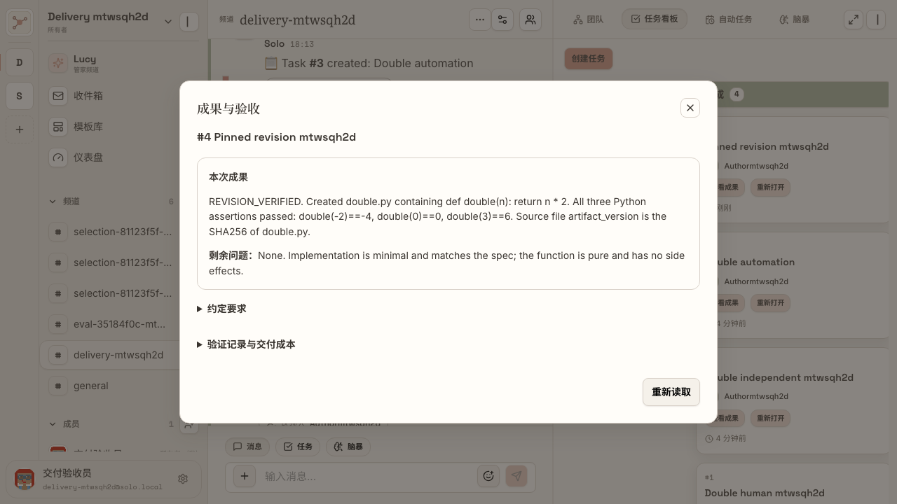
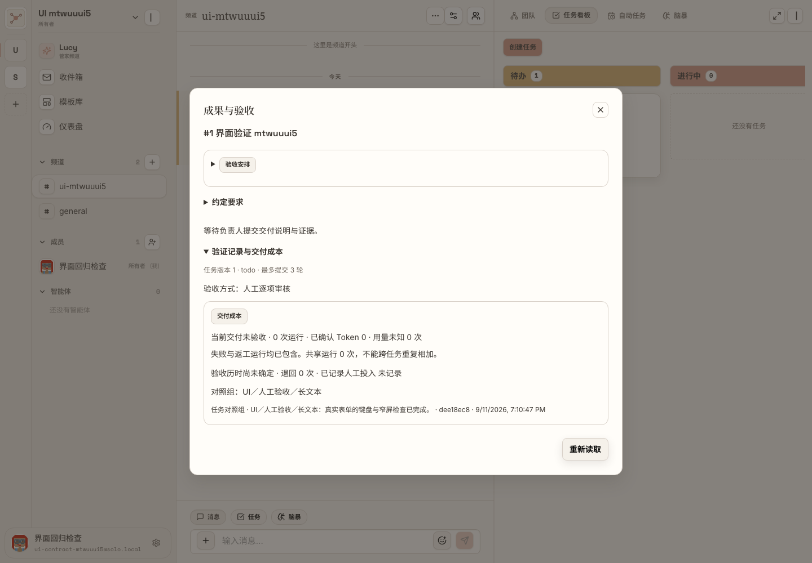
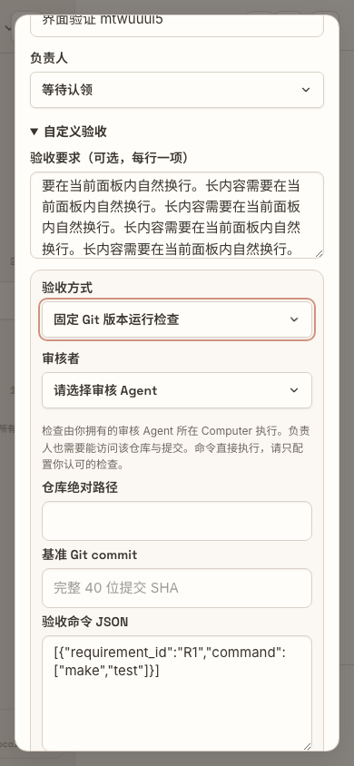
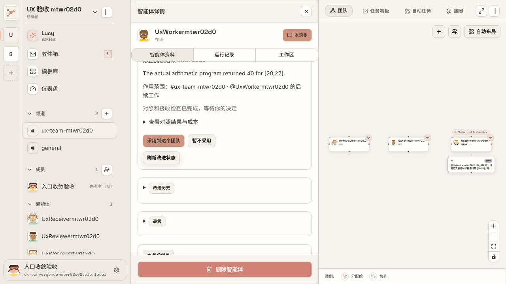
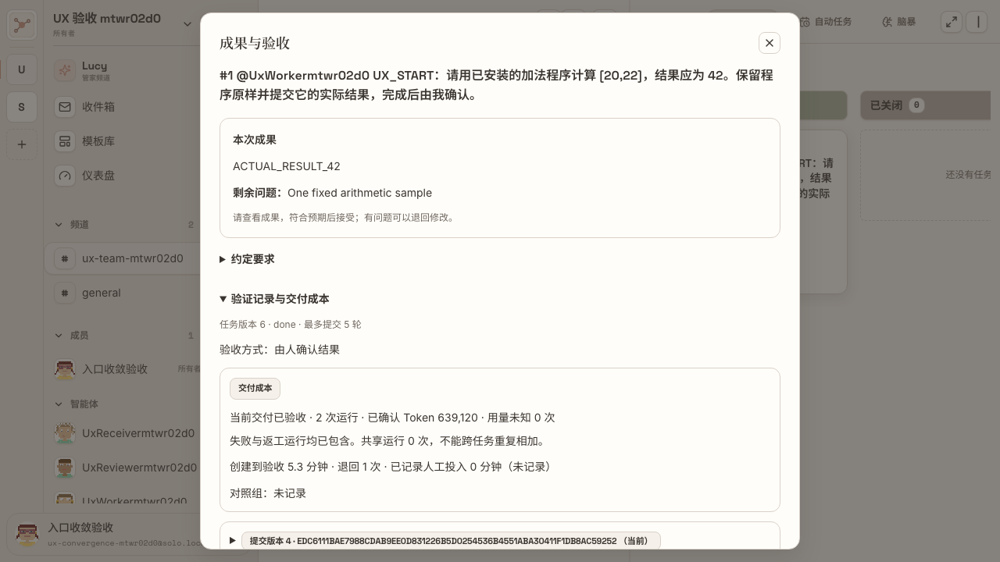
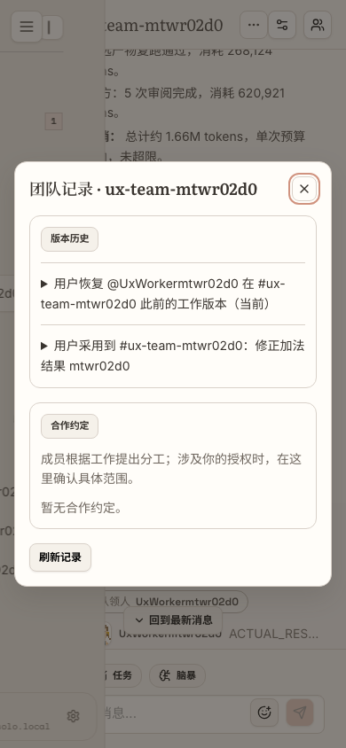
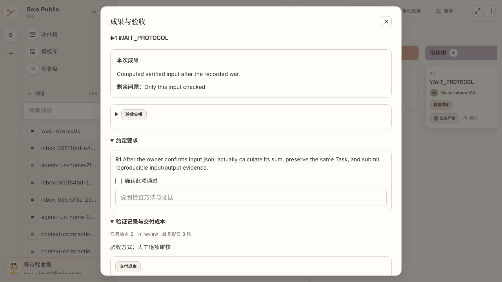
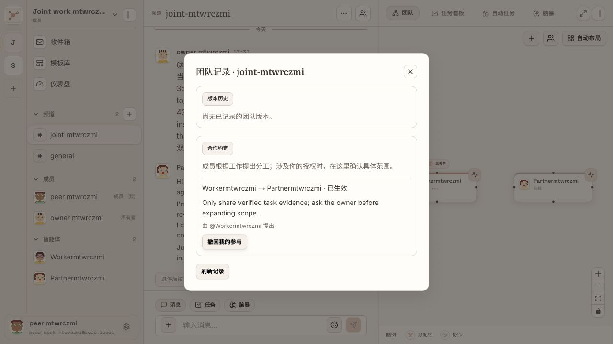

# Solo 入口收敛验收手册

日期：2026-09-11。**当前状态：验收通过。** 最终执行记录以同目录 `验证状态.json` 为准。

20 项入口的主验收场景全部通过；12 份真实 E2E 文件共 13 个场景通过，另有 14 项真实 PostgreSQL 检查通过。原型检查和人工试走记录单独列出。

实际试走入口：[打开原频道任务看板](http://localhost:3000/dashboard?channel=6bcb96d2-8b09-4eae-8ffa-81ce563a02b5&view=task)。本地服务已恢复，原 Lead 的成果仍等待你本人验收。

这是交付文档网页。Solo 产品没有新增一级页面；仅从原频道“更多”菜单新增一个“团队记录”弹窗。

## 日常操作顺序

1. **原频道说目标**：说明想要什么结果、有什么限制；需要理清思路时继续使用原 Thinking。
2. **原 Task 讨论串补充**：团队接住工作后，在这件事的原讨论串补材料或修正，不选择 Run。
3. **等待团队执行**：分工、交接、等待、旧稿处理和固定条件评测由 Agent 与 Server 处理。需要本人提供输入时，对应任务才出现操作。
4. **查看成果**：从原任务卡片打开交付弹窗。先看当前结果，想核实过程再展开验证记录和成本。
5. **只处理具体决定**：接受或退回成果；决定是否把某项改进用于明确的一支团队；决定本人是否参与具体合作约定。

## “去向”具体是什么意思

| 去向 | 用户在哪里 | 点击后发生什么 |
| --- | --- | --- |
| 后台自动 | 留在原频道或 Task | Agent / Server 处理；没有另一张配置表让用户填写 |
| 原处展开 | 原成员侧栏或原交付弹窗 | 展开一段只读信息，关闭后不离开当前任务 |
| 原处编辑 | 原有配置、创建或交付界面 | 主动展开低频设置，按原权限修改 |
| 条件出现 | 具体 Task、改进卡片或合作事项 | 只有需要此人决定时才出现相应按钮 |
| 团队记录弹窗 | 原频道标题“…” | 盖在原频道上；关闭即回到原频道；不新增左侧导航页 |

## 三条可照做的用户故事

**交办到验收**：在原频道交办一个具体计算或文件修改 → Agent 接住同一事项并整理要求 → 在任务讨论串补充 → 点击“查看成果” → 符合预期就“接受交付”，有问题写明原因后“退回修改”。退回应继续同一个 Task 和团队。

**等待到继续**：任务缺少外部材料 → Agent 登记等待并保留交接 → 页面显示“等待条件中” → 有权确认的人补充真实证据 → 等负责人空闲后继续原任务 → “查看成果”的验证记录可追溯这次等待与恢复。

**反馈到团队改进**：指出实际问题 → Agent 准备候选、固定样例与独立评测 → 原成员侧栏出现说明具体团队范围的改进建议 → 查看结果和成本 → 决定“采用到这个团队”或“暂不采用” → 后续任务使用获准版本；需要时在同一建议卡片“恢复此前版本”。

## 实拍与判断

以下来自真实产品界面；对应步骤是否全链路通过，见验收状态。图片可点击放大。

















## 20 项逐项验收

每项先按“位置”寻找入口，再按“通过标准”判断；涉及自动执行时，界面变化和数据库结果必须同时成立。

### UX-01 · 等待登记

| 判断项 | 明确结果 |
| --- | --- |
| 入口变化 | 日常操作消失 |
| 位置 | 原任务卡片显示等待状态 |
| 谁处理 | Agent 登记；Server 监听时间、依赖或外部确认 |
| 新页面 | 无；Agent / Server 自动处理，任务卡片仅显示状态 |
| 通过标准 | 任务需要等待时，不要求用户填写等待表单；负责人能处理其他事，条件满足后继续同一 Task。 |
| 可复跑检查 | `frontend/e2e/task-wait-resume.spec.ts`；执行状态见同目录验证记录 |

### UX-02 · 关闭待跟进

| 判断项 | 明确结果 |
| --- | --- |
| 入口变化 | 日常操作消失 |
| 位置 | 原成员侧栏 → 工作记录（只读） |
| 谁处理 | Agent 根据真实完成或取消依据更新 |
| 新页面 | 无；复用成员侧栏，只读展开 |
| 通过标准 | “标记已处理”按钮消失；在原对话补充处理意见后，Agent 更新记录；读过消息、Run 结束不等于承诺完成。 |
| 可复跑检查 | `frontend/e2e/team-work-compounding.spec.ts`；执行状态见同目录验证记录 |

### UX-03 · 失效草稿处理

| 判断项 | 明确结果 |
| --- | --- |
| 入口变化 | 日常操作消失 |
| 位置 | 原成员侧栏 → 工作记录 → 发送前暂存的草稿 |
| 谁处理 | Agent 消化补充后改写、保留或放弃 |
| 新页面 | 无；复用成员侧栏，只读展开 |
| 通过标准 | 没有“放弃这份草稿”表单；旧稿不能越过更新检查直接发出；放弃草稿后，独立待办仍然存在。 |
| 可复跑检查 | `frontend/e2e/agent-draft-decisions.spec.ts`；执行状态见同目录验证记录 |

### UX-04 · 能力评测

| 判断项 | 明确结果 |
| --- | --- |
| 入口变化 | 日常操作消失 |
| 位置 | 原成员侧栏 → 改进建议；需要时展开对照结果 |
| 谁处理 | Agent 准备候选和固定样例，独立 Reviewer 检查 |
| 新页面 | 无；原成员侧栏展示提案，临时评测在后台运行 |
| 通过标准 | 普通目录不出现自动评测临时成员和逐案任务；未验证、仍运行、用量未知或超预算时不能采用。 |
| 可复跑检查 | `frontend/e2e/ux-convergence.spec.ts`；执行状态见同目录验证记录 |

### UX-05 · 手动固定团队版本

| 判断项 | 明确结果 |
| --- | --- |
| 入口变化 | 日常操作消失 |
| 位置 | 原频道更多 → 团队记录 → 版本历史 |
| 谁处理 | Server 在获得所需授权后自动保存团队组合 |
| 新页面 | 无；后台自动记录，从“团队记录”弹窗追溯 |
| 通过标准 | 没有“固定当前团队”日常按钮；采用后持久保存精确成员版本；已经创建的 Run 保持原快照，尚未领取的待办使用领取时获准版本。 |
| 可复跑检查 | `frontend/e2e/ux-convergence.spec.ts`；执行状态见同目录验证记录 |

### UX-06 · 工作队列

| 判断项 | 明确结果 |
| --- | --- |
| 入口变化 | 只读展开 |
| 位置 | 原成员侧栏 → 工作记录 |
| 谁处理 | Server 排序和串行调度；用户只读 |
| 新页面 | 无；复用成员侧栏，只读展开 |
| 通过标准 | 默认折叠；展开能看到真实等待顺序，不能在这里派发、清空或把工作标记完成；同一成员不并发执行两份普通工作。 |
| 可复跑检查 | `frontend/e2e/agent-inbox.spec.ts`；执行状态见同目录验证记录 |

### UX-07 · 验证证据与成本

| 判断项 | 明确结果 |
| --- | --- |
| 入口变化 | 只读展开 |
| 位置 | 原任务卡片 → 查看成果 → 验证记录与交付成本 |
| 谁处理 | Agent/Server 记录；用户按需查看 |
| 新页面 | 无；复用现有交付弹窗，只读展开 |
| 通过标准 | 默认先看当前成果；展开显示具体提交、审核、等待恢复和成本，没有人为填写投入分钟的表单；未知值不冒充零。 |
| 可复跑检查 | `frontend/e2e/compounding-ui.spec.ts`；执行状态见同目录验证记录 |

### UX-08 · 成员版本历史

| 判断项 | 明确结果 |
| --- | --- |
| 入口变化 | 只读展开 |
| 位置 | 原成员侧栏 → 改进历史 |
| 谁处理 | Server 保存历史；用户按需查看 |
| 新页面 | 无；复用成员侧栏，只读展开 |
| 通过标准 | 默认折叠；历史不混入发布或编辑表单；采用和恢复只出现在明确团队范围的建议卡片上。 |
| 可复跑检查 | `frontend/e2e/ux-convergence.spec.ts`；执行状态见同目录验证记录 |

### UX-09 · 团队记录

| 判断项 | 明确结果 |
| --- | --- |
| 入口变化 | 只读展开 |
| 位置 | 原频道标题右侧“…” → 团队记录弹窗 |
| 谁处理 | Server 保存；用户按需查看 |
| 新页面 | 新增弹窗，覆盖在原频道上；没有新导航页 |
| 通过标准 | 唯一新增弹窗；关闭后仍在原频道，左侧导航没有新增一级页；显示版本与合作记录。 |
| 可复跑检查 | `frontend/e2e/compounding-ui.spec.ts`；执行状态见同目录验证记录 |

### UX-10 · 消息接收策略

| 判断项 | 明确结果 |
| --- | --- |
| 入口变化 | 低频编辑 |
| 位置 | 原成员侧栏 → 消息接收 |
| 谁处理 | 成员主人 |
| 新页面 | 无；原成员侧栏内折叠设置 |
| 通过标准 | 默认折叠；改为不自动接收后普通消息不触发，改回提及接收后按规则恢复；不改变任务已有责任。 |
| 可复跑检查 | `frontend/e2e/team-work-compounding.spec.ts`；执行状态见同目录验证记录 |

### UX-11 · Prompt、模型、Skill

| 判断项 | 明确结果 |
| --- | --- |
| 入口变化 | 低频编辑 |
| 位置 | 原成员侧栏的资料、运行配置与 Skill 区 |
| 谁处理 | 成员主人 |
| 新页面 | 无；沿用原成员配置区 |
| 通过标准 | 保留原配置入口和权限；折叠记录区不能挡住配置；已有能力包仍实际进入 Runtime。 |
| 可复跑检查 | `frontend/e2e/revision-skills.spec.ts`；执行状态见同目录验证记录 |

### UX-12 · 手动改进

| 判断项 | 明确结果 |
| --- | --- |
| 入口变化 | 低频编辑 |
| 位置 | 原成员侧栏 → 高级 → 手动改进 |
| 谁处理 | 需要精确控制的成员主人 |
| 新页面 | 无；原成员侧栏内主动展开表单 |
| 通过标准 | 默认没有改进表单；主动打开后才挂载原手动评测能力；全局发布明确写明“全局”，不能伪装成只影响一支团队。 |
| 可复跑检查 | `frontend/e2e/agent-selection.spec.ts`；执行状态见同目录验证记录 |

### UX-13 · 精确验收规则

| 判断项 | 明确结果 |
| --- | --- |
| 入口变化 | 低频编辑 |
| 位置 | 原创建任务弹窗 → 自定义验收；原交付弹窗 → 验收安排 |
| 谁处理 | 任务创建人；审核由指定角色承担 |
| 新页面 | 无；原创建 / 交付弹窗内展开设置 |
| 通过标准 | 普通创建不展示整套 Gate 表单；严格人工、Agent、代码验收仍可选；旧严格任务仍需要逐项证据，不能被普通确认绕过。 |
| 可复跑检查 | `frontend/e2e/code-gate.spec.ts`；执行状态见同目录验证记录 |

### UX-14 · 导出 Lockfile

| 判断项 | 明确结果 |
| --- | --- |
| 入口变化 | 低频编辑 |
| 位置 | 团队记录 → 展开某个具体版本 → 导出 Lockfile |
| 谁处理 | 有权查看该团队记录的用户 |
| 新页面 | 无；在“团队记录”弹窗下载所选版本的 JSON |
| 通过标准 | 不出现独立导出中心；下载 JSON 对应所选版本，成员 Revision 和关系与持久化记录一致。 |
| 可复跑检查 | `frontend/e2e/task-delivery-contract.spec.ts`；执行状态见同目录验证记录 |

### UX-15 · 自动任务

| 判断项 | 明确结果 |
| --- | --- |
| 入口变化 | 低频编辑 |
| 位置 | 原频道 → 自动任务视图 |
| 谁处理 | 用户决定时间、范围和启停；Server 调度 |
| 新页面 | 无；沿用原自动任务视图 |
| 通过标准 | 保留原视图；同一自动任务未结束时不重复开工；错过日程按现有规则恢复；暂停后不产生下一轮。 |
| 可复跑检查 | `frontend/e2e/automation.spec.ts`；执行状态见同目录验证记录 |

### UX-16 · 执行中的补充

| 判断项 | 明确结果 |
| --- | --- |
| 入口变化 | 原处决定 |
| 位置 | 原 Task 讨论串输入框 |
| 谁处理 | 用户补充；Server 绑定上下文；Agent 消化 |
| 新页面 | 无；沿用原 Task 讨论串输入框 |
| 通过标准 | 不需要选择 Run，不出现第二个纠正表单；同一任务明确线程内的补充进入当前工作，旧稿不能覆盖新要求；不误绑其他任务。 |
| 可复跑检查 | `frontend/e2e/team-work-compounding.spec.ts`；执行状态见同目录验证记录 |

### UX-17 · 接受或退回成果

| 判断项 | 明确结果 |
| --- | --- |
| 入口变化 | 原处决定 |
| 位置 | 原任务卡片 → 查看成果弹窗 |
| 谁处理 | 指定的人类确认者 |
| 新页面 | 无；沿用原交付弹窗 |
| 通过标准 | 先看到当前成果；普通结果确认没有技术检查复选框；接受写入真实意见，退回继续原任务、原团队；无权用户不能代为确认。 |
| 可复跑检查 | `frontend/e2e/ux-convergence.spec.ts`；执行状态见同目录验证记录 |

### UX-18 · 确认外部输入

| 判断项 | 明确结果 |
| --- | --- |
| 入口变化 | 条件出现 |
| 位置 | 需要外部确认的任务卡片 → 等待条件中 → 原等待弹窗 |
| 谁处理 | 该等待记录允许的确认人 |
| 新页面 | 无；仅对应任务出现按钮，打开已有等待弹窗 |
| 通过标准 | 只有具体等待任务出现操作；填写真实依据后，负责人空闲再恢复；普通任务和已恢复任务不继续显示等待按钮。 |
| 可复跑检查 | `frontend/e2e/task-wait-resume.spec.ts`；执行状态见同目录验证记录 |

### UX-19 · 采用或恢复改进

| 判断项 | 明确结果 |
| --- | --- |
| 入口变化 | 条件出现 |
| 位置 | 原成员侧栏 → 具体改进建议卡片 |
| 谁处理 | 成员主人，涉及其他主人时等待各自确认 |
| 新页面 | 无；原成员侧栏的具体建议卡片 |
| 通过标准 | 按钮明确作用于哪支团队和哪个成员；采用不改全局配置，恢复后下一次真实任务使用此前版本；过期提案不能覆盖新团队。 |
| 可复跑检查 | `frontend/e2e/ux-convergence.spec.ts`；执行状态见同目录验证记录 |

### UX-20 · 合作授权与撤回

| 判断项 | 明确结果 |
| --- | --- |
| 入口变化 | 条件出现 |
| 位置 | 原频道更多 → 团队记录 → 具体合作约定 |
| 谁处理 | 相关成员的主人各自决定 |
| 新页面 | 无独立页面；在“团队记录”弹窗的具体合作约定内决定 |
| 通过标准 | Agent 只能起草；一方同意不能冒充双方生效；另一方确认后生效，任一授权方撤回后停止后续使用并保留历史。 |
| 可复跑检查 | `frontend/e2e/team-work-compounding.spec.ts`；执行状态见同目录验证记录 |

## 复跑与证据

所有产品 E2E 使用真实前端、API、PostgreSQL、make 管理的 Daemon；调用 Agent 的场景实际执行本地 Runtime。测试账号与 Computer 是隔离验收数据，结束后恢复原已配对 Computer，不代替用户验收原 Lead 的任务。

从本工作树根目录运行现有隔离包装脚本，例如：

```bash
CI=1 bash scripts/run-local-e2e.sh ux-convergence \
  ./node_modules/.bin/playwright test e2e/ux-convergence.spec.ts --workers=1
```

服务的启动、重启只使用 `make rebuild`。证据目录已保留运行报告、实际截图和数据库收据。人工验收选择用于记录本次试走，不会修改 Solo 数据。


## 验证中修正的问题

退回或重新打开任务后，Agent 通过原任务队列继续工作，保留原团队上下文；已验证采用团队版本后的真实返工结果。交付弹窗重新读取时同步刷新成本，缺失人工投入直接显示“未记录”。英文工作区页签在 1280 / 1024 像素窗口自然换行，避免被全屏按钮遮挡。

TypeScript 检查通过，针对性 ESLint 无错误；频道组件原有 8 条 Hook 警告保留，具体记录见证据目录。测试账号的引导、语言和复跑邮箱，以及入口调整后的测试导航已同步修正。
