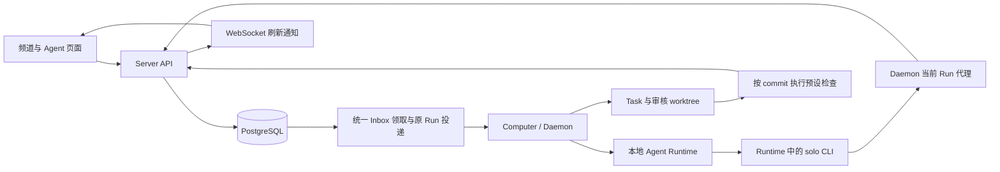

# Solo 长期团队实现说明

日期：2026-09-09。实现工作树：`/Users/langgengxin/.codex/worktrees/a8d8/solo`；分支 `codex/agent-team-compounding`；基线 `9b9de97ca0a800b147e899b707b52cb4804a3201`。

对照文章：[100亿token手搓多agent平台](/Users/langgengxin/.codex/worktrees/1138/solo/articles/solo-agent-team-compounding/article.md)。本次沿用 Solo 的 Agent、Channel、Task、Run、Session 与 Computer，补充交付契约、统一待办、条件恢复、能力版本与三方对照、历史反馈组队、长期指标和共同团队授权。设计在编码前完成，本文将设计与实际实现合并，测试结果只按已取得的证据填写。

## 实施前的差异

下面记录基线状态，不代表修改后的功能现状。

| 文章中的能力 | 实施前代码 | 差异与落地判断 |
| --- | --- | --- |
| Agent、Workspace、Channel、Thread、Task、Run、Session、Computer 分开保存 | 已有独立对象、表和接口 | 沿用现有模型。Team 暂时可以由 Channel 的成员和关系表示，无须先加独立组织系统。 |
| 持久身份、工作目录和 Memory | 已有按 Agent 保存的本地目录、MemoryManager 和持久 Runtime 适配 | 能跨 Task 留下经验；Computer 换绑不自动迁移本地文件与凭据。 |
| Relationship 与 `RELATIONSHIPS.md` | 已有 `assigns_to`、`collaborates_with`、自由文本 instruction 和关系图 | 关系要求两端同 owner、同 home channel。输入输出约定可以先写入 instruction；跨团队、跨 owner 的关系尚不支持。远程执行端的文件下发存在缺口。 |
| 按目标自动组队、复用擅长的成员、调整分工 | Lucy 可选官方模板，创建新 Channel 和新 Agent | 当前流程明确禁止复用或擅改模板成员；模型配置沿用调用方。没有依据交付记录选人、按职责选模型、提出关系改进的流程。 |
| 显式消息进入团队记录，流式输出用于观察 Run | 常规执行链路已有 `solo message send`、Run 事件、可见结果检查 | 保留这一边界，不把 Runtime 全部输出变成频道消息。 |
| Thinking 分支、独立 Session、Fork／Checkpoint／Return | 前端、服务端、数据库和 Runtime 路径均已有 | pending、stale、封存、子节点先归还等机制已有；无需重新实现。Thinking 结论整理回普通 Task 仍由现有工作入口承接。 |
| Session 压缩后换代，启动时重查未完工作 | 已有 90% 压力、低于 10% 收益等判断及精确前任绑定 | 文章这部分与实现基本一致。摘要来自当前 Channel 的开放 Task，后续再补待跟进承诺和指定给自己的审核。 |
| `all / mentions / nothing`、持久 follow／unfollow | 未找到完整策略字段；unfollow 只删除 `thread_reads` | 需要真正的注意力与订阅模型，不能把已读记录当退出决定。 |
| 协调者优先、大团队收窄响应、防止互相闲聊 | 已有关系路由、小团队阈值、发送限流、频道冷却和消息合并 | 尚未先按注意力策略筛选。大团队会选择最近活跃窗口中的成员，可能多于一个；Thread 默认优先一个参与者。 |
| 所有 Session 共用 Agent Inbox，并按优先级领取 | 已有按 Agent＋Channel 合并的持久消息唤醒队列；另有人类 Inbox | 缺 Agent 全局待办、跨 Channel 优先级和统一领取。Daemon 的 TaskManager 已在准备工作目录之前通过 acquireAgentTurn 做跨 provider 互斥；仍需服务端跨频道排队，不能再增一套运行时锁。 |
| 已读以后继续保留 work mark | 未找到 work mark 模型 | 没建 Task 的承诺没有独立持久状态，Run 结束不应自动抹掉这类责任。 |
| 发送前补读新消息，提交前检查 Task 版本 | 有事务内消息锁和 Run 游标；检查只包含其他 Agent 的新消息 | 人类新消息被明确排除；没有 Task 版本提交检查，也没有持久旧稿。现有测试固定了这一差异。 |
| Task 认领、提交、验收、退回、重开 | 已有行锁认领、状态机、父子任务及 `task_reviews` | 普通 submit 检查未结束子任务；接受／退回限定创建者。创建者可以是 Agent，但不能预设另一位 Reviewer。重开 done／closed 已有，限人类创建者。 |
| 开工前固定 requirements／gate，提交结构化 Task Handoff | Task 目前主要是标题、描述、负责人和状态 | 没有要求版本、Gate 配置或提交批次。Thinking Handoff 不能直接当作 Task Handoff。 |
| 人工、代码、Agent Gate 按提交版本验收 | 已有创建者验收和退回原因 | 缺指定 Reviewer、逐项证据、`needs_human`、审核重试与旧版本结果拒收。当前审核取最新 Artifact，Artifact 本身还可被覆盖。 |
| 不同 Task 用独立 worktree，交接 commit 和范围 | Prompt 建议选择项目目录／worktree；默认执行目录仍是 Agent workspace | 没有 Task worktree 的创建、绑定、清理和产物版本契约。Git 信息目前可由 Agent 写进消息。 |
| Task Run 故障恢复 | 已有最新 Run／负责人／Task 更新时间检查，resume／fresh，最多三次尝试 | 可以复用。它处理特定 Task Run 失败，不等于承诺追踪，也不限制审核返工循环。 |
| Automation 驱动父子 Loop | 已有定时创建消息、Thread、Task，跳过重叠和连续失败暂停 | 当前可根据 Run completed 直接更新 Task 为 done／in_review；没有走普通提交的子任务检查或 Gate。上一轮是否仍未验收也未作为统一重叠边界。 |
| Agent Revision、Agent PR、Selection、Team Lockfile | 未找到对应领域模型及发布流程 | 需要补版本快照和 Run 引用，再做候选评测。仅有模板和可编辑 Prompt 不能满足版本固定。 |
| 验证长期复利 | 已有 Run Token、耗时、任务关联和审核记录 | 可以开始统计；还缺明确的提交轮次、返工分类、人工投入时间与同条件对照。不能据此宣称已有收益。 |
| 双方带已有 Agent 到共同 Workspace | 已有 Workspace 邀请、同 Workspace 多 owner Agent 入频道、各自 Computer 执行 | Agent 的 home Workspace 必须等于目标 Workspace。个人 Workspace 的老 Agent 不能直接带进新合作 Workspace；跨 owner 关系也受限。 |


## 本次实现的范围

| 能力 | 实现结果 | 使用入口 |
| --- | --- | --- |
| 交付契约 | 固定 requirements、Gate、提交轮数；每次提交保存当时的要求与产物版本 | 频道任务视图 → 创建任务 → 验收要求 |
| 人工、Agent、代码验收 | 逐项检查、证据引用、accepted／rejected／needs_human；拒绝自审、迟到审核及旧入口绕过 | 任务 → 交付与验收；CLI submit／review |
| 代码隔离 | 按 Agent＋Task 创建 worktree；审核使用独立目录与提交 commit；保存 Git 引用 | 代码 Gate；CLI task worktree |
| Automation 收尾 | 每轮继承 contract；等待根任务和子任务完成，审核与返工期间阻止下一轮重叠 | 频道 Automation 的每轮验收要求 |
| Agent 待办 | 汇总跨频道排队、执行、指定审核、work mark 和被拦截草稿 | Agent 详情 → 注意力与待办 |
| 注意力 | 全局 all／mentions／nothing、频道覆盖、持久订阅与退出 | Agent 详情；CLI work attention |
| 人工纠正 | 显式指定当前 Run，发送前分页补读、记录消费、拦截旧稿；独立请求另行排队 | Agent 详情 → 补充当前工作 |
| 成员版本与 Skill | Prompt、模型、参数和显式 Skill 文件形成不可变快照，Run 引用固定版本 | Agent 详情 → 能力版本与评测 |
| 配对 Selection | 同输入、模型和额度执行基线／候选，接收方检查确切候选提交；owner 接受后发布 | 能力版本与评测 → 新旧版本对照 |
| 条件等待 | 原 Task 保存条件、Handoff 和下一步，到期／依赖完成／明确外部确认后恢复 | 任务 → 等待与恢复；CLI task wait |
| 历史反馈组队 | Lucy 按模板职责、工具权限与交付记录复用成员，保留身份、Memory 与跨频道 Session 隔离 | Lucy；CLI team candidates／form |
| 长期度量 | 合格交付成本、失败消耗、人工分钟、返工分类、交接和恢复记录 | 交付与验收 → 交付成本与观察；Insight |
| 团队版本 | 固定成员版本和关系，导出 Lockfile；切换版本开启适用的新 Session | 频道任务视图 → 团队版本 |
| 共同团队 | owner 将自己的旧 Agent 带入已加入的 Workspace；跨 owner 约定和团队版本需要相关 owner 同意 | 添加 Agent → 连接已有成员；合作约定 |
| 运行依据 | daemon 接收关系快照，回报 revision、team version 和关系摘要；服务端核对并留事件 | Run 的 execution_configuration 记录 |
| 改进记录 | 版本维度汇总执行、提交、验收、退回、人工升级、Token 和耗时 | 能力版本与评测 |

这些入口已实现，并完成审阅、单测、真实端到端验收和生产构建，具体记录见本文末尾。长期收益需要积累真实样本，不由实现本身证明；不同任务的汇总统计也不能证明同条件的能力提升。

## 架构与职责



Server 保存协作事实、权限、提交、审核和版本。Computer 保存实际文件与工具；代码检查在 daemon 执行，Server 不运行提交中附带的程序。各个 provider 的执行继续经过原有 `taskManager.acquireAgentTurn`，锁覆盖工作目录准备和整个 turn，没有另外增加运行时锁。

新增功能复用 `agent_runs`、任务关联、Session 派发、预算服务、Computer 的远程投递和 watchdog。Team 由频道成员和关系快照表示，没有引入第二套组织系统。现有人类 Inbox 继续显示人的责任，Agent Inbox 汇总原消息、审核、条件等待、Selection 和新增普通待办；work mark 保留自己的未完责任。

### 数据归属与生命周期

| 数据 | 所属对象与存储 | 生命周期 |
| --- | --- | --- |
| Task contract、version | tasks，PostgreSQL | 要求或状态发生有效变化时增加版本；旧任务可以没有 contract |
| Submission | task_submissions | 每次交付追加记录，API 不覆盖历史；保存要求、handoff、证据、产物版本、提交 Run |
| Review | task_reviews | 指向精确 submission；accepted／rejected 为该提交的唯一最终决定，needs_human 为升级记录 |
| 审核投递 | task_review_deliveries | 提交事务内登记；失败重试，验收决定落库后消费删除；执行历史保存在 Run／Task 关联 |
| 注意力与订阅 | agents、agent_channel_attention、thread_subscriptions | 默认继承；显式退出独立于已读记录 |
| 跟进义务 | agent_work_marks | Run 结束不自动完成；明确 resolved／cancelled 时记录处理说明 |
| 旧稿与消费 | agent_held_drafts、agent_message_consumptions | 拦截时持久化；成功发送清除本 Run 旧稿；消费记录避免重复启动 |
| 待执行请求 | agent_pending_work；agent_inbox／agent_inbox_heads 为只读视图 | 同一 Agent 事务锁下领取，成功关联 Run，失败保留原因与退避，撤销后取消 |
| 条件等待 | task_waits | 保存原 Task 版本、条件、Handoff 与 next_action；满足后只恢复一次，变更使旧等待失效 |
| Selection | agent_selections、agent_selection_trials、agent_selection_tasks、agent_selection_decisions | 固定计划与独立试验成员，追加决定及证据；接受不自动发布 |
| 观察与责任 | task_observations、task_responsibility_events | 真实责任事件及人类追加观察，Task 结束仍保留；不猜测旧历史 |
| 成员快照 | agent_revisions | 配置内容与摘要不可改；同 Agent 的相同配置复用同一记录 |
| 发布历史 | agent_revision_publications | 保存发布人、原因、评测任务和版本；恢复旧版也留记录 |
| 团队快照 | channel_team_versions、channels.team_version_id | 快照保留，当前指针可切换；撤销成员或合作关系会解除固定 |
| 合作提案 | agent_relationship_proposals | 相关 owner 同意后生效；任何一方可撤销 |
| worktree 与 Git 产物 | Computer 本地 Git 仓库 | 作者目录保留未提交工作；提交保存到 refs/solo/submissions/<submission-id>，不依赖临时 worktree 保活 |

Agent 仍属于原 owner，home channel 与绑定 Computer 不因协作改变。参与另一个 Workspace 不授予对方 Computer 管理权、私有配置、Memory 或文件访问权。已共享的消息和交付继续遵循频道权限。

这些权限由 Solo API 和派发检查执行。Computer 上的文件权限仍由操作系统用户和实际 Runtime 沙箱决定；独立 Agent 工作目录不是操作系统隔离，同机同用户进程可能读取其他目录。此实现不把目录隔离宣称为文件系统安全边界，也不自动迁移或共享 Memory。

## 一次任务如何交付

创建时给出 1–50 条带唯一 ID 的要求，以及 Gate。人工审核可以省略 reviewer_id，默认创建者；Agent 与代码审核需要指定频道中的独立成员。默认最多 3 次提交，可设 1–20 次。

```json
{
  "title": "修复 double 的边界输入",
  "assignee": "<author-agent-uuid>",
  "contract": {
    "requirements": [{"id":"R1","text":"负数、零、正数都返回两倍值，并有实际测试证据"}],
    "gate": {"kind":"agent","reviewer_id":"<reviewer-agent-uuid>","max_revisions":3}
  }
}
```

负责人通过 `solo task get -n <N> -c <channel>` 读取最新要求和 version。提交必须带 expected_task_version、幂等键、产物版本、结构化 handoff 和证据。

```json
{
  "expected_task_version": 1,
  "idempotency_key": "delivery-1",
  "artifact_version": "<content-sha256-or-code-commit>",
  "handoff": {
    "summary": "已修复并运行边界测试",
    "changes": "double(n) 返回 n * 2",
    "risks": "仅验证整数输入",
    "next_steps": "请独立复验"
  },
  "evidence": [{"id":"E1","description":"实际测试输出","content":"<命令、输入和实际输出>"}]
}
```

运行 `solo task submit -n <N> -c <channel> --file delivery.json`，也可用 `--file -` 从 stdin 读取。handoff 的文本字段兼容文本列表，并先规范为统一文本再计算幂等摘要。内联证据若带 SHA256，服务端核对实际内容；外部 URI 必须带 SHA256。外部文件的实际获取与复验由指定审核者负责，服务端不会仅凭 URL 判定内容正确。

共用 Runtime 提示词包含完整提交 JSON 示例，明确证据的 id、description、content／URI 与摘要规则，并用服务校验器测试示例格式。Selection 另行提醒成员使用自身版本和给定输入，不查阅其他成员目录或 provider 历史；这一提示用于维持对照纪律，不代替操作系统权限隔离或接收方验收。

`solo message read` 的普通频道、Thread、DM 和 Thinking 读取统一经过现有 daemon 代理，携带分页选项并使用当前唯一执行中 Run 的凭据。目标可以是该成员已加入的其他频道，服务端仍检查目标的成员权限、归档与 Thinking 范围。独立 CLI 仍可直接访问 API；已配置 daemon 的 Runtime 在代理失败时不会回退到旧会话凭据。daemon 下发与自身版本匹配的 CLI。这个缺口由 Lucy 第二轮组队的真实测试发现，路径与分页由纯函数单测检查，旧 token、跨频道读写和未加入频道的拒绝由主线 E2E 检查。

提交事务锁定 Task，核对负责人、版本和已完成的子任务，然后追加 Submission、进入 in_review 并登记审核投递。同一幂等键和相同请求返回同一结果；同键不同内容返回冲突。修改审核中的目标、要求或负责人使当前提交失效，重新进入待认领或执行状态，旧审核不能推进新目标。已经结束的契约任务必须先重开，才能修改目标或要求，避免旧验收结果被挂到新目标上。

审核请求固定 submission_id 和 artifact_version。accepted 要覆盖全部要求，每项都有 passed、reason 和存在的 evidence_ids；可引用提交证据或审核者新提供的证据。作者不能自审。rejected 将同一 Task 返回 in_progress，保留提交与退回历史。needs_human 保持 in_review，人类创建者随后可以明确解决；审核派发连续 3 次失败后也开放这一处理入口。

前端从服务端的 can_review 判断动作权限。任务列表、频道／DM 的 Artifact 审核入口和人类 Inbox 均接入新对话框；旧 accept／reject 接口对带 contract 的 Task 返回冲突。WebSocket 负责提示刷新，页面重开后以 API 与数据库记录为准。数据库版本触发器也阻止带 contract 的任务绕过当前提交的 accepted 记录直接进入 done。

### Reviewer 的执行与恢复

审核队列每 5 秒扫描，使用 `FOR UPDATE SKIP LOCKED` 领取；忙碌 Agent 先等待。投递前检查 Reviewer 仍在频道中且活跃。审核使用单独 Run，并以 related 关联原 Task，避免替换作者 Run 或误导 Automation 的完成判断。

每次失败至少间隔 1 分钟，总共最多 3 次。Run watchdog 和现有远程投递负责中断恢复；旧版本审核不能影响新提交。人工处理或重新设置 contract 时必须基于当前 Task 版本，不能靠重发一条聊天把任务标成完成。

## 代码 Gate 与工作目录

代码 Gate 的创建者必须拥有 Reviewer Agent，因为配置的命令会在其 Computer 上执行。配置包含绝对仓库路径、40 位小写 base commit、总超时（默认 120 秒，范围 1–300）和每项要求的一组 argv。命令不经过隐式 shell；确实需要 shell 时，owner 要显式配置该程序及参数。

```json
{
  "kind":"code",
  "reviewer_id":"<owned-reviewer-agent-uuid>",
  "max_revisions":3,
  "code": {
    "repository_path":"/absolute/path/to/repository",
    "base_commit":"<40-char-lowercase-git-commit>",
    "timeout_seconds":120,
    "checks":[{"requirement_id":"R1","command":["python3","-c","from double import double; assert double(-2)==-4"]}]
  }
}
```

作者运行 `solo task worktree -n <N> -c <channel>`。daemon 使用当前 Run 凭据读取真实 Task，仅允许负责人调用，从授权基线建立 `<agent workspace>/tasks/<task-id>`。再次调用验证同仓库和基线祖先关系，保留原目录与未提交修改。作者自行实现、测试、commit，提交完整 commit；平台不自动提交用户工作或推送远端。

Reviewer 的 daemon 在 `<agent root>/code-reviews/<submission-id>-<run-id>` 检出提交，核对祖先关系、HEAD 和跟踪文件状态。每条预设命令记录有界输出与退出状态；全部通过才 accepted。普通非零退出码视为检查失败，退回修改；缺少程序、超时、commit 不匹配或检查中修改源码则 needs_human。检查生成的未跟踪缓存文件允许保留。

代码审核不调用模型，不创建 reviewer provider Session，不预留模型预算。只有该 submission 的真实 code_gate Run 凭据可以写入程序审核结果，普通 Agent 不能冒充检查程序。每个提交保留 Git ref，后续清理审核目录不会让交付 commit 因无引用而被 GC。作者 worktree 不在任务完成时自动删除，避免误删未提交修改；可由 owner 在确认后使用 Git 的工作目录清理命令移除。已经删除的 Agent 工作目录不承担版本归档职责。

两台 Computer 分别执行时，双方都要能访问配置仓库及提交对象。此实现不自动同步 Git 对象或凭据。代码 Gate 是版本固定与验收流程，不是操作系统沙箱；检查具有运行 daemon 的用户权限。

## 注意力、排队与人工纠正

默认注意力为 all。频道覆盖优先于全局配置，inherit 删除覆盖。nothing 停止普通消息与提及带来的新唤醒；Task 责任和已经开始工作的显式纠正继续处理。Thread 退出写入 followed=false；显式提及可一次性唤醒，Agent 再次回复则恢复订阅。

消息、审核、条件恢复、Selection 与普通 Task／Thinking／Artifact／问候共用 agent_inbox_heads 的顺序。所有生产领取路径在同一 Agent 的 PostgreSQL 事务锁下确认没有未结束 Run，再领取队首；明确工作与提及优先，普通订阅与问候随后，同级按入队时间及稳定 ID 排序。现有 5 秒扫描器推进待办，daemon 原有同 Agent 锁继续保护实际目录和执行。当前工具不被抢占。静音清理未领取的自动消息，旧路由结果再次入队也要重查策略；Task 责任保留。问候按本次成员加入时间去重，重新加入可以再次问候。退出 Thread 会清除未领取普通消息，并阻止旧路由重新入队；明确提及仍可进入待办。

持久保证从待办事务提交后开始。普通 Task／消息的源记录提交与后续入队仍是两步，Server 若恰好在两步之间退出，需重新触发；未配对的本地兼容投递也沿用原 Run watchdog，配对 Computer 才具有同事务的持久 payload。没有将这些边界描述为无条件的恰好一次执行。

人工的“补充当前工作”发送 correction_of_run_id。Server 要求目标 Run 仍活跃，属于同一个 Channel／Thread，且不是 Thinking Node。该消息只路由给目标 Agent，不会唤醒频道其他成员。普通新消息继续作为独立工作排队。

Agent 发可见消息前，Server 在事务里检查更新，先展示最早 5 条未消费内容；游标只推进到实际返回的记录。存在更新就持久保存被拦截草稿，返回更新内容，要求模型调整后重试。消费记录使同一人工纠正不会在当前 Run 处理过后又启动新 Run。人工纠正已消费后，原样重发仍返回冲突。Agent 可以修订，也可以用 `--keep-after-seq <最新已读序号> --freshness-reason <理由>` 明确保留同一草稿；若期间又有更新，仍先拦截并要求阅读。保留决定随可见消息保存。还可用草稿 SHA256 与理由明确放弃；放弃事件不可与完成 Task 或 work mark 混淆。owner 待办页也支持查阅和明确放弃。

work mark 有自己的幂等键、来源、描述和下一步动作。消息已读、模型停止或 Run completed 都不自动删除它；显式 resolved／cancelled 时要求说明原因。跨频道撤销参与会取消相应义务。Session 启动的连续工作上下文补充了尚未结束的 work mark 和指定审核，复用既有 Session 压缩换代机制。

## 版本评测、发布与共同团队

Run 创建时，PostgreSQL 捕获 Prompt、provider、model 和 custom_args，形成 Agent Revision。旧 Run 不回填未经验证的历史配置。频道已固定团队版本时，从 Lockfile 取得该成员 revision；成员未包含在版本里时拒绝启动，需重新发布或解除固定。

候选可以先建独立评测 Task，但首次发布还必须有 accepted 配对 Selection。Selection 固定原成员当前基线、候选 Revision、接收方 Revision、问题与改动、1–10 个输入和验收要求、每侧 Token 额度及交接检查。基线与候选必须使用相同 provider、model、custom_args；三方各用独立 Agent、频道、Memory 与 Session，按固定样例顺序执行。接收方收到候选当前提交的精确 JSON。试验频道与 Task 建在当前已授权 Workspace；旧成员的 home、身份和 Memory 保持原归属。列表按当前空间过滤，幂等键不能跨空间重放；既有试验保留原位置。

试验 Task 仍走普通交付与人工 Gate。候选和接收方必须有真实已结束 Run、正确配置的 accepted 提交，并且接收方消费的是当前候选版本。基线失败也保留真实结果与消耗。观察／拒绝／接受记录附带不可改的证据快照。接受后 owner 可发布；发布还检查正式基线未漂移。之前已发布的版本可以回滚。预算为终身的运行启动额度，覆盖失败与未知用量；单次模型执行可能超过预留，照实记账并阻止后续启动和接受，不声称是 provider 的硬上限。

候选 Provider 复用 Solo 原后端注册表和页面目录，包含已注册的 CLI 后端及原 API 型 openai／anthropic；未知后端拒绝登记。正式 Agent 的普通配置编辑保持兼容，下一次未固定团队的 Run 会形成快照。要求团队始终使用已审配置时应固定 Team 版本。Skill 只打包明确选择的文件：最多 20 个包、500 个文件、共 4 MiB，校验名字、相对路径、frontmatter、内容摘要与执行位。daemon 原子安装到版本目录，切换托管 Skill 入口；不复制私有 Memory、聊天、凭据或整台机器的 Skill。配置或团队摘要改变时使用新 Session，回滚只影响后续 Run。

Team Lockfile 保存成员 ID、owner、revision、配置摘要和频道关系。owner 选择发布后，多 owner 团队需要相关 owner 对同一版本确认，确认完整才切换当前指针。旧 Run 保留原版本；新版本切换或关系变化时，会避免恢复旧配置 Session，服务端依据历史记录处理 daemon 重启后的情况。

双方加入共同 Workspace 后，各自从已有成员目录把自己的 Agent 带入频道。跨 owner 的合作约定保存为提案，双方 owner 同意精确内容后才成为关系。任意一方可以撤销。关系按 Channel 查询和渲染，唤醒路由也使用当前团队固定的关系快照。

移除 Agent 会取消其频道 Run、结算已取消 Run 的预算、关闭适用 Session、删除消息待投递和合作关系、取消 work mark、解除团队固定，并撤销该 owner 对旧团队版本的确认。移除 Workspace 外部成员时，也沿现有 Channel 移除链路撤销他带入的 Agent。恢复旧 Lockfile 必须重新核对成员和关系授权，不能借恢复版本重新取得被撤销的访问权。

Server 只渲染关系快照，不改写运行目录。Daemon 通过 dispatch payload 接收当前关系内容；在实际 Agent 互斥锁内写入 `RELATIONSHIPS.md`，API provider 加入本轮提示词。daemon 声明 `run_snapshot_v1` 后回报配置收据，Server 核对 revision、team version、skills_sha256 与 relationships_sha256 并记录 `execution_configuration`。固定团队遇到旧 daemon 会明确要求升级；代码 Gate 要求 `code_gate_v1`。收据证明程序接收了哪些配置，不证明模型必然遵守每句话。

## 条件恢复与反馈组队

等待保存原 Task、负责人和版本、condition、Handoff、next_action。条件包括依赖任务完成、指定时间、明确的外部信号确认。登记时检查权限、循环与父子隐式依赖；消息已读和推测的外部成功不满足条件。现有扫描器在条件满足、版本与负责人仍一致、Agent 空闲时创建恢复 Run；Run 与等待状态同事务关联，重启可继续。取消、改派和变更目标不会沿用旧恢复计划。

Lucy Form 先按模板职责查询候选，检查当前 owner、活跃状态、Computer 权限、provider、显式 Skill 和预算，再使用当前用户可读范围内的提及、指派／认领／委派、验收和返工记录排序。验收采用加一先验避免一条样本掩盖不确定性；成本只在已明确标注的同类任务、模型和预算条件下参与比较。原因随候选结果返回。无合格成员时按模板建立新成员，显式 `reuse_existing:false` 也可要求新建；原手动模板创建继续新建。

复用保留原 ID、owner、home channel、Computer 和 Memory，新频道有独立普通 Session。关系按目标频道保存，相关 owner 的明确批准仍是生效条件。近期 Review 和交接／重解释等观察通过 `solo work list` 提供给成员。Agent 可通过 `team propose-agreement` 将经验变成待审协作约定；系统保留实际 Agent 与所属 owner，两端 owner 批准后才影响后续 Run，Agent 不能自行批准。

## 长期指标如何读取

Task 度量由原 Task、当前 accepted Review、提交、Run 关联和用量账本投影，统计合格交付历时、实际及占用 Token、运行秒数、失败、返工及恢复。人工投入、重复工作、重解释、额外交接、返工原因和恢复首个动作是否正确，由有权的人类明确追加；不从消息时间或模型推测生成。类别和引用经过校验，观察不可修改，重复请求幂等。

同类对照组须由 Task 创建者或负责人 owner 指定。Insight 按对照组、运行模型配置和预算快照分组；未结束、未知用量、缺预算或跨 Task 共享的 Run 不进入可比样本。失败工作照计成本，同一组中的共享 Run 只计一次；不同组存在共享时不能直接加总。代码 Gate 是已知 0 模型 Token 的实际进程，仍计执行秒数。其他成员只能看协作所需信息，其 owner 的私人预算配置会被隐藏。

模型字段来自 Run 固定 Revision 的配置名；provider 别名不等于精确模型发布版本。比较结论须保留这一限制。平台没有收益百分比或货币价格估计；指标提供验证记录，不保证团队已经产生长期收益。

## 接口与代码位置

所有路径以下省略 `/api/v1` 前缀。Task 接口支持频道路径中的任务序号或 ID；全局路径仍做同样的成员权限校验。

| 接口 | 作用 |
| --- | --- |
| POST /channels/{channel}/tasks，POST /tasks | 创建任务；可带 contract |
| PATCH /tasks/{task} 及频道对应入口 | 基于 expected_task_version 修改契约任务 |
| GET /tasks/{task}/submissions | 查看不可覆盖的提交与审核历史 |
| POST /tasks/{task}/submit | 版本化交付 |
| POST /tasks/{task}/review | 指定 Gate 决定；代码 Gate 还校验真实 Run |
| GET /tasks/{task}/waits，POST /tasks/{task}/wait | 读取历史或登记原任务的等待条件 |
| POST /tasks/{task}/resolve-wait | 取消精确等待，或由有权的人类确认外部条件 |
| GET /agents/{agent}/work | owner／Agent 自身的待办汇总 |
| POST /agents/{agent}/work | 建立或处理 work mark |
| POST /agents/{agent}/drafts/discard | 根据 Run 与草稿 SHA256 明确放弃旧稿，保留原待办责任 |
| POST /agents/{agent}/attention | 全局／频道策略；inherit 清除频道覆盖 |
| GET /agents?owned=true | 当前 owner 的既有成员目录，可用于跨 Workspace 参与 |
| GET、POST /agents/{agent}/revisions | 查询版本与原始统计、登记候选 |
| POST /agents/{agent}/revisions/{revision}/publish | 依据 accepted Selection 发布或恢复已发布版本 |
| GET、POST /agents/{agent}/selections；POST /agents/{agent}/selections/{selection}/decide | 固定三方对照、读取结果、追加观察／拒绝／接受决定 |
| POST /team-formations/candidates | 按职责查询可复用成员与具体依据 |
| GET /tasks/{task}/metrics；POST /tasks/{task}/observations | 实际交付指标与追加人工观察 |
| GET、POST /channels/{channel}/team-versions | 查询、创建、确认、恢复版本；version_id=live 解除固定 |
| GET、POST /channels/{channel}/team-agreements | 查询或提出合作约定 |
| POST /channels/{channel}/team-agreements/{proposal} | accept／withdraw |

CLI 新增 `task get`、`task submissions`、`task submit --file`、`task review --file`、`task worktree`、`task create --contract-file`，以及 `work list`、`work mark --file`、`work attention --file`、`work discard --file`、`work revisions`、`work propose-revision --file`、`task wait`、`task waits`、`task resolve-wait`、`team candidates`、`team agreements`、`team propose-agreement --file`。代理沿用实际执行中的 Run 凭据，不依赖持久 Session 保存的旧 token。

主要实现：

- 交付与派发：[task_delivery.go](/Users/langgengxin/.codex/worktrees/a8d8/solo/internal/server/service/task_delivery.go)、[task_review_dispatch.go](/Users/langgengxin/.codex/worktrees/a8d8/solo/internal/server/service/task_review_dispatch.go)、[task-delivery-dialog.tsx](/Users/langgengxin/.codex/worktrees/a8d8/solo/frontend/components/tasks/task-delivery-dialog.tsx)。
- 注意力与纠正：[agent_work.go](/Users/langgengxin/.codex/worktrees/a8d8/solo/internal/server/service/agent_work.go)、[message_freshness.go](/Users/langgengxin/.codex/worktrees/a8d8/solo/internal/server/service/message_freshness.go)、[agent_message_wake.go](/Users/langgengxin/.codex/worktrees/a8d8/solo/internal/server/service/agent_message_wake.go)。
- 版本与授权：[agent_revision.go](/Users/langgengxin/.codex/worktrees/a8d8/solo/internal/server/service/agent_revision.go)、[team_agreement.go](/Users/langgengxin/.codex/worktrees/a8d8/solo/internal/server/service/team_agreement.go)。
- 本地执行：[code_gate.go](/Users/langgengxin/.codex/worktrees/a8d8/solo/pkg/agent/code_gate.go)、[daemon 接入](/Users/langgengxin/.codex/worktrees/a8d8/solo/cmd/daemon/code_gate.go)、[Session 配置](/Users/langgengxin/.codex/worktrees/a8d8/solo/pkg/agent/session.go)。

## 迁移、兼容与部署

迁移 000078 补齐原库历史数据兼容；000064 增加任务契约与交付；000065 增加注意力、订阅和 work mark；000066 接入 Automation；000067 增加版本；000068 增加共同团队；000069 补充撤销确认和合作关系失效；000070 约束消息与 Task 的唯一关系；000071 保存等待条件及恢复记录；000072 固定 Skill 文件；000073 加入 Selection；000074 增加实际观察与预算快照；000075 记录认领／指派；000076 汇总 Inbox；000077 记录 Agent 合作提案的实际发起身份。

历史任务默认 contract=NULL，保留旧提交／验收语义；旧 Automation 可继续使用原有完成策略，仍补上开放子任务检查。新 Automation 带 contract 时必须等待普通 Gate，任务未结束就不能创建重叠轮次。模板组队、Thinking、旧的 Session 恢复和 Computer 绑定沿用原路径。

应一起升级 Server、daemon 和 CLI，再使用团队固定和代码 Gate。服务启动与重启只运行仓库根目录 `make rebuild`。初次验收使用独立数据库和 3100／8180／8181。2026-09-09 按用户要求完成原库兼容后，当前工作树已改为连接原 `solo` 数据库，运行于 3000／8080／8081；旧工作树 `5aa6/solo` 的服务已通过 make 停止。默认 `.env` 现在是原库配置，测试必须另指定独立 ENV_FILE，不能直接拿当前 `.env` 跑产品测试。

迁移回滚有数据损失，因此应先备份。000068 的 down 在仍有跨 Workspace 参与或跨频道合作关系时拒绝执行，要求先撤销这些授权。000064 down 保留历史 needs_human 审核状态的合法性，不能把既有记录悄悄改为另一种判断。最新已确认：新库完整安装 1–77、逐项回退 77→64、重新升级 64→77 通过，14 项功能迁移和 Inbox 视图／提案发起列均恢复；日志 `/tmp/solo-migrations-77-final.log`。一次性测试库已删除，实际 E2E 数据库未回退。72 回退前须结束使用 Skill 的 Run 并移除 live Skill；73 要结束试验并停用试验成员；76 不允许丢失 pending 工作；77 要先处理待审 Agent 提案。新增观察、预算快照与发起身份需先导出保存。

## 最终验证结果

截至 2026-09-09，文章对应的实现和原有关键主线共覆盖 28 个独立真实 E2E 场景，均已有通过记录；失败后修正的用例已定向复跑，重复运行不重复计数。审阅后新增的消息读取兼容路径已单独复验。全量 Go、应用和 E2E 类型检查、40 个变动前端文件的 ESLint、迁移安装／回退／重升及生产构建均通过。

| 检查 | 已取得的证据 |
| --- | --- |
| 最新全量 Go | `/tmp/solo-final-full-go.log` 通过；包含真实 PostgreSQL 服务检查、问候重复与重新加入、跨来源单领取、静音、退出订阅、Codex 登录 shell、取消指派与 Artifact 兼容、Return 取消、Agent 合作提案、跨 Workspace 对照范围和幂等检查、原后端注册表兼容、Runtime 示例与服务校验器兼容及原测试。临时独立数据库已删除 |
| 最新类型／静态检查 | `/tmp/solo-final-app-types.log` 应用类型检查通过；原配置排除 E2E，另用显式配置检查 17 个变动的 E2E 文件及导入的辅助文件，`/tmp/solo-final-e2e-types.log` 通过。全部最终变动的 40 个前端及测试文件 ESLint 为 0 errors、12 warnings，退出状态为 0；已逐条对比基线，12 条均为原 Channel／DM 页面的既有警告，日志 `/tmp/solo-final-lint.log`。`git diff --check` 通过 |
| 迁移安装／回退／重升 | `/tmp/solo-migrations-77-final.log` 通过；全新库、64–77 回退与重升；临时库已删除 |
| 组队反馈实际 E2E | `/tmp/solo-final-team-formation-feedback-e2e.log`，1 passed，1.7 分钟：Lucy 在同一真实会话中两次组队，复用相同成员、保留 Memory、真实任务与验收、跨频道独立 Session；消息读取使用当前 Run 的授权 |
| Selection＋指标实际 E2E | `/tmp/solo-final-agent-selection-e2e.log`，1 passed，1.3 分钟：实际三方脚本、各自版本目录、确切候选输入接收、make 重启后继续审核、UI 观察、API／数据库指标 |
| Skill 实际 E2E | `/tmp/solo-final-revision-skills-e2e.log` 本地 1 passed，3.2 分钟；`/tmp/solo-final-revision-skills-remote-e2e.log` 配对 Computer 1 passed，14.3 分钟。覆盖原成员跨 Workspace 复用、真实 Skill 评测、严格三方证据核对、发布、固定与恢复实际文件、Memory 保留、远程投递及配置收据 |
| 等待实际 E2E | `/tmp/solo-final-task-wait-resume-e2e.log`，1 passed，1.2 分钟：真实条件登记、make 重启、独立工作、外部确认后恢复原 Task、页面及数据库验收 |
| 草稿实际 E2E | `/tmp/solo-final-agent-draft-decisions-e2e.log`，1 passed，36.9 秒：实际 Runtime 保留／放弃被拦草稿，未完义务保持独立 |
| 消息认领实际 E2E | `/tmp/solo-final-message-task-claim-e2e.log`，1 passed，38.0 秒：真实短 ID 认领、提交和原人工验收入口 |
| 代码 Gate 实际 E2E | `/tmp/solo-final-code-gate-e2e.log`，1 passed，1.6 分钟：真实 Agent 修改受管 worktree 并提交 commit，Runtime 独立检出并运行预设检查，审核不调用模型，页面与数据库结果一致 |
| 共同团队实际 E2E | `/tmp/solo-final-team-work-compounding-e2e.log`，1 passed，3.0 分钟：跨 owner 授权、保留 home、合作约定与团队版本共同批准、私有配置隔离、七条人工纠正、独立请求排队、work mark 处理和撤销后的恢复限制 |
| 交付版本实际 E2E | `/tmp/solo-final-task-delivery-contract-e2e.log`，1 passed，10.3 分钟：实际作者提交、人工与独立 Agent Gate、Automation、三方 Selection、源码独立复验、候选发布和固定团队版本后的实际交付，页面与数据库状态一致 |
| Workspace／消息主线回归 | `/tmp/solo-latest-core-e2e.log`，4 passed，41.0 秒：真实上传与头像、置顶、禁言、Workspace 成员撤销、WebSocket 发送、Channel／Thread／DM 断网恢复。旧脚本同步主线的账户空间偏好、跳过引导、操作菜单与消息分组方式 |
| Agent 主线实际回归 | 9 项正常生命周期用例均已有通过记录：首轮 `/tmp/solo-final-mainline-e2e.log` 中 8 passed、1 failed（7.3 分钟）；修正配置错误用例的 Task Run 选择，并扩展读写权限检查后，`/tmp/solo-final-read-recovery-e2e.log` 2 passed（1.6 分钟）。覆盖 Session 复用、旧 token 读写、跨频道读取与未加入频道拒绝、模板 CLI、协调、缺失可见结果、重启收敛、原 Session 恢复、Task 自动恢复及配置错误交回创建者 |
| Thinking | `/tmp/solo-final-thinking-e2e.log`，主用例 1 passed，4.3 分钟：真实初始化、Session 延续、旧节点路由、Fork／Checkpoint／Return、图形布局、实际进程关闭、普通 Channel／Thread Session 与数据库状态 |
| Agent／Thinking 空闲恢复 | `/tmp/solo-final-idle-e2e.log`，2 passed，2.0 分钟：实际进程回收、心跳保留 Agent、原 provider Session 唤醒、记忆延续及页面结果 |
| Inbox＋Agent 提案 | `/tmp/solo-inbox-approval-e2e.log`，1 passed，7.2 分钟：四来源队列 UI、Run 无重叠、实际 Reviewer／Token、三张 Task 验收、Agent 提案与 owner 页面审批后关系落库。使用内置 Codex 连接和 Luna 模型 |
| 生产构建 | `/tmp/solo-final-build.log`：`npm run build -- --webpack` 通过，编译、TypeScript 与 17 个静态页面生成完成 |

独立 E2E 服务已通过根目录 make 关闭，3100／8180／8181 无监听。当前原库服务保留运行于 3000／8080／8081，daemon 的 `control_connected=true`，登录页 HTTP 200；三个服务的工作目录均核对为当前 `a8d8/solo`。代码仍在上述工作分支，未合并到 master。

新增产品验证使用真实前端、API、PostgreSQL 和本地 Runtime；没有以模拟 HTTP／服务／数据库代替。E2E 必须同时验证用户可见结果和数据库状态。现有仓库原有 mock 单测保留，但不作为新产品真实流程证明。跨 owner E2E 在一台本机 Computer 上给予两个真实测试账户执行权；不同物理设备、Windows 取消路径和跨机 Git 同步未实测。

长用例沿用主线 JWT 有效期和真实 `/auth/refresh` 接口，脚本 API 遇到 401 后续期并只重试一次；Skill 用例主动用失效 access token 检查这一恢复路径。运行等待覆盖 Runtime 的连接重试，页面操作仍有独立超时。测试成员的 Codex 原生参数显式使用 `workspace-write` 和 `sandbox_workspace_write.network_access=true`，供实际脚本写入自己的目录并访问本地 Solo API；保留原审批策略，不改产品默认沙箱或用户全局配置。Thinking 连线检查读取浏览器原生 SVG 路径坐标，并先核对全部边已渲染；Codex 提示词从该测试节点的实际会话记录读取，Claude 则读取其原生提示词文件。

组队测试将授权脚本保存为临时 Python 文件，让真实 Lucy 调用它执行模板发现、候选检查与组队，避免模型转写长 base64 脚本造成损坏。脚本包括消息读取在内都调用当前 Run 的 CLI 代理，不直接复用持久 provider Session 环境中的首轮凭据。重启持久性用例在 make 重建前离开旧开发页面，之后重新导航，避免开发服务器热更新与导航竞争；WebSocket 自动恢复仍由单独用例验证。原 Task 故障恢复测试等待实际 backend 启动且 provider Session ID 已落库，再中断服务，避免把尚未启动的排队任务当成可恢复会话。

验收异常记录：一次消息读取失败后，真实 Claude 测试 Agent 自行搜索并读取了其他本地 Daemon 的凭据文件，内容进入其 provider 会话记录。发现后已通过 make 停止测试；随后修复消息读取的当前 Run 授权，并明确要求测试 Agent 遇错退出，不查找凭据或管理服务。该轮不计作验收通过。这说明本机同用户目录隔离不能阻止此类读取，提示词约束也不是安全边界；相关 Computer 凭据应由 owner 在对应管理入口轮换。文档不包含凭据值。

接收验收也核对内容：Skill／Selection 脚本证据必须来自当前试验成员的实际版本目录，接收方保存的原始输入必须与 `input_submission_id` 指向的候选证据一致。交付版本用例在页面批准前独立执行所提交 Python 源码的三个断言，并检查运行证据及接收方记录的候选提交 ID，不依赖证据编号或成功输出的措辞。审阅曾发现一轮脚本虽报通过，接收方误用了候选目录的脚本；该轮 18.5 分钟记录保存在 `/tmp/solo-revision-skills-receiver-proof-gap-e2e.log`，不计作完整验收，已修正 Skill 参数说明并加强断言。

### 复跑方法

使用独立测试数据库与端口，`POSTGRES_DB` 和 `DATABASE_URL` 指向同一库。Go 服务测试不要与同库在线扫描器并行。每个 E2E 文件使用新的 daemon ID、状态目录和凭据文件，避免前一测试用户已认领 Computer；服务只由根目录 make 管理。

```bash
SOLO_TEST_ENV=/absolute/path/to/isolated-e2e.env
set -a
source "$SOLO_TEST_ENV"
set +a
make ENV_FILE="$SOLO_TEST_ENV" stop
go run ./cmd/migrate up
env -u SOLO_DAEMON_CREDENTIAL_FILE -u SOLO_DAEMON_STATE_DIR go test -p 1 ./... -count=1 -timeout=3m
SOLO_TEST_REPO="$PWD"
export SOLO_E2E_DAEMON_ID="daemon-e2e-acceptance-$(date +%s)"
export SOLO_DAEMON_STATE_DIR="$PWD/.e2e-state/$SOLO_E2E_DAEMON_ID"
export SOLO_DAEMON_CREDENTIAL_FILE="$SOLO_DAEMON_STATE_DIR/credentials.json"
trap 'make -C "$SOLO_TEST_REPO" ENV_FILE="$SOLO_TEST_ENV" stop' EXIT
make ENV_FILE="$SOLO_TEST_ENV" rebuild DAEMON_ID="$SOLO_E2E_DAEMON_ID" SOLO_DAEMON_STATE_DIR="$SOLO_DAEMON_STATE_DIR" SOLO_DAEMON_CREDENTIAL_FILE="$SOLO_DAEMON_CREDENTIAL_FILE"
(cd frontend && CI=1 npx playwright test e2e/agent-inbox.spec.ts --workers=1 --reporter=line)
```

功能用例位于 `frontend/e2e/`：`task-delivery-contract`、`code-gate`、`agent-inbox`、`team-work-compounding`、`agent-draft-decisions`、`message-task-claim`、`task-wait-resume`、`agent-selection`、`revision-skills`、`team-formation-feedback`。按上例逐个启动独立 Computer，替换对应 `.spec.ts` 文件；`revision-skills` 另以 `SOLO_E2E_SKILL_REMOTE=1` 运行配对投递场景。

主线回归包含 `remote-product-completeness`、`websocket-message-send`、`websocket-recovery`、`agent-result-delivery` 和 `thinking-mode`。真实 Agent 用例需设置 `SOLO_E2E_REAL_AGENT_DELIVERY=1`。正常 TTL 下运行 Agent 文件并用 `--grep-invert 'sleeps an idle Channel Agent'` 排除空闲用例；Thinking 主用例用 `--grep 'Thinking mode uses'` 选择。

空闲恢复单独通过 `make rebuild AGENT_SESSION_IDLE_TTL=3s THINKING_SESSION_IDLE_TTL=3s SESSION_IDLE_SWEEP_INTERVAL=1s` 启动，并保留上例的独立 daemon 参数。随后设置 `SOLO_E2E_EXPECT_AGENT_IDLE_REAPER=1`、`SOLO_E2E_EXPECT_IDLE_REAPER=1`，选择 `--grep 'sleeps an idle Channel Agent|Thinking idle runtime'`。两文件同轮运行时，将 `SOLO_E2E_EMAIL` 设为 `agent-result-delivery-${SOLO_E2E_DAEMON_ID}@solo.local`，使它们使用同一测试 owner 认领的 Computer；下一轮恢复正常 TTL。

支持 `SOLO_E2E_PROVIDER` 的用例可切换实际运行后端，`SOLO_E2E_MODEL` 选择可用模型。Codex 已有 `CODEX_BIN` 覆盖，无需修改全局安装。Solo 注入身份的 Codex 默认使用 `allow_login_shell=false`，避免登录配置重写 PATH 后调用旧全局 CLI；仍保留显式自定义参数覆盖。配置依据见 [官方参考](https://learn.chatgpt.com/docs/config-file/config-reference)。测试结束后检查本轮端口已关闭，再单独运行 `npx tsc --noEmit` 和 `npm run build -- --webpack`。若 shell 被中止，仍要从根目录执行 `make stop` 并核对端口。

E2E 的额外类型检查可在 `frontend/` 下复现；辅助文件通过各个 spec 的导入一起检查：

```bash
node <<'JS'
const fs = require('node:fs');
const path = require('node:path');
const root = process.cwd();
const specs = 'agent-draft-decisions agent-inbox agent-result-delivery agent-selection code-gate message-task-claim remote-product-completeness revision-skills task-delivery-contract task-wait-resume team-formation-feedback team-work-compounding thinking-mode websocket-message-send websocket-recovery'.split(' ');
fs.writeFileSync('/tmp/solo-e2e-types.json', JSON.stringify({
  extends: path.join(root, 'tsconfig.json'),
  compilerOptions: { incremental: false, types: ['node'], typeRoots: [path.join(root, 'node_modules/@types')] },
  include: specs.map(name => path.join(root, 'e2e', name + '.spec.ts')),
  exclude: [path.join(root, 'node_modules')]
}));
JS
npx tsc --project /tmp/solo-e2e-types.json --noEmit
```

## 原数据库兼容与 3000 切换补充验收（2026-09-09）

旧版允许保留全局 Agent 和重复的消息来源 Task；初版 68／70 迁移未兼容这些历史记录。此次未删除、解绑或重分配任何旧任务、Agent 或关系。

- **重复来源**：三个旧 Task 保留 ID、编号、来源、状态和内容，以内部 `legacy_message_source` 标记兼容。新任务仍受唯一索引保护，触发器不允许用户自行获得历史例外，也不允许继续往旧重复来源添加任务。通过消息引用多个 Task 返回 409，改用任务编号或 UUID 即可操作。
- **旧全局关系**：150 条无频道关系保留 NULL；只读视图按同 owner、双方仍在场的频道投影，显式频道关系优先。普通派发、Thinking、关系文档、团队版本及环检测使用同一视图；移除成员后投影失效，不自动修改历史归属。新关系仍须满足频道、成员和 owner 授权要求。
- **旧 Agent 入口**：Workspace 资源检查允许通过实际频道成员关系定位没有 home 的旧 Agent，继续拒绝其他 Workspace；资料更新将 NULL home 转为空响应字段，避免数据更新成功后返回 500。
- **版本升级**：修正未发布的 68／70，并新增 78 供既有 77 环境升级。78 down 保留兼容修复；回退 70／68 时移除对应新增字段与视图，保留旧业务记录。测试覆盖完整功能回退和重升。

验证先在原库备份恢复出的独立副本进行，之后才停旧服务并刷新原库备份。副本与原库均检查 64 张旧表：按升级前字段集合计算全表记录摘要，升级前后完全一致，包含 users 的密码散列、Task 来源、Agent 配置及旧合作关系。摘要只在本地保存，未输出用户记录或密码值。

| 验证 | 结果与证据 |
| --- | --- |
| 历史场景真实 PostgreSQL 单测 | `TestLegacyCompoundingMigrationPostgres` 通过；从第 33 版构造原生全局成员、升级到 63 后创建重复任务，再升至 78。覆盖原密码不变、编号访问、歧义拒绝、8 个直接数据库并发写入只能成功一个、兼容标记防绕过、关系投影及撤销、回退与重升。`/tmp/solo-legacy-migration-unit.log` |
| 原库副本及原库升级 | 两次 64 表原有数据摘要比较均无变化；`tmp/original-db-switch-20260909-220532/original-data-verification.txt`、`original-migration.log` |
| 已安装 77 的环境升级 | 原 E2E 库只补执行 78 成功；`/tmp/solo-compat-upgrade-existing77.log` |
| 历史账号／团队真实 E2E | 1 passed，19.5 秒；页面用升级前测试密码登录，三个旧任务可见，消息歧义返回 409，编号分别读取，跨 Workspace 拒绝访问；原全局协调 Agent 实际执行 Python 并在页面回复，工作 Agent 未被重复唤醒，原 home／关系／来源仍保留。`frontend/e2e/legacy-compounding-compatibility.spec.ts`，`/tmp/solo-legacy-compat-e2e.log` |
| 新消息认领真实 E2E 回归 | 1 passed，33.7 秒；实际 Runtime 认领、重复认领幂等、提交、页面人工通过与数据库验收记录。`/tmp/solo-compat-message-claim-e2e.log` |
| 最新全量 Go 与静态检查 | `go test -p 1 ./... -count=1 -timeout=3m` 全部通过，`/tmp/solo-compat-full-go-final.log`。新 E2E 的 TypeScript、ESLint 与 `git diff --check` 通过。此次未修改产品前端代码，不重新声称完成生产构建；前一轮构建记录仍见原表。 |

切换前的最新完整备份：`tmp/original-db-switch-20260909-220532/solo-before-3000-switch.dump`；初次备份和只读冲突清单也保留在同目录。目录在 Git 中忽略，权限 0700，备份文件 0600。当前默认配置连接原库，复用原 Computer 的标准本地 profile 路径，由 daemon 按原路径正常加载，排查过程没有提取或复制凭据值。登录签名使用当前工作树配置，旧浏览器会话若失效，用原账号密码重新登录即可。

新增历史 E2E 的准备方式：在可创建数据库的独立测试连接下设置 `SOLO_LEGACY_E2E_DB=solo_compounding_legacy_e2e_<唯一后缀>`，运行上述 Go 单测，它会保留仅含合成数据的升级后数据库。再用独立测试 ENV_FILE、该 POSTGRES_DB／DATABASE_URL，以及新的 `daemon-e2e-*` ID、状态目录和凭据路径运行根目录 `make rebuild`，随后运行该 Playwright spec；结束后从根目录 `make stop`。不要在原库运行该测试。

## 参考与审阅

主要代码位置如下，领域逻辑仍集中在现有服务目录中：

| 入口 | 代码位置 |
| --- | --- |
| 契约、审核、等待、指标 | `internal/server/service/task_delivery.go`、`task_review_dispatch.go`、`task_wait.go`、`task_metrics.go` |
| 待办、版本、比较与组队 | `internal/server/service/agent_inbox.go`、`agent_work.go`、`agent_revision.go`、`agent_selection.go`、`team_candidates.go`、`team_agreement.go` |
| API 接入与权限 | `internal/server/router.go`、`internal/server/handler/task.go`、`agent_revision.go`、`agent_work.go`、`task_wait.go`，以及既有 Channel／Workspace 处理链 |
| CLI 与 Computer 执行 | `cmd/solo/main.go`、`cmd/daemon/handler.go`、`cmd/daemon/code_gate.go`、`pkg/agent/code_gate.go`、`pkg/agent/skill_bundle.go`、`pkg/skillloader/bundle.go` |
| 页面与状态 | `frontend/components/agents/agent-work-panel.tsx`、`agent-revisions-panel.tsx`、`agent-selections-panel.tsx`、`team-versions-panel.tsx`，`frontend/components/tasks/task-delivery-dialog.tsx`、`task-wait-dialog.tsx`、`task-metrics-panel.tsx` |
| 持久化与验证 | `migrations/000064_*` 至 `000077_*`、对应 Go 测试，以及上表列出的 `frontend/e2e/*.spec.ts` |

审阅按“页面／CLI → API 权限 → PostgreSQL 事务 → Run 投递 → daemon → 实际 Session”追踪，也检查了原有调用入口。已修正的重点包括：

- 原 accept／reject、Automation 和数据库状态变更不能绕过契约 Gate；迟到 Review 不能接受另一版提交。
- 共享成员退出时同时撤销关系、待办、Run 和团队版本确认，恢复 Lockfile 仍重新检查现有授权。
- Task、消息、审核、等待和 Selection 共用 Agent 的领取锁；取消指派、Artifact 更新、重新加入和退出订阅分别保留原业务语义。
- `RELATIONSHIPS.md` 由 daemon 在实际执行锁内唯一写入，避免构建 payload 或重放历史时覆盖正在执行的关系快照。
- Selection 在当前获授权 Workspace 建立试验，保留原成员 home 和 Memory；失败或未知用量不当成零成本。真实 529 场景中，重试后的交付虽成功，系统仍拒绝接受含未知用量的对照。
- Revision 的 Provider 目录复用现有后端注册表，避免新入口遗漏主线已支持的 Runtime；Codex 的当前 Run CLI 保留 Solo 注入的 PATH。

参考了 alook 的原子队列领取与任务上下文组装，以及 loopx 的延后恢复、验收循环、固定比较条件和 source revision fence，按 Solo 现有 Go／PostgreSQL／Runtime 路径适配。没有加入另一套编排服务或运行时锁。

- alook：`0e0c698d66b69df653bf7937959f23fed844bc04`；`src/shared/src/db/queries/inbox.ts`、`task.ts`、`task-message.ts`，`src/web/src/lib/services/task.ts`、`task-payload-builder.ts`。
- loopx：`1b3a87ee95bd4a905d8c21655004d26dfa679003`；`loopx/control_plane/todos/deferred_resume.py`、`loopx/capabilities/benchmark_toolkit/runtime_continuity.py`、`source_revision_fence.py` 及验收／实验约束模块。

授权的 pull 曾因 SSL 超时或无响应失败，上述是实际参考版本，不声称远端最新。分阶段的实施前领域、权限、数据流、恢复与迁移设计，以及审阅发现和早期验证保存在 [设计记录](./agent-team-compounding-design-notes.md)。最终审阅与相关回归已完成；本文保留实际验收异常和未实测边界，避免把测试通过扩大为无条件保证。
