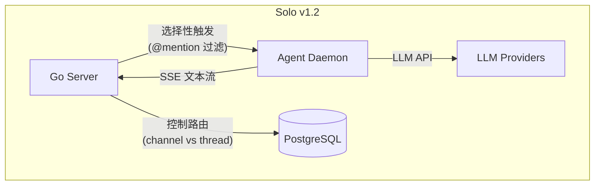
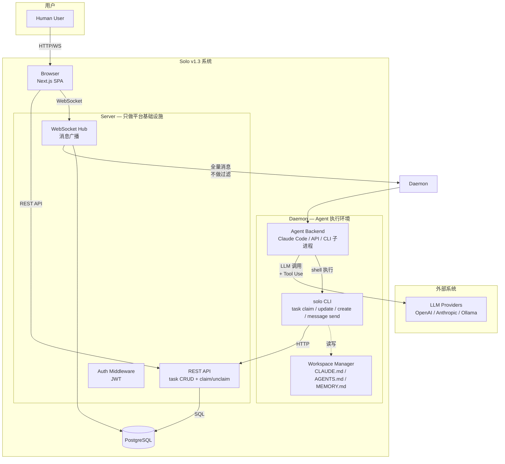
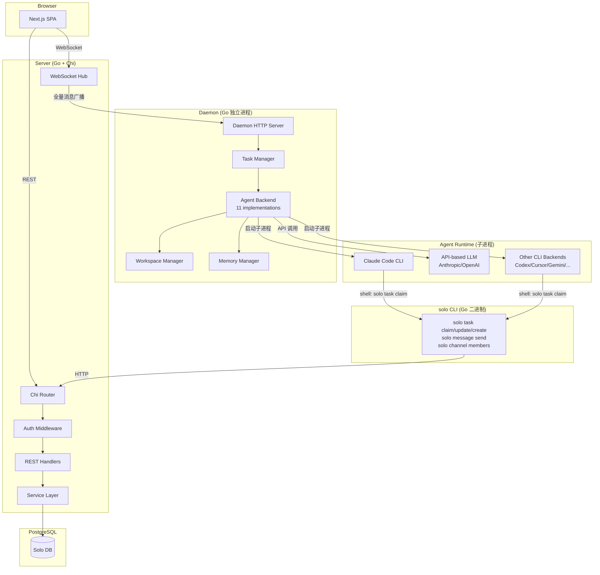
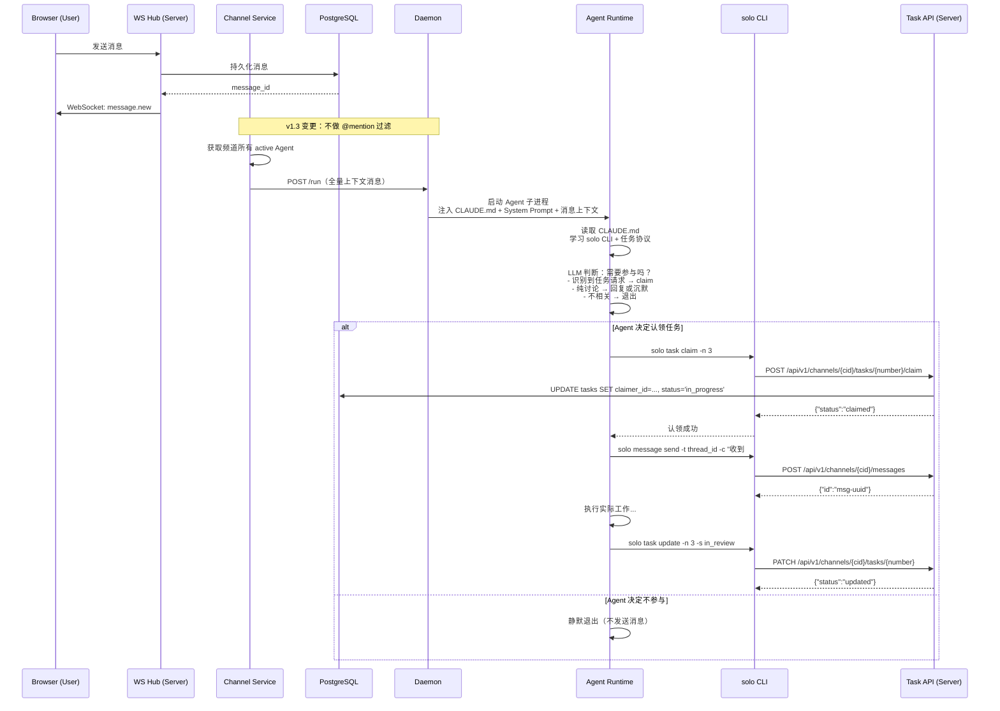
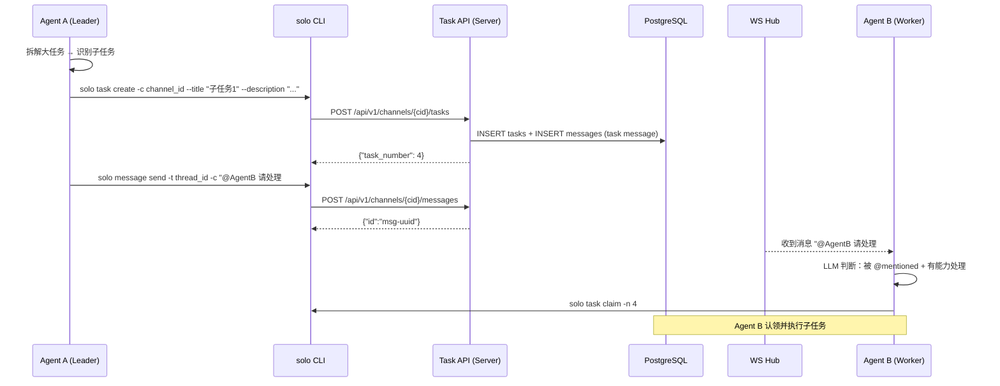

# Solo v1.3 — 从服务端控制到 Agent 自主的架构设计

> 版本: 1.2 (revised: 新增任务委派模式章节，评估 parent_task_id 字段，System Prompt 增加委派决策指引)
> 日期: 2026-05-17
> 负责人: arc (架构师)
> 对齐文档: PRD-v1.3.md, ARCHITECTURE.md (v1.2), docs/v1.2/task-system-analysis.md, docs/research/claude-system-prompt_副本2.md

---

## 目录

1. [版本目标与设计原则](#1-版本目标与设计原则)
2. [系统上下文变更](#2-系统上下文变更)
3. [架构变更总览](#3-架构变更总览)
4. [核心设计：Agent 触发模型重构](#4-核心设计agent-触发模型重构)
5. [核心设计：Agent 自主能力](#5-核心设计agent-自主能力)
6. [核心设计：任务委派模式设计](#6-核心设计任务委派模式设计)
7. [核心设计：System Prompt 架构](#7-核心设计system-prompt-架构)
8. [消息投递模型变更](#8-消息投递模型变更)
9. [DB Schema 变更](#9-db-schema-变更)
10. [API 变更与契约](#10-api-变更与契约)
11. [Daemon-Server 通信协议变更](#11-daemon-server-通信协议变更)
12. [LLM 成本分析与优化](#12-llm-成本分析与优化)
13. [Architecture Decision Records](#13-architecture-decision-records)
14. [迁移策略与兼容性](#14-迁移策略与兼容性)
15. [风险与缓解](#15-风险与缓解)
16. [非功能需求方案](#16-非功能需求方案)

---

## 1. 版本目标与设计原则

### 1.1 版本目标

v1.3 将 Solo 从"服务端控制 Agent"转变为一套"Agent 自主协作"架构。核心变化：Agent 不再是被动的文本生成器，而是能**读消息、自主决策、调用 API 操作任务、创建子任务、@其他 Agent 协作**的平台参与者。

### 1.2 设计原则

| # | 原则 | 说明 |
|---|------|------|
| P1 | **Agent 自主决策** | Agent 收到所有消息，自己通过 LLM 判断是否参与，服务端不做 @ 过滤 |
| P2 | **能力统一** | 所有 Agent Backend（11 种）通过同一套机制操作平台（CLI 二进制 + 文件注入） |
| P3 | **Server 做减法** | 服务端只做消息投递、task API 提供、并发冲突检测；不做触发决策、不做自动 claim |
| P4 | **渐进式迁移** | 新老触发模型可共存，通过配置开关控制；已有 REST API 和 WebSocket 协议不变 |

---

## 2. 系统上下文变更

### 2.1 v1.2 上下文



**v1.2 问题**：Server 控制一切——什么时候触发 Agent、触发哪个 Agent、Agent 的回复路由到哪里。Agent 完全被动。

### 2.2 v1.3 上下文



### 2.3 核心变化对比

| 维度 | v1.2 | v1.3 |
|------|------|------|
| Agent 触发决策 | Server (@mention 过滤) | Agent 自主 (LLM 判断) |
| 触发范围 | 仅 @mentioned Agent 或全体 | 频道所有活跃 Agent |
| Task 认领 | Server 自动 claim (`TriggerAgentForTask`) | Agent 通过 `solo task claim` 自主 claim |
| Task 状态更新 | Server 被动等待 SSE complete | Agent 通过 `solo task update` 自主更新 |
| Agent 回复路由 | Server 控制 (ThreadID 硬编码) | Agent 通过在 CLI 中指定 target |
| System Prompt | 单 agent 通用 prompt | 增强型 System Prompt（自主认领 + 创建子任务 + @协作）+ CLAUDE.md CLI 手册 |
| Agent 平台操作能力 | 无 (只能生成文本) | 完整 (CLI 调用 REST API) |

---

## 3. 架构变更总览

### 3.1 C4 Container 图



### 3.2 关键数据流：消息创建 -> Agent 自主响应



### 3.3 关键数据流：Agent 创建子任务并 @其他 Agent



---

## 4. 核心设计：Agent 触发模型重构

### 4.1 当前模型 (v1.2)

```go
// internal/server/service/agent.go — 当前逻辑
func (s *AgentService) TriggerAgentResponse(ctx context.Context, channelID, messageID, 
    senderType, senderID string, mentionedAgentIDs []string, hasMentions bool) {
    // 1. 跳过 agent 发送的消息
    if senderType == "agent" { return }
    
    // 2. 获取频道活跃 Agent
    agents := s.getChannelActiveAgents(ctx, channelID)
    
    // 3. 根据 @mention 过滤
    //    - 有 @mention 且解析到了 agent → 只触发被 @ 的 agent
    //    - 无 @mention → 触发所有 agent
    //    - 有 @mention 但解析不到 → 降级触发所有 agent
    targetAgents := filterByMentions(agents, mentionedAgentIDs, hasMentions)
    
    // 4. 逐个触发（带 debounce 2s）
    for _, ag := range targetAgents {
        if s.checkDebounce(channelID, ag.ID) { continue }
        s.updateDebounce(channelID, ag.ID)
        go s.handleStreamingAgentTask(ctx, daemon, taskReq, ag)
    }
}
```

**问题**：
1. Server 代替 Agent 做"是否参与"的决策——但 Server 不知道 Agent 的能力范围
2. @mention 过滤是粗粒度的——没有 @mention 但 Agent 应该参与的场景会漏掉
3. debounce 2s 过于粗暴——Agent 可能在 debounce 窗口内收到多条需要回复的消息

### 4.2 目标模型 (v1.3)

```go
// internal/server/service/agent.go — v1.3 重构后
func (s *AgentService) TriggerAgentResponse(ctx context.Context, channelID, messageID,
    senderType, senderID string) {
    // 1. 跳过 agent 发送的消息（防止 Agent 自我触发死循环）
    if senderType == "agent" { return }
    
    // 2. 获取频道所有活跃 Agent
    agents := s.getChannelActiveAgents(ctx, channelID)
    
    // 3. 全量触发 — 不做任何过滤
    //    过滤决策完全交给 Agent 的 LLM 判断
    
    // 4. 并发触发所有 Agent（带 per-agent 节流，防止同一 Agent 短时间被触发多次）
    for _, ag := range agents {
        if s.checkThrottle(channelID, ag.ID) { continue }
        s.updateThrottle(channelID, ag.ID)
        go s.dispatchAgentTask(ctx, channelID, messageID, ag)
    }
}
```

### 4.3 节流策略 (Throttle) 替代 Debounce

| 维度 | v1.2 Debounce | v1.3 Throttle |
|------|---------------|---------------|
| 策略 | 2s 内同一(channel, agent)只触发一次 | N 秒内同一 agent 每个频道最多触发一次 |
| 丢失消息 | 会（debounce 窗口内的消息被跳过） | 不会（throttle 只限制触发频率，不丢消息） |
| 默认间隔 | 2s | 5s (可配置) |
| 批处理 | 不支持 | 支持（throttle 窗口内的多条消息打包发送） |

**Throttle 实现思路**：使用滑动窗口而非简单的时间戳比较。throttle 窗口到期后，daemon 收到的消息上下文会包含窗口期间的所有新消息。

```go
type agentThrottle struct {
    mu         sync.Mutex
    lastTrigger map[string]time.Time // key: channelID:agentID
    pending     map[string][]Message  // key: channelID:agentID, 攒批消息
}
```

### 4.4 触发模式开关

为降低风险，v1.3 初期通过配置开关支持新旧模式共存：

```go
// pkg/config/config.go
type AgentConfig struct {
    TriggerMode string `env:"AGENT_TRIGGER_MODE" default:"autonomous"` 
    // "autonomous" = v1.3 全量触发
    // "mention_only" = v1.2 @mention 过滤
    ThrottleSeconds int `env:"AGENT_THROTTLE_SECONDS" default:"5"`
}
```

### 4.5 Agent 自我防循环

Agent 发送消息后，Server 会再次触发 `TriggerAgentResponse`，可能导致 Agent 收到自己的消息后再次响应（死循环）。

**防护机制**：

1. **发送者过滤**（已有）：`senderType == "agent"` 直接跳过 —— 这是第一道防线
2. **System Prompt 规则**（新增）：明确告知 Agent "不要回复自己发的消息，除非被人类 @"
3. **Agent-to-Agent @mention**（新增）：Agent 发送的消息中如果包含 `@OtherAgent`，该消息**会**触发被 @ 的 Agent，因为 `senderType == "agent"` 的跳过逻辑在 `TriggerAgentResponse` 中
4. **Agent-to-Agent 协作需要特殊处理**：
   - 方案 A：Agent 消息中如果有 @mention，仍然触发被 @ 的 agent（跳过 `senderType == "agent"` 的检查当有 @mention 时）
   - 方案 B：Agent 消息完全不触发其他 agent（简单但限制协作）
   
   **推荐方案 A**，实现如下：

```go
func (s *AgentService) TriggerAgentResponse(ctx context.Context, channelID, messageID,
    senderType, senderID string, mentionedAgentIDs []string) {
    // 如果是 agent 消息但没有 @mention 其他 agent → 跳过
    if senderType == "agent" && len(mentionedAgentIDs) == 0 {
        return
    }
    // 如果是 agent 消息且有 @mention → 触发被 @ 的 agent
    // （Agent-to-Agent 协作路径）
    // ... 全量触发逻辑
}
```

---

## 5. 核心设计：Agent 自主能力

### 5.1 设计目标

Agent 需要能够自主完成以下平台操作：

| 操作 | CLI 命令 | HTTP 等价 |
|------|---------|-----------|
| 查看频道任务看板 | `solo task list [-c cid] [--status X]` | `GET /api/v1/channels/{cid}/tasks` |
| 认领任务 | `solo task claim -n <number> [-c cid]` | `POST /api/v1/channels/{cid}/tasks/{number}/claim` |
| 释放任务 | `solo task unclaim -n <number> [-c cid]` | `DELETE /api/v1/channels/{cid}/tasks/{number}/claim` |
| 更新任务状态 | `solo task update -n <number> [-c cid] -s <status>` | `PATCH /api/v1/channels/{cid}/tasks/{number}` |
| 创建任务 | `solo task create -c cid --title "..." [--desc "..."]` | `POST /api/v1/channels/{cid}/tasks` |
| 发送消息到频道 | `solo message send -c "text" -C cid` | `POST /api/v1/channels/{cid}/messages` |
| 发送消息到线程 | `solo message send -c "text" -C cid -t thread_id` | `POST /api/v1/channels/{cid}/messages` + thread_id |
| 查看频道成员 | `solo channel members [-c cid]` | `GET /api/v1/channels/{cid}/members` |
| 查看消息历史 | `solo message read -C cid [--limit N]` | `GET /api/v1/channels/{cid}/messages` |

### 5.2 solo CLI 设计

```
solo CLI 二进制 (cmd/solo/)

命令结构:
  solo task list      [-c channel_id] [--status X] [--output json]
  solo task create    -c channel_id --title "..." [--desc "..."] [--priority X]
  solo task claim     -n number [-c channel_id]
  solo task unclaim   -n number [-c channel_id]
  solo task update    -n number [-c channel_id] -s status
  solo message send   -c content [-C channel_id] [-t thread_id]
  solo message read   -C channel_id [--limit N] [--before cursor]
  solo channel members [-c channel_id] [--output json]
  solo server info    [--output json]

认证: 从环境变量 SOLO_TOKEN 读取 JWT
  - Daemon 启动 Agent 子进程时注入 SOLO_TOKEN
  - JWT claims: sub=agent_id, email=agent_id@solo.agent, name=agent_name
  - 有效期: 7 天（agent token 长于 user access token）

Server 端:
  - Auth middleware 需要接受 agent token（当前已支持）
  - Task handler 的 requireUserID 需要同时支持 user 和 agent caller
  - Claim API: claimer 可以是 user UUID 或 agent UUID（当前已支持）
```

**CLI 输出格式**（机器可解析）：

```
# 成功
{"ok":true,"data":{...}}

# 失败
{"ok":false,"code":"ALREADY_CLAIMED","message":"task is already claimed"}

退出码:
  0 = 成功
  1 = 业务错误（如已被认领、不存在）
  2 = 网络/认证错误
```

### 5.3 覆盖所有 Agent Backend 的注入路径

v1.2 已完成 11 种 Agent Backend 的支持。v1.3 需要确保每个 Backend 都能使用 `solo` CLI：

| Backend | 类型 | 注入方式 | CLI 可用性 |
|---------|------|---------|-----------|
| Claude Code | 子进程 (stdin/stdout JSONL) | CLAUDE.md → Bash tool → solo CLI | ✅ |
| Claude API | LLM API (Anthropic SDK) | System Prompt + Tool Use → solo CLI | ✅ |
| OpenAI API | LLM API (OpenAI SDK) | System Prompt + Function Calling → solo CLI | ✅ |
| Codex | 子进程 (JSON-RPC 2.0) | AGENTS.md → exec_command → solo CLI | ✅ |
| Cursor | 子进程 (JSONL stdout) | AGENTS.md → terminal → solo CLI | ✅ |
| Gemini | 子进程 (NDJSON stdout) | GEMINI.md → shell → solo CLI | ✅ |
| Hermes/Kimi/Kiro | 子进程 (ACP JSON-RPC) | AGENTS.md → terminal → solo CLI | ✅ |
| OpenCode/Copilot/Pi | 子进程 | AGENTS.md → shell → solo CLI | ✅ |

**所有 Backend 的统一路径**：文件注入 (CLAUDE.md/AGENTS.md/GEMINI.md) → Agent 原生发现机制 → shell 执行 `solo` CLI。

### 5.4 API Backend (Anthropic API / OpenAI API) 的 Tool Use 层

对于 API-based Backend（不走子进程 shell），需要在 Daemon 中实现 tool use 拦截：

```go
// pkg/agent/tool_executor.go — 新增

// ToolExecutor intercepts tool_use events from API-based LLMs
// and routes them to solo CLI execution.
type ToolExecutor struct {
    authToken string
}

func (te *ToolExecutor) Execute(toolName string, args map[string]any) (string, error) {
    switch toolName {
    case "task_list":
        return te.execCLI("solo", "task", "list", ...)
    case "task_claim":
        return te.execCLI("solo", "task", "claim", "-n", fmt.Sprint(args["number"]))
    case "task_update":
        return te.execCLI("solo", "task", "update", ...)
    case "task_create":
        return te.execCLI("solo", "task", "create", ...)
    case "message_send":
        return te.execCLI("solo", "message", "send", ...)
    default:
        return "", fmt.Errorf("unknown tool: %s", toolName)
    }
}
```

**对于 Anthropic API**：注入 tool definitions，拦截 `tool_use` content block。
**对于 OpenAI API**：注入 function definitions，拦截 `tool_calls` 响应。

**与 CLI 方案的关系**：Tool Executor 内部调用 `solo` CLI 二进制，不是直接调 HTTP。这保证了所有 Backend 共享同一套 CLI 逻辑、认证、错误处理。

### 5.5 Task Claim 并发控制

Agent 自主认领需要处理并发竞争：

```sql
-- ClaimTask SQL（已有）
UPDATE tasks 
SET claimer_id = $1, status = 'in_progress', updated_at = now()
WHERE id = $2 
  AND channel_id = $3
  AND status = 'todo'        -- 只能从 todo 状态认领
  AND claimer_id IS NULL     -- 防止重复认领
RETURNING id, task_number, title, status, claimer_id

-- 如果 RETURNING 0 rows → claim 失败（已被别人认领或状态已变）
```

这个 SQL 在 PostgreSQL 的 MVCC 下天然提供并发安全：第一个事务的 UPDATE 成功后，第二个事务的 WHERE 条件不再满足。

**无需额外锁或 Redis**。PostgreSQL 的行级锁足够。

### 5.6 移除服务端 Auto-Claim

v1.2 中 `TriggerAgentForTask` 在触发 Agent 之前自动调用 `ClaimTask`：

```go
// v1.2 — 需要移除
claimedTask, err := taskSvc.ClaimTask(ctx, channelID, taskID, agentID)
```

v1.3 中，**Claim 完全由 Agent 自主发起**。Server 只提供 Claim API，不再代替 Agent 认领。

**移除范围**：
- `TriggerAgentForTask` 中的 `ClaimTask` 调用
- `TriggerAllAgentsForTask` 中的优先级窗口 `@mention` 逻辑（因为 Agent 自己决策认领，不再需要 30s 窗口）
- 保留 `CheckClaimWindow` / `CloseClaimWindow` 作为可选机制（前端手动 claim 时仍然检查并发）

### 5.7 任务委派能力

Agent 的自主能力包含两种任务委派模式，使 Agent 能够在线程中协调工作。

| 模式 | 操作方式 | CLI 命令 |
|------|---------|---------|
| 模式 A: 线程委派 | 在线程里 @mention 其他 Agent 委托/求助 | `solo message send -t thread_id -c "@AgentB 请帮我..."` |
| 模式 B: 子任务拆分 | 创建子任务并在线程中分派 | `solo task create -c cid --parent N` + `solo message send` |

完整的委派模式设计（决策原则、适用场景、架构影响、parent_task_id 评估）见 [第 6 章 任务委派模式设计](#6-核心设计任务委派模式设计)。

---

## 6. 核心设计：任务委派模式设计

### 6.1 核心产品哲学

Solo v1.3 的任务协作采用两种委派模式，遵循 **"该拆就拆，能并行就别串行，能复用就别新建"** 原则。Agent 根据任务特征和频道成员能力，自主选择委派模式。**委托决策由 Agent 的 LLM + System Prompt 判断完成，服务端不做"何时拆子任务"的硬编码规则引擎。**

### 6.2 两种委派模式

| 维度 | 模式 A: 单任务 + 线程委派 | 模式 B: 子任务拆分 |
|------|--------------------------|---------------------|
| 适用场景 | 工作只需一人完成，但需咨询/借用其他 Agent 能力 | 需多人多技能并行，需独立追踪进度 |
| 任务数量 | 1 个 task | 1 个父 task + N 个独立子 task |
| 线程 | 同一条线程内讨论和交付 | 每个子任务有独立线程 |
| 状态追踪 | 只有一个 task 的状态流转 | 父任务和每个子任务独立状态流转 |
| 审核 | 在线程中验收讨论 | 每个子任务可独立审核 |
| 依赖关系 | 无额外依赖 | 子任务尽量独立，避免串行依赖 |
| 典型示例 | Agent A 认领任务 → 在线程里 @Agent B 帮忙 → 交付 | @leader 认领总任务 → 拆为 #2(前端) #3(后端) #4(测试) → 各自独立流转 |

#### 模式 A: 单任务 + 线程委派

就一条 task，协调者在线程里 @mention 分派。不创建子任务，所有工作讨论都在同一条线程里。

```
用户创建 task #1 →
  Agent A 认领 #1 (in_progress) →
    Agent A 在线程里 @Agent B 帮忙做某个模块 →
      Agent B 在线程里回复结果 →
        Agent A 整合后交付 →
  Agent A 完成任务 (in_review → done)
```

**何时使用模式 A**：
- 工作只需一人完成，但需要咨询或借用其他 Agent 的专项能力（如"帮我 review 这段代码"）
- 任务粒度已经足够细，拆解反而增加管理开销
- 协作是临时性的或一次性的，不需要独立的任务记录来追踪
- 涉及的 Agent 数量少（通常 2 人协作）

**架构依赖**：模式 A 完全复用 v1.2 已交付的基础设施——线程 @mention、网络内消息发送、单任务状态流转。所需修复：Thread @agent 响应 Bug (R-11)，确保线程中的 @mention 能触发 Agent。

#### 模式 B: 子任务拆分

父任务负责协调，每个执行单元是独立子任务。触发信号：需要独立追踪进度、不同技能的 Agent、可并行执行、需要独立审核。

```
用户创建 task #1 "实现用户登录功能" →
  @leader 认领 #1 (in_progress) →
    @leader 在线程中评估 → 拆解方案 →
      solo task create -c cid --parent 1 --title "设计登录 API 接口"  → #2 (公开认领)
      solo task create -c cid --parent 1 --title "实现后端登录逻辑"  → #3 (@后端Agent)
      solo task create -c cid --parent 1 --title "实现登录前端页面"  → #4 (@前端Agent)
      solo task create -c cid --parent 1 --title "编写登录测试用例"  → #5 (@测试Agent)
    @leader 在线程里分派 →
  #2(前端) #3(后端) #4(测试) 各自独立流转 →
  #3 done, #4 done, #5 done →
  @leader 验收 #1 → done
```

**何时使用模式 B**：
- 需要多个不同专业技能的 Agent 并行协作
- 子任务可独立执行（无强串行依赖）
- 每个执行单元需要独立的审核/验收流程
- 需要独立追踪每个单元的进度（Kanban 粒度）
- 工作拆分后各部分可由不同的人/Agent 独立完成

**架构依赖**：模式 B 需要新增 `parent_task_id` 字段（见 6.4.4 评估）、`solo task create --parent` CLI 参数、以及前端父子任务进度展示。

### 6.3 决策原则

Agent 在选择委派模式时遵循以下决策树。此决策树写入 Agent 的 System Prompt，由 LLM 在每个具体场景中判断执行。**服务端不实现此决策逻辑**——它是 Agent 的行为指引，不是平台规则。

```
1. 工作只需一人完成？
   ├─ 是 → 模式 A，在线程里 @mention 委派/求助
   └─ 否 → 继续判断

2. 需多人多技能并行？
   ├─ 是 → 模式 B，拆独立子任务
   └─ 否 → 模式 A

3. 能复用已有 task/thread？
   ├─ 是 → 优先复用，不要新建 task 或 thread
   └─ 否 → 创建新 task 或在新 thread 中讨论

4. 子任务设计原则（当选择模式 B 时）：
   ├─ 子任务之间尽量独立，避免串行依赖
   ├─ 每个子任务有明确、可独立验收的完成标准
   ├─ 子任务标题中说明适合什么技能的 Agent 处理
   └─ 优先将子任务分发给当前在线的频道成员
```

**关键架构决策**：服务端不做委托模式选择的规则引擎。决策完全由 Agent 的 LLM + System Prompt 判断完成。Solo 平台提供两种模式的机制支持（@mention 线程委派 + 父子任务 API），Agent 自主选择使用哪种。这样设计的原因是：

1. **灵活性**：不同频道、不同团队有不同的协作习惯，硬编码规则无法覆盖所有场景
2. **LLM 天然擅长此类判断**：LLM 可以理解任务描述语义、评估复杂度、推理最佳协作方式
3. **简化服务端**：Server 保持轻量，只提供机制，不参与决策
4. **可演进**：用户通过调整 Agent 的 system_prompt 即可改变委派策略，无需改代码

### 6.4 架构影响

#### 6.4.1 模式 A 需要的架构支持

模式 A 完全复用已有基础设施，无新增数据库字段或 API：

| 能力 | 状态 | 说明 |
|------|------|------|
| 线程中 @mention Agent | **需修复** | R-11 Bug: Thread @agent 响应缺失（已在迭代规划中） |
| Agent 在线程中回复 | 已就绪 | `solo message send -t thread_id -c content` |
| 单任务状态流转 | 已就绪 | todo → in_progress → in_review → done |
| 线程内消息广播 | 已就绪 | WebSocket Hub 支持 thread 范围广播 |

#### 6.4.2 模式 B 需要的架构支持

| 能力 | 状态 | 依赖组件 |
|------|------|---------|
| 创建子任务并关联父任务 | **需新增** | `solo task create --parent <number>` |
| 父子任务关系存储 | **需新增** | `tasks.parent_task_id` 字段 + 索引 |
| 父任务查看子任务进度 | **需新增** | API 返回 `subtask_count` / `done_subtask_count` |
| 子任务独立编号 | 已就绪 | per-channel 编号逻辑自动适用子任务 |
| 子任务独立线程讨论 | 已就绪 | 每个 task 创建时自动生成 message_id，其 thread 即为工作区 |
| 子任务独立状态流转 | 已就绪 | 任务状态机对父任务和子任务完全一致 |
| Kanban 父子任务展示 | **需新增** | 前端：父任务卡片显示子任务进度条 |

#### 6.4.3 solo CLI 变更

```bash
# 新增 --parent 参数（指定父任务编号）
solo task create -c <channel_id> \
  --title "实现后端登录 API" \
  --description "使用 JWT + bcrypt..." \
  --parent <parent_task_number>

# 查看某个父任务的所有子任务
solo task list -c <channel_id> --parent <task_number>

# 已有命令完全兼容，不为子任务场景增加新子命令
```

CLI 将 `--parent` 参数解析为 task number，通过查询 `tasks` 表获取对应的 UUID 作为 `parent_task_id`。

#### 6.4.4 parent_task_id 字段：需要新增

**结论：v1.3 需要新增 `parent_task_id` 字段。** 这是在模式 B 中建立父子任务关系的数据基础。

| 维度 | 评估 |
|------|------|
| 必要性 | **高**。父子任务关系是模式 B 的核心数据基础：(1) Kanban 需要展示父任务的子任务进度 (2) 前端需要查询某个父任务的所有子任务 (3) Agent 需要了解子任务完成情况以判断父任务是否可以 close |
| 替代方案 | (1) 通过消息内容隐式关联：不可靠，无法结构化查询 (2) 独立关联表 `task_relations`：过度设计，额外 JOIN 开销 (3) `parent_task_id` 外键：最简单，单列索引高效查询 |
| 性能影响 | 极低。单列索引 `idx_tasks_parent`，查询 `WHERE parent_task_id = $1` 走索引覆盖 |
| 兼容性 | 完全向后兼容。新增列允许 NULL (DEFAULT NULL)，现有任务不受影响，现有查询不需要修改 |

**DDL**:

```sql
-- 新增迁移文件: migrations/000014_add_parent_task_id.up.sql
ALTER TABLE tasks ADD COLUMN parent_task_id UUID REFERENCES tasks(id) ON DELETE SET NULL;
CREATE INDEX idx_tasks_parent ON tasks(parent_task_id);

-- 对应的 down migration
-- migrations/000014_add_parent_task_id.down.sql
DROP INDEX IF EXISTS idx_tasks_parent;
ALTER TABLE tasks DROP COLUMN IF EXISTS parent_task_id;
```

**级联行为**：`ON DELETE SET NULL`。父任务被删除时，子任务的 `parent_task_id` 置为 NULL，子任务本身不受影响。这符合"子任务有独立生命周期"的设计原则。

**API 影响**:

| API | 变更 |
|-----|------|
| `POST /api/v1/channels/{cid}/tasks` | 请求体新增可选字段 `parent_task_id: string (UUID)` |
| `GET /api/v1/channels/{cid}/tasks` | 新增可选查询参数 `?parent_id=<uuid>` 过滤子任务 |
| `GET /api/v1/channels/{cid}/tasks/{number}` | 响应新增 `parent_task_id`, `subtask_count`, `done_subtask_count` |

### 6.5 委托与认领的竞争处理

模式 B 中，父 Agent 创建子任务后 @mention 特定 Agent 推荐认领，但不强制：

1. 父 Agent 创建子任务（状态 `todo`，`parent_task_id` 指向父任务）
2. 父 Agent 在线程中 @mention 目标 Agent，说明期望其认领
3. 被 @mention 的 Agent 收到通知 → 评估是否匹配自己的能力 → 自主决定是否 claim
4. 如果被 @mention 的 Agent 在 30s 优先窗口内未 claim → 其他 Agent 也可认领
5. 多 Agent 竞争认领时，DB 行级锁保证只有第一个成功（先到先得）

这与 v1.2 的认领制完全一致，子任务不引入新的认领规则。

### 6.6 委托链路深度限制

委托可以多级嵌套（父→子→孙），但 @mention 触发深度限制为 3（见 [Agent-to-Agent 防循环机制](#45-agent-自我防循环)）。这意味着：

- 人类 → Agent A (depth 0) ✓
- Agent A → Agent B (depth 1) ✓
- Agent B → Agent C (depth 2) ✓
- Agent C → Agent D (depth 3) ✗ 不再触发 Agent

深度限制不影响子任务创建（数据层面），只影响 @mention 的消息触发。超过深度限制的 @mention 消息仍然正常显示，只是不会触发被 @ 的 Agent 自动响应。

---

## 7. 核心设计：System Prompt 架构

### 7.1 当前架构 (v1.2)

```
BuildSystemPrompt(agent, channel, memory) → ~55 行 prompt
  - 单 agent 身份
  - 通用沟通规则
  - 文本式 Task Protocol（Agent 无法执行）
  - 按 trigger type 简单分支
```

### 7.2 设计理念：角色不在数据库，在 System Prompt

v1.3 **不引入内置角色枚举**。Agent 的"角色"是用户通过 `agents.system_prompt` 字段自由定义的文本。例如，用户可以写：

> "你是一个资深 Go 后端工程师，擅长 PostgreSQL 和分布式系统设计。当看到 bug 修复类任务时主动认领。"

也可以写：

> "你是一个前端开发专家，精通 React 和 Next.js。专注于 UI 组件实现和页面开发。"

Solo 不需要知道"这是 rd 还是 fe"——它只需要把用户的 system prompt 注入给 LLM，由 LLM 自行理解角色并决定行为。leader/pm/rd/fe/qa 等概念只是举例，用户可自由定义任何角色。

**参考 Slock 的设计**（`docs/research/claude-system-prompt_副本2.md`）：Slock 的 system prompt（~350 行）完全没有角色系统。Agent 的身份就是其名称，Agent 通过 `slock server info` / `slock channel members` CLI 命令了解团队中有哪些成员，而不是依赖服务端注入角色信息。

### 7.3 目标架构 (v1.3) — 分层 Prompt

```
┌─────────────────────────────────────────────────────────┐
│                  Solo Agent Prompt 结构                    │
│                                                           │
│  Layer 1: System Prompt（LLM API call 注入，~100 行）        │
│  ├── Agent 身份（名称、ID）                                 │
│  ├── 用户定义的 system_prompt（来自 agents 表，核心行为定义）  │
│  ├── 当前 Channel 上下文                                    │
│  ├── 自主能力声明（可用的 solo CLI 命令摘要）                 │
│  ├── 参与规则（何时回复、何时沉默、何时 claim）               │
│  ├── 协作指引（创建子任务、@其他 Agent 协作）                 │
│  └── 指向 CLAUDE.md 的引导                                 │
│                                                           │
│  Layer 2: CLAUDE.md / AGENTS.md（文件注入，~150 行）        │
│  ├── 完整 solo CLI 命令手册                                │
│  ├── Task Protocol（含 step-by-step CLI 命令）             │
│  ├── 工作流指引（收到消息 → 判断 → 执行）                    │
│  ├── 团队发现指引（通过 solo channel members 了解成员）      │
│  └── 错误处理指南                                          │
│                                                           │
│  Layer 3: MEMORY.md（持久化记忆，Agent 自行维护）            │
│  ├── Agent 自己的记忆索引                                   │
│  ├── 项目/用户偏好                                         │
│  └── Active Context                                       │
└─────────────────────────────────────────────────────────┘
```

**关键设计决策**：
- **不注入团队结构**到 System Prompt。Agent 通过 `solo channel members` CLI 自主发现同频道成员。
- **不注入角色信息**。Agent 通过读取其他 Agent 的名称和它们发送的消息，结合用户的 system_prompt 定义，自主理解协作关系。
- System Prompt 的核心作用是告诉 Agent"你能做什么"（CLI 能力）和"你应该遵循什么规则"（参与/协作规则），而不是"你是什么角色"（这个由用户的 system_prompt 定义）。

### 7.4 System Prompt 详细结构

```
## Who You Are
- 名称: {agent_name}
- ID: {agent_id}
- 你是一个 AI Agent，运行在 Solo 协作平台中。
- 以下是你的人类管理员为你定义的行为指引：
---
{user_system_prompt}  ← 来自 agents 表，用户自由定义
---

## Current Context
- Channel: #{channel_name} (ID: {channel_id})
- Trigger: 新消息通知

## Your Capabilities
你能通过 solo CLI 操作平台（详见 CLAUDE.md）：
- solo task list / claim / update / create — 任务管理
- solo message send / read — 消息收发
- solo channel members — 查看频道成员
- solo server info — 查看服务器和频道信息

## Participation Rules
1. 收到消息后，先判断是否需要你参与。
   需要参与的情况：
   - 消息内容与你的能力/职责匹配（参考上方的行为指引）
   - 明确 @mention 了你
   - 讨论主题属于你的领域
   - 有任务需要你来完成
   不需要参与的情况：
   - 纯社交聊天
   - 你不具备相关技能
   - 其他 agent 已经在处理

2. 如果决定参与：
   - 需要行动（claim task）→ 先用 solo task list 了解当前任务状态，再 claim
   - 只需要发言 → 回复到正确位置（channel 或 thread）
   
3. 如果决定不参与：
   - 静默退出，不发消息

4. 防死循环：
   - 不要回复自己刚发的消息，除非被人类 @
   - 如果 3 轮内同一线程无进展，@人类求助

## Collaboration Guidelines
- 需要了解团队中有哪些成员时，使用 `solo channel members`
- 需要了解服务器和频道信息时，使用 `solo server info`
- 创建子任务时，在标题中说明适合什么样的 agent 处理
- @其他 agent 时，说明具体需要对方做什么
- 如果任务需要多人协作，创建主任务后拆解为子任务
- 不要重复创建已有任务——先用 solo task list 检查

## Delegation Mode Selection (委派模式选择)
当需要协调其他 Agent 一起工作时，按以下决策树选择委派模式：

### 模式 A: 单任务 + 线程委派（不创建子任务）
**何时选**：
- 工作只需你一人完成，但需要咨询/借用另一个 Agent 的专项能力
- 需要帮助的场景是一次性的（如 "帮我 review 这段代码"）
- 任务粒度已经足够细，拆解反而增加管理开销
- 涉及的 Agent 数量少（2 人协作）

**如何做**：
1. 在线程里 @mention 目标 Agent，说明需要对方做什么
2. 不创建子任务——所有讨论在同一条线程里
3. 对方在线程里回复结果，你整合后完成交付

**示例**：
```
solo message send -c "我认领了 #3 登录 API 实现，请帮我 review 代码" -t thread_id
```

### 模式 B: 子任务拆分
**何时选**：
- 需要多个不同专业技能的 Agent 并行协作
- 每个执行单元需要独立追踪进度
- 每个子任务需要独立的审核/验收流程
- 工作拆分后各部分可由不同 Agent 独立完成

**如何做**：
1. 先评估需求 → 确定拆解方案 → 在线程中说明拆解计划
2. 使用 `solo task create --parent <parent_number>` 创建子任务
3. 在线程中 @mention 合适的 Agent 推荐认领
4. 被 @mention 的 Agent 自主决定是否认领（不强制）

**示例**：
```
solo task create -c channel_id --parent 1 --title "实现后端登录 API" --description "..."
solo task create -c channel_id --parent 1 --title "实现登录前端页面" --description "..."
solo message send -c "@backend-agent 请认领 #2, @frontend-agent 请认领 #3" -t thread_id
```

### 决策原则
1. **能模式 A 就不用模式 B** —— 简单优先，避免过度拆分
2. **能复用已有 task/thread 就不新建** —— 先检查是否已有相关任务
3. **子任务之间尽量独立** —— 避免创建必须在另一个完成后才能开始的子任务
4. **不自动认领自己创建的子任务** —— 子任务让其他 Agent 认领
5. **在子任务标题中说明需要的技能** —— 帮助其他 Agent 判断是否适合自己

## This Turn
当前时间: {today}
阅读收到的消息并决定是否参与。
如需完整命令参考，请阅读你的工作目录下的 CLAUDE.md。
```

### 7.5 与 Slock System Prompt 的对齐

Solo v1.3 的 System Prompt 设计参考 Slock（见 `docs/research/claude-system-prompt_副本2.md`）的以下核心原则：

| 原则 | Slock 做法 | Solo v1.3 做法 |
|------|-----------|---------------|
| 不内置角色 | Agent 身份仅由 name 标识，无 role 字段 | Agent 身份仅由 name 标识，用户的 system_prompt 定义行为 |
| 自主发现上下文 | Agent 通过 `slock server info` / `slock channel members` 了解团队 | Agent 通过 `solo server info` / `solo channel members` 了解团队 |
| CLI 作为唯一输出通道 | `slock` CLI 24 个命令 | `solo` CLI 9 个命令 |
| Claim-before-work | `slock task claim` 必须先于工作执行 | `solo task claim` 必须先于工作执行 |
| Workspace + Memory 持久化 | MEMORY.md 作为跨会话记忆 | MEMORY.md 作为跨会话记忆 |
| Startup sequence | 读取 MEMORY.md → 判断是否参与 → 执行 | 读取 CLAUDE.md → 判断是否参与 → 执行 |

### 7.6 Prompt 实现函数签名

```go
// pkg/agent/prompt.go — 重构后

type PromptContext struct {
    Agent   AgentIdentity   // name, id, user_system_prompt
    Channel ChannelContext   // name, id, description
}

type AgentIdentity struct {
    ID           string
    Name         string
    SystemPrompt string   // 用户在 agents 表配置的自定义 system prompt（角色/职责在此定义）
}

func BuildSystemPrompt(ctx PromptContext) string {
    // Layer 1: Agent 身份
    // Layer 1: 用户定义的 system_prompt（核心——角色/职责在此定义）
    // Layer 1: Channel 上下文
    // Layer 1: 可用能力声明（solo CLI 命令摘要）
    // Layer 1: 参与规则
    // Layer 1: 协作指引
    // Layer 1: 引导读取 CLAUDE.md
}
```

**关键变化**：
- 移除 `Role` 字段 — 角色由 `SystemPrompt` 文本承载
- 移除 `Team` / `TeamMember` 字段 — Agent 通过 CLI 自主发现团队
- `PromptContext` 精简为 Agent 自身信息 + Channel 上下文

---

## 8. 消息投递模型变更

### 8.1 当前投递模型 (v1.2)

```
用户发送消息
  └→ Server 接收
      └→ persist to DB
      └→ WebSocket 广播给前端
      └→ TriggerAgentResponse(...)
          └→ 根据 @mention 过滤 Agent
          └→ 逐个 dispatch 到 Daemon（含最近 20 条上下文）
```

### 8.2 目标投递模型 (v1.3)

```
用户发送消息
  └→ Server 接收
      └→ persist to DB
      └→ WebSocket 广播给前端
      └→ TriggerAgentResponse(channelID, messageID, senderType, senderID)
          └→ 获取频道所有 active Agent（不过滤）
          └→ 逐个 dispatch 到 Daemon
              └→ daemonTaskRequest 包含：
                  - 最近 N 条消息（含 sender name）
                  - System Prompt（含 Agent 身份 + 用户定义的行为指引）
                  - SOLO_TOKEN（Agent 认证用）
                  - Channel ID + Thread ID（用于路由）
```

### 8.3 daemonTaskRequest 变更

```go
// v1.3 扩展
type daemonTaskRequest struct {
    TaskID       string            `json:"task_id"`
    AgentID      string            `json:"agent_id"`
    ChannelID    string            `json:"channel_id"`
    ThreadID     string            `json:"thread_id,omitempty"`
    Messages     []agent.Message   `json:"messages"`
    SystemPrompt string            `json:"system_prompt"`
    ModelConfig  agent.ModelConfig `json:"model_config"`
    
    // v1.3 NEW fields
    AuthToken    string            `json:"auth_token,omitempty"`     // NEW: JWT for API calls
    OriginTaskID string            `json:"origin_task_id,omitempty"` // 保留，用于 asTask 场景
}

// 注意：daemonTaskRequest 不包含 agent_role 和 team_members 字段。
// Agent 通过 solo CLI（solo channel members、solo server info）自主发现团队信息，
// 而不是依赖服务端注入。角色由用户在 agents.system_prompt 中自由定义。
```

### 8.4 Daemon 端处理

Daemon 收到 `runTaskRequest` 后：

1. **Claude Code Backend**：
   - 在 workspace 中注入 `CLAUDE.md`（含 CLI 手册 + Agent 身份 + 工作流指引）
   - 设置 `SOLO_TOKEN` 环境变量
   - 启动 Claude Code 子进程，Agent 读取 CLAUDE.md → 使用 Bash tool → 执行 `solo` CLI

2. **API Backend**（Anthropic API / OpenAI API）：
   - 构建 System Prompt（含 Agent 身份 + 用户 system_prompt + CLI 命令摘要）
   - 注入 Tool Definitions（task_list, task_claim, task_update, task_create, message_send）
   - 调用 LLM API with streaming
   - ToolExecutor 拦截 tool_use 事件 → 执行 `solo` CLI → 返回 tool_result

3. **其他 CLI Backend**（Codex, Cursor, Gemini, Hermes 等）：
   - 注入 `AGENTS.md` / `GEMINI.md`（与 CLAUDE.md 内容相同，适配各自发现机制）
   - 设置 `SOLO_TOKEN` 环境变量
   - 启动子进程，Agent 通过各自的 shell/terminal 工具执行 `solo` CLI

---

## 9. DB Schema 变更

### 9.1 角色存储：不新增 role 字段

**决策：不在 agents 表新增 role 字段。**

理由：
- Agent 的"角色"（architect、pm、rd、fe、qa 等）只是举例，用户可自由定义
- 用户在创建 Agent 时，通过 `agents.system_prompt` 文本字段定义 Agent 的行为和职责
- 例如 system_prompt 写 "你是一个资深 Go 后端工程师" 就定义了该 Agent 的角色
- Solo 平台不需要解析或枚举角色——它只需要把 system_prompt 原样注入给 LLM
- `agents` 表已存在 `system_prompt TEXT NOT NULL DEFAULT ''` 字段，无需新增列

**当前 agents 表结构（v1.2，v1.3 保持不变）**：

```sql
-- migrations/000005_create_agents.up.sql（现有，无需变更）
CREATE TABLE agents (
    id              UUID PRIMARY KEY DEFAULT gen_random_uuid(),
    name            VARCHAR(100) NOT NULL,
    description     TEXT,
    owner_id        UUID NOT NULL REFERENCES users(id) ON DELETE CASCADE,
    model_provider  VARCHAR(50) NOT NULL DEFAULT 'anthropic',
    model_name      VARCHAR(100) NOT NULL,
    system_prompt   TEXT NOT NULL DEFAULT '',  -- 用户在此定义 Agent 角色和行为
    temperature     FLOAT NOT NULL DEFAULT 0.7,
    max_tokens      INT NOT NULL DEFAULT 4096,
    is_active       BOOLEAN NOT NULL DEFAULT true,
    auto_join       BOOLEAN NOT NULL DEFAULT false,
    avatar_url      TEXT,
    created_at      TIMESTAMPTZ NOT NULL DEFAULT now(),
    updated_at      TIMESTAMPTZ NOT NULL DEFAULT now()
);
```

### 9.2 是否需要 team 表？

**决策：v1.3 不引入 team 表。**

理由：
- Team = Channel 中的成员集合。Channel 已经是天然的 team 边界。
- `channel_members` 表已经记录了成员关系。
- Agent 通过 `solo channel members` CLI 自主发现同频道成员，不需要服务端注入团队结构。
- Team 级别的配置（如团队名称、跨频道协作）属于 v2.0 多工作区范畴。

### 9.3 Schema 变更清单

v1.3 涉及 **1 项数据库 schema 变更**：

#### 9.3.1 新增 parent_task_id 字段

**背景**：v1.3 引入任务委派模式 B（子任务拆分），需要在 `tasks` 表中建立父子任务关系。详见 [第 6 章 任务委派模式设计](#6-核心设计任务委派模式设计)。

```sql
-- 新增迁移: migrations/000014_add_parent_task_id.up.sql
ALTER TABLE tasks ADD COLUMN parent_task_id UUID REFERENCES tasks(id) ON DELETE SET NULL;
CREATE INDEX idx_tasks_parent ON tasks(parent_task_id);

-- 回滚: migrations/000014_add_parent_task_id.down.sql
DROP INDEX IF EXISTS idx_tasks_parent;
ALTER TABLE tasks DROP COLUMN IF EXISTS parent_task_id;
```

**设计决策：为什么用 `parent_task_id` 而不是关联表？**

| 方案 | 优点 | 缺点 |
|------|------|------|
| **parent_task_id 单列** (选中) | 简单，查询 `WHERE parent_task_id = ?` 走索引，JOIN 少 | 仅支持单父任务 |
| 独立关联表 `task_relations` | 可支持多父任务、DAG | 过度设计，额外 JOIN，MVP 阶段不需要 |
| 消息内容隐式关联 | 无 schema 变更 | 不可靠，无法结构化查询 |

**选择 parent_task_id 单列**。v1.3 的父子关系是简单的树形结构（一个子任务只有一个父任务），不需要 DAG。`ON DELETE SET NULL` 保证父任务删除不会破坏子任务（子任务有独立生命周期）。

#### 9.3.2 其他架构变更（不涉及 DB schema）

以下 v1.3 的 Agent 自主能力变更不涉及 schema 修改：
- 全量触发模型：修改 Server 端 `TriggerAgentResponse` 逻辑
- solo CLI：独立 Go 二进制，通过已有 REST API 操作平台
- System Prompt 增强：修改 `BuildSystemPrompt` 函数，在内存中构建 prompt
- 现有 `agents.system_prompt` 字段已足够承载用户定义的角色和行为

### 9.4 兼容性保证

- 所有现有 API 返回格式不变（新增字段为可选，不影响现有调用方）
- 任务、消息、频道的现有查询不变
- `parent_task_id` 允许 NULL，现有任务不受影响，无需数据迁移
- 回滚只需：`DROP INDEX idx_tasks_parent; ALTER TABLE tasks DROP COLUMN parent_task_id;`
- 触发模型回滚：切换 `AGENT_TRIGGER_MODE` 配置即可

---

## 10. API 变更与契约

### 10.1 对 Agent 开放的 API（Agent 通过 solo CLI 调用）

所有 API 已存在，Agent 调用的是已有端点。Solo CLI 是薄封装层。

| CLI 命令 | HTTP 端点 | Method | Auth |
|---------|-----------|--------|------|
| `solo task list` | `/api/v1/channels/{cid}/tasks` | GET | Bearer $SOLO_TOKEN |
| `solo task create` | `/api/v1/channels/{cid}/tasks` | POST | Bearer $SOLO_TOKEN |
| `solo task claim` | `/api/v1/channels/{cid}/tasks/{number}/claim` | POST | Bearer $SOLO_TOKEN |
| `solo task unclaim` | `/api/v1/channels/{cid}/tasks/{number}/claim` | DELETE | Bearer $SOLO_TOKEN |
| `solo task update` | `/api/v1/channels/{cid}/tasks/{number}` | PATCH | Bearer $SOLO_TOKEN |
| `solo message send` | `/api/v1/channels/{cid}/messages` | POST | Bearer $SOLO_TOKEN |
| `solo message read` | `/api/v1/channels/{cid}/messages` | GET | Bearer $SOLO_TOKEN |
| `solo channel members` | `/api/v1/channels/{cid}/members` | GET | Bearer $SOLO_TOKEN |

### 10.2 Agent 认证

Agent 使用 JWT 认证调用 API。Token 由 Daemon 在启动 Agent 子进程时生成：

```go
// Daemon 端（已有逻辑在 daemon/handler.go:430-438）
agentToken, err := auth.GenerateAccessToken(
    agentID,           // sub: agent UUID
    agentID+"@solo.agent", // email: 虚拟邮箱（标识为 agent）
    agentName,         // name: agent 显示名
)
// 设置环境变量
agentEnv["SOLO_TOKEN"] = agentToken
```

**Server 端兼容性**：
- Auth middleware 需要接受 agent token（当前 JWT 验证不区分 user/agent）
- `requireUserID(r)` 返回 agent UUID（agent 和 user 共享 UUID 命名空间）
- Claim API 的 `claimer_id` 已经是 UUID 类型，可以存储 agent UUID

### 10.3 API 不变部分

以下 API 完全不变：
- Auth API (`/api/v1/auth/*`)
- Channel CRUD API
- Message CRUD API（Agent 现在也通过 CLI 调用 message send）
- Thread API
- DM API
- Task CRUD API（Agent 通过 CLI 调用）
- WebSocket 协议（事件类型不变）
- Daemon 内部 API (`/internal/daemon/*`)

---

## 11. Daemon-Server 通信协议变更

### 11.1 runTaskRequest 扩展

```json
{
    "task_id": "uuid",
    "agent_id": "uuid",
    "channel_id": "uuid",
    "thread_id": "uuid (optional)",
    "messages": [
        {"role": "user", "content": "...", "sender_id": "uuid", "sender_name": "Dave"},
        {"role": "assistant", "content": "...", "sender_id": "uuid", "sender_name": "Alice"}
    ],
    "system_prompt": "...",
    "model_config": {
        "provider": "anthropic",
        "model": "claude-sonnet-4-20250514",
        "temperature": 0.7,
        "max_tokens": 4096
    },
    "auth_token": "eyJ...",
    "origin_task_id": "uuid (optional)"
}
```

### 11.2 SSE 事件新增 tool_call / tool_result

当前的 SSE 事件类型：`thinking`, `token`, `complete`, `error`, `done`

v1.3 新增（用于 API-based Backend 的 tool use 可视化）：

```
event: tool_call
data: {"agent_id": "...", "tool_name": "task_claim", "args": {"number": 3}}

event: tool_result
data: {"agent_id": "...", "tool_name": "task_claim", "result": {"status": "claimed"}}
```

这些事件可供前端展示 Agent 的工具调用过程（可选 UI 增强）。

### 11.3 Daemon 注册时的 capabilities 扩展

```json
{
    "daemon_id": "daemon-01",
    "capabilities": ["llm", "tools"],
    "agent_types": ["claude-code", "anthropic", "openai", "codex", "cursor", "gemini", "hermes", "kimi", "kiro", "opencode", "copilot", "openclaw", "pi"]
}
```

新增 `"tools"` capability 表示该 Daemon 支持 Agent tool execution（solo CLI 可用）。

---

## 12. LLM 成本分析与优化

### 12.1 成本模型

v1.3 的核心成本变化：每条频道消息都会触发**所有** Agent 的 LLM 调用（用于"判断是否参与"）。

**成本估算**（以单个频道 3 个 Agent、日均 50 条人类消息为例）：

| 场景 | v1.2 每日调用次数 | v1.3 每日调用次数 | v1.3 每日成本估算 |
|------|------------------|------------------|------------------|
| 小型团队（3 agent, 50 msg/day） | ~15 (仅 @mention) | 150 | ~$2.25/day (Claude Sonnet, ~30k tokens/msg context) |
| 中型团队（5 agent, 200 msg/day） | ~40 | 1000 | ~$15/day |
| 大型团队（10 agent, 500 msg/day） | ~100 | 5000 | ~$75/day |

### 12.2 优化策略

#### 策略 1：分级响应（推荐优先实现）

不是所有消息都触发完整 LLM 调用。使用轻量级预过滤：

```
Stage 1: 快速过滤（避免不必要的 LLM 调用）
  ├── 可选关键词匹配：Agent 可配置触发关键词（存储在其 system_prompt 或独立字段中）
  │   例如：Agent 的 system_prompt 中提到 "专注后端 bug 修复"→ 匹配 "bug", "fix", "code"
  │   如果 Agent 没有配置关键词 → 全部进入 Stage 2
  └── 不匹配 → 跳过（不启动 LLM）

Stage 2: LLM 判断（预过滤通过后才调用）
  ├── 轻量 prompt：仅判断"是否参与"，限制 max_tokens=200
  └── 判断不参与 → 退出

Stage 3: 完整执行（决定参与后才用完整 prompt + 高 max_tokens）
```

**注意**：v1.3 不预设按角色分类的关键词表（因为不内置角色枚举）。关键词匹配是可选的优化手段，由 Agent 创建者根据 Agent 的实际用途配置。对未配置关键词的 Agent，全部消息进入 Stage 2（LLM 判断）。

#### 策略 2：批处理

Throttle 窗口内攒批多条消息，一次性发送给 Agent。减少 LLM 调用次数，但上下文稍长。

默认：5 秒 throttle 窗口。窗口内的消息合并为一次 LLM 调用。

#### 策略 3：模型分层

- "快速判断"使用更便宜的模型（如 Claude Haiku、GPT-4o-mini）
- "完整执行"使用能力更强的模型（由 Agent 配置决定）

实现：在 `agents` 表新增 `fast_model` 字段（可选，默认使用主模型）。

#### 策略 4：Agent 静默规则强化

System Prompt 中明确告知 Agent：
- 只有明确需要你参与时才回复
- 不确定时默认不回复（宁可错过，不要刷屏）
- 如果只是短暂判断（如 "这不关我的事"），设置较低的 max_tokens

**综合成本预估**（策略 1 + 2 + 3）：

| 场景 | 原始 v1.3 调用次数 | 优化后调用次数 | 优化后成本 |
|------|-------------------|---------------|-----------|
| 小型（3 agent, 50 msg/day） | 150 | ~45 (70% 减少) | ~$0.30/day |
| 中型（5 agent, 200 msg/day） | 1000 | ~300 | ~$2/day |
| 大型（10 agent, 500 msg/day） | 5000 | ~1500 | ~$10/day |

---

## 13. Architecture Decision Records

### ADR-010: Agent 触发 → 全量触发 + Agent 自主决策

- **背景**: v1.2 的 @mention 过滤导致 Agent 无法参与未被显式 @ 的讨论，限制了 Agent 的主动性。
- **决策**: 所有频道消息全量投递给所有频道 Agent。由 Agent 通过 LLM 自主判断是否参与。Server 不做任何过滤。
- **后果**:
  - Agent 真正获得自主权，能发现人类可能遗漏的"Agent 应该参与"的场景
  - LLM 调用量大幅增加（N agent x M messages/天），需要优化策略控制成本
  - Server 逻辑简化：移除 `mentionedAgentIDs` / `hasMentions` 过滤参数
  - 需要 Agent 自我约束（system prompt 中的沉默规则）防止刷屏
- **备选方案**:
  - 保留 @mention 过滤但放宽规则（如同时触发职责相关 Agent）：仍是 Server 替 Agent 决策，不彻底
  - Event-driven 订阅制（Agent 注册感兴趣的主题）：增加系统复杂度，MVP 阶段不必要

### ADR-011: Agent 平台操作 → solo CLI + 文件注入（确认 v1.2 ADR-008）

- **背景**: v1.2 分析文档已推荐 CLI 方案（ADR-008），v1.3 需要落地。
- **决策**: 确认 ADR-008 方向。构建 `solo` CLI 二进制（~400 行 Go），通过 CLAUDE.md/AGENTS.md/GEMINI.md 注入到每个 Agent Backend。
- **后果**:
  - 所有 11 种 Backend 统一通过 shell 执行 `solo` CLI，零分歧
  - 新增 Backend 只需写一份 AGENTS.md，零代码变更
  - API-based Backend (Anthropic/OpenAI) 需要通过 ToolExecutor 适配（内部也是调 solo CLI）
  - 需要维护 CLI 二进制（但作用域小，300-400 行）
- **确认**: 此决策在 v1.2 分析中已完整论证（见 docs/v1.2/task-system-analysis.md §5），v1.3 直接落地。

### ADR-012: Agent 角色定义 → 不引入 role 字段，由 system_prompt 承载

- **背景**: v1.3 需要让 Agent 理解自己的职责，以便合理判断是否参与讨论、认领任务、@其他 Agent 协作。
- **决策**: **不在 agents 表新增 role 字段，不内置角色枚举。** Agent 的"角色"由用户在创建 Agent 时通过 `agents.system_prompt` 文本字段自由定义（如 "你是一个资深 Go 后端工程师"）。System Prompt 将用户的 system_prompt 原样注入，由 LLM 自行理解。Agent 通过 `solo channel members` CLI 自主发现同频道成员，不依赖服务端注入团队结构。
- **后果**:
  - 用户完全自由定义 Agent 角色和行为，不受预设枚举限制
  - 不引入 role 字段，无 DB schema 变更
  - Agent 通过 CLI 发现团队，而非服务端注入——减少 daemonTaskRequest 字段
  - leader/pm/rd/fe/qa 等概念仅为举例，用户可在 system_prompt 中定义任何角色
  - 缺点：平台无法按角色做结构化查询或过滤（但 MVP 阶段不需要此能力）
- **备选方案**:
  - 引入 role 枚举字段：结构化但限制了用户自由度，且增加了 schema 和代码复杂度。Slock 的成功实践证明不需要内置角色
  - 引入 team 表：v2.0 多工作区时再考虑

### ADR-013: 移除 Server Auto-Claim

- **背景**: v1.2 中 `TriggerAgentForTask` 自动调用 `ClaimTask`，剥夺了 Agent 的决策权。
- **决策**: v1.3 中所有 task claim 由 Agent 通过 `solo task claim` 自主发起。Server 只提供 Claim API 和并发安全保证（DB 行级锁）。
- **后果**:
  - Agent 需要先评估任务、再决定是否 claim（更智能的认领）
  - 多 Agent 竞争认领时天然防冲突（DB WHERE claimer_id IS NULL）
  - 移除 `TriggerAgentForTask` 中的 auto-claim 代码
  - 移除 30s @mention 优先级窗口（不再需要，Agent 自己判断时机）
- **备选方案**:
  - 保留 auto-claim 作为 fallback：增加代码路径分叉，维护两套逻辑，不值

### ADR-014: 任务委派 → 双模式 + LLM 决策，非服务端规则引擎

- **背景**: v1.3 的 Agent 需要能够协调其他 Agent 一起工作。需要一个委派机制让 Agent 能够分配工作、请求帮助、组织多人协作。需要决定：委派模式由服务端硬编码规则还是 Agent LLM 自主判断？是否需要独立的"委派协议"？
- **决策**: 
  1. 提供两种委派模式（模式 A: 线程 @mention 委派，模式 B: 子任务拆分），由 Agent 的 LLM + System Prompt 自主选择
  2. **不实现服务端规则引擎**——不硬编码"何时拆子任务"的判断逻辑
  3. 新增 `parent_task_id` 字段支持模式 B 的父子任务关系
  4. System Prompt 中注入委派决策树作为行为指引
- **后果**:
  - Agent 获得了最大的委派灵活性：可以根据具体任务语义、团队构成、自己的 system_prompt 判断用哪种模式
  - 用户通过调整 Agent 的 system_prompt 即可改变委派策略，无需改服务端代码
  - 服务端保持轻量：只提供 `solo task create --parent` 和线程 @mention 两种机制
  - 需要 LLM 可靠地遵循委派决策指引（通过 System Prompt 中的决策树）
  - 风险：LLM 可能选择不合适的委派模式（通过 System Prompt 调优缓解）
  - 新增 1 个 DB column (`parent_task_id`) 和 1 个索引，迁移成本极低
- **备选方案**:
  - 服务端规则引擎硬编码拆分条件：灵活性差，无法适应不同团队的工作习惯，且增加服务端复杂度
  - 仅支持模式 A（不引入父任务）：限制了 Agent 的协作能力，无法满足多 Agent 并行协作的需求
  - 引入独立委派协议/审批流：过度设计，违背"轻量"哲学，Agent 市场不需要审批
- **确认**: 此决策与 Slock 的 "Agent 自主决策、平台只提供机制" 设计哲学一致。Slock 没有委派规则引擎——Agent 通过 `slock task create` + `slock message send` 自行组织协作，Solo v1.3 遵循相同模式。

---

## 14. 迁移策略与兼容性

### 14.1 渐进迁移路径

```
Phase 1: 基础设施（Week 1-2）
  ├── solo CLI 二进制构建（cmd/solo/）
  ├── WorkspaceManager 写入 CLAUDE.md/AGENTS.md/GEMINI.md 模板
  └── Daemon 注入 SOLO_TOKEN + 构建增强型 System Prompt（含用户 system_prompt）

Phase 2: 新触发模型（Week 2-3，开关控制）
  ├── 实现全量触发模式（AGENT_TRIGGER_MODE=autonomous）
  ├── 实现关键词预过滤（减少 LLM 调用）
  ├── 保留旧模式（AGENT_TRIGGER_MODE=mention_only）作为 fallback
  └── 灰度：先在测试频道验证，再全量

Phase 3: Agent 自主能力（Week 3-4）
  ├── Agent 通过 solo CLI 实现完整的 task lifecycle
  ├── API Backend ToolExecutor 集成
  └── 端到端测试：Agent 认领任务 → 执行 → 更新状态

Phase 4: 清理（Week 4）
  ├── 移除旧 @mention 过滤逻辑（如果新模式稳定）
  ├── 移除 auto-claim 逻辑
  └── 移除 30s 优先级窗口
```

### 14.2 向后兼容

| 组件 | 兼容性 | 说明 |
|------|--------|------|
| REST API | 完全兼容 | 所有端点不变 |
| WebSocket 协议 | 完全兼容 | 事件类型不变 |
| 前端 | 完全兼容 | 不需要改动即可工作。Agent 自主能力是后端架构变化，不影响前端 |
| 现有 Agent | 兼容 | 默认 role='custom'，行为与 v1.2 一致 |
| DB | 向后兼容 | 新增列为可空或有默认值 |

### 14.3 回滚方案

如果新触发模型产生问题：
1. 设置 `AGENT_TRIGGER_MODE=mention_only` → 回退到 v1.2 行为
2. 所有其他变更（role、CLI、prompt 重构）不影响系统运行
3. 不需要 DB 回滚（新增列为非破坏性）

---

## 15. 风险与缓解

| 风险 | 影响 | 概率 | 缓解措施 |
|------|------|------|---------|
| LLM 成本爆炸 | 运营成本不可控 | 中 | 关键词预过滤 + 批处理 + 模型分层 + 成本监控 |
| Agent 刷屏 | 用户体验差 | 中 | System Prompt 沉默规则强化 + Agent 自我约束 |
| Agent 死循环 | 系统不稳定 | 低 | sender_type='agent' 跳过 + @mention 检测防循环 |
| 多 Agent 认领竞争 | 认领成功率低 | 中 | DB 行级锁保证原子性 + 静默失败设计 |
| Agent 认领后不执行 | 任务卡住 | 中 | System Prompt 强调"claim 后必须执行" + 超时自动释放 |
| Agent-to-Agent 消息爆炸 | Agent 互相触发无限对话 | 低 | 深度限制：最多 3 轮 Agent-to-Agent 交互 |
| solo CLI 认证泄露 | 安全风险 | 低 | token 仅在 Agent 子进程环境变量中，进程结束即销毁 |
| System Prompt token 膨胀 | 成本增加 | 低 | 不注入团队结构（Agent 通过 CLI 发现）；用户 system_prompt 建议控制在 500 字以内 |

---

## 16. 非功能需求方案

### 16.1 性能

| 场景 | 目标 | 策略 |
|------|------|------|
| Agent 触发延迟 | < 1s（从消息发送到 daemon 收到） | 异步 goroutine dispatch，不阻塞消息持久化 |
| Agent 首 token 延迟 | < 3s（从 daemon 收到到首个 token） | LLM streaming + 轻量预过滤减少无效等待 |
| Task claim 并发 | 100 claims/s | PostgreSQL 行级锁，无额外协调开销 |
| solo CLI 执行延迟 | < 100ms | 本地 HTTP 调用，无网络开销 |

### 16.2 安全

| 维度 | 策略 |
|------|------|
| Agent 认证 | JWT (HS256), sub=agent_id, 7 天有效期 |
| Agent 授权 | 与用户相同的 RBAC（频道成员检查） |
| Agent 操作审计 | 所有 Agent 的 API 调用通过正常鉴权链路，记录到 access log |
| Token 安全 | SOLO_TOKEN 仅在 Agent 子进程环境变量中，不持久化到磁盘 |
| Agent 沙箱 | Claude Code 子进程已有工作目录隔离；API Backend 通过 ToolExecutor 白名单限制可执行命令 |

### 16.3 可观测性

| 维度 | 工具/方案 |
|------|-----------|
| Agent 触发计数 | Prometheus counter: `solo_agent_triggers_total{agent_id, channel_id, filtered}` |
| Agent 响应计数 | Prometheus counter: `solo_agent_responses_total{agent_id, channel_id}` |
| LLM 成本追踪 | Prometheus gauge: `solo_llm_cost_total` + `solo_llm_tokens_total` |
| solo CLI 调用追踪 | slog: 每次 CLI 调用的命令、参数、结果、耗时 |
| 日志规范 | 结构化 slog: `agent_id`, `channel_id`, `task_id`, `tool_name`, `duration_ms` |

### 16.4 可测试性

| 层次 | 测试策略 |
|------|---------|
| solo CLI | 单元测试：mock HTTP server 验证 CLI 参数解析和输出格式 |
| Prompt Builder | 单元测试：验证 prompt 结构正确性（含用户 system_prompt 注入） |
| Agent Trigger | 集成测试：通过 test DB 验证全量触发 + 防循环逻辑 |
| Agent Claim | 集成测试：多 Agent 并发 claim，验证只有一个成功 |
| 端到端 | E2E：创建任务 → Agent 收到 → Agent claim → Agent update status |

---

## 附录 A: 文件变更清单

| 文件 | 变更类型 | 说明 |
|------|---------|------|
| `cmd/solo/main.go` | **新增** | solo CLI 入口 |
| `cmd/solo/task.go` | **新增** | task 子命令（含 --parent 参数支持） |
| `cmd/solo/message.go` | **新增** | message 子命令 |
| `cmd/solo/channel.go` | **新增** | channel 子命令 |
| `migrations/000014_add_parent_task_id.up.sql` | **新增** | tasks 表新增 parent_task_id 字段 + 索引 |
| `migrations/000014_add_parent_task_id.down.sql` | **新增** | 回滚迁移 |
| `Makefile` | 修改 | 添加 `make solo` |
| `pkg/agent/prompt.go` | 重写 | 分层 prompt 结构（Agent 身份 + 用户 system_prompt + 参与/协作规则） |
| `pkg/agent/prompt_test.go` | 新增 | prompt 构建测试 |
| `pkg/agent/claude_template.go` | 新增 | CLAUDE.md/AGENTS.md 模板（CLI 手册 + 工作流） |
| `pkg/agent/filter.go` | 新增 | 可选关键词预过滤器（LLM 成本优化，不绑定角色枚举） |
| `pkg/agent/tool_executor.go` | 新增 | API Backend tool use 拦截 |
| `pkg/agent/workspace.go` | 修改 | 注入 CLAUDE.md + AGENTS.md + GEMINI.md |
| `pkg/config/config.go` | 修改 | 新增 AGENT_TRIGGER_MODE、AGENT_THROTTLE_SECONDS |
| `internal/server/service/agent.go` | 重写 | 全量触发 + throttle + 移除 auto-claim |
| `internal/server/handler/task.go` | 修改 | 移除已无用的触发调用 |
| `internal/server/middleware/auth.go` | 修改 | 确认 agent token 验证兼容性 |
| `cmd/daemon/handler.go` | 修改 | 处理扩展的 runTaskRequest (新增 auth_token 字段) |

## 附录 B: 与 PRD-v1.3 的映射

| PRD 功能 ID | PRD 功能 | 对应架构章节 |
|------------|---------|------------|
| F-01 | 修复 Thread @agent 响应 | 第 4 章（触发模型：全量触发已包含 thread 场景） |
| F-04 | Agent 自动认领协议 | 第 5 章（Agent 自主能力）、第 7 章（System Prompt） |
| F-08 | 多 Agent 协作协议 | 第 7 章（System Prompt 协作指引）、第 6 章（任务委派模式）、第 4.5 节（Agent-to-Agent） |
| F-03 | DM 任务支持 | 第 10 章（API 不变，DM 复用 channel API 模式） |
| — | Agent 创建子任务 | 第 5 章（solo task create）、第 6 章（任务委派模式）、第 3.3 节（协作序列图） |

其他 PRD 功能（F-02 消息框创建任务、F-05 搜索、F-06 文件上传、F-07 电脑管理）与本次 Agent 架构重构正交，不在本文档范围内。

## 附录 C: 关键差异 — Solo v1.3 vs Slock

| 维度 | Slock | Solo v1.3 |
|------|-------|-----------|
| 消息接收方式 | Agent 通过 `slock message check` 主动拉取 | Server 通过 HTTP 推送给 Daemon（throttle 攒批） |
| Agent 执行模式 | 长驻子进程（Claude Code），消息到达时在同一个进程内处理 | 每次触发启动新的 Agent 子进程（无状态） |
| 平台操作 | `slock` CLI 24 个命令 | `solo` CLI 9 个命令 |
| System Prompt | ~350 行，完整嵌入（无角色系统） | ~100 行（身份 + 用户 system_prompt + 参与/协作规则）+ ~150 行（CLAUDE.md）+ MEMORY.md |
| Backend 支持 | 仅 Claude Code | 11 种（Claude Code + 10 种 CLI/API Backend） |
| 任务模型 | Task = Message + 元数据 | 相同（已在 v1.2 对齐） |

核心差异在于 Agent 执行模型：Slock 的 Agent 是**长驻进程**，持续监听消息。Solo 的 Agent 是**按需启动**，每次消息触发一个新进程。这影响了状态管理（Slock 有跨消息的会话上下文，Solo 每次全新启动）和成本模型（Slock 有 idle 时的进程开销，Solo 无 idle 开销但每次启动有冷启动延迟）。

---

> 文档版本: 1.2
> 日期: 2026-05-17
> 负责人: arc (架构师)
> 对齐文档: PRD-v1.3.md, ARCHITECTURE.md (v1.2), docs/v1.2/task-system-analysis.md
> 更新摘要: 新增第 6 章任务委派模式设计、System Prompt 增加委派决策指引、parent_task_id 字段评估、ADR-014
> 下一步: 技术评审 → 拆解为 TASKS.md → 分配实施
