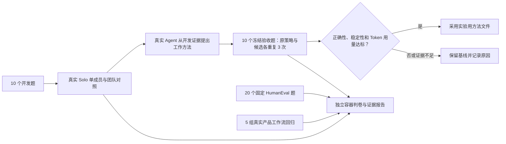

# Solo 自动评测

首版已完成并实际运行 141 次模型试验及 5 组工作流回归。候选未证明改善，自动保持基线；交付协议仍有真实失败。详见 [本轮结果](RESULTS-2026-09-12.md) 和 [可交互报告](results/solo-eval-cycle-20260912-v2/index.html)。

## 目标与验收

建立无需用户参与判卷的内部评测体系：真实 Agent 完成任务，独立程序验证产物，保留失败、用量、重复试验与数据库证据；从开发集失败生成候选工作方法，再在未见验收集比较，证据不足或发生退步时保持原版本。普通产品不新增评测页面或必填表单。

首版包含 20 个围绕 Skill 维护的原创程序任务（10 个开发任务、10 个未见验收任务）、固定版本的 HumanEval 开源补充测试，以及复用现有真实 Solo 工作流回归。原创任务是按实际工作形态编写的受控案例，不冒充生产用户样本。公开题目可能被模型见过，只作补充能力信号，不能用其分数证明长期进化。

## 自动闭环

当前原生题集为 v2，仅澄清相对路径题的连续斜杠行为，判卷器和 111 项隐藏检查不变。v1 与历史结果保留。修复后重跑属于已见题回归；下文“未见验收”描述首轮实验设计，后续重复不能再据此主张新的泛化或进化收益。



所有分支自动执行。图中的“采用”只作用于评测方法文件，正式 Agent 不会被这套测试自动改写。

## 实施前架构

### 领域、归属与生命周期

- Case：版本化任务说明、输入文件、参考实现、独立验收条件、开发/验收划分和来源。任务要求公开；参考答案与隐藏测试仅由判卷器消费。
- Trial：一次固定 case、策略、模型、预算和重复序号的真实执行。新建隔离 Agent/Channel，保持版本和初始文件一致；失败不可覆盖。Task/Run/Submission 仍归 Solo PostgreSQL 管理。
- Experiment：冻结题库、判卷器和策略摘要，记录全部 trial、实际 Token 用量与汇总。报告保存在本地文件，不新增产品数据库表。
- Candidate：真实 Solo Agent 根据开发集执行证据生成的可复用工作方法。保存原始提案与摘要；不含验收题和答案。只影响评测成员，不改动用户正式 Agent。
- Decision：固定规则产生 adopt/reject/inconclusive；不可用单次最好结果、缺失用量或不完整试验作采用依据。

### 数据流与现有调用路径

CLI 入口 → 原 scripts/run-local-e2e.sh → 仓库根 make rebuild 管理的前端/API/Daemon → 原验证注册与 Computer 租约 → Channel/Agent/Task API → durable Inbox → agent Run → daemon 单 Agent 执行锁 →真实本地 Runtime → solo CLI submit → PostgreSQL Submission → 独立容器执行隐藏验收 → 原 Task review API → 前端成果卡核对 → JSON/HTML 报告。

评测协议仅负责准备输入与提交实际文件，不替 Agent 求解。程序判卷在无网络、无宿主挂载的短生命周期 Docker 容器中运行；判卷脚本和参考答案不注入 Agent 工作目录。文件证据取自当前 submission，并与实际工作目录及 Run 关联核对。

### 团队、进化和公平性

单 Agent 与两成员团队使用同一模型和工具；团队用原 Task 的产物作为接收输入，由第二成员实际检查/修订，不靠“已检查”声明。全部成员、审核、失败与返工的 Token 和耗时均计入。每个条件的独立重复从新成员状态开始。

候选方法追加到作者 Agent 的指令中，审核成员的指令保持固定。因此首版测的是作者工作方法迁移，团队结构搜索和审核成员学习不属于本次实验。

进化阶段只提供开发集输入、产物与判卷反馈。候选生成后冻结；原策略与候选使用同一未见验收集与同一初始条件重复比较。当前实验只测工作方法的跨任务迁移，不将其称为全量 Memory/关系自进化；长期团队状态测试与原 Session/恢复/关系回归分别报告。今后扩展 Memory 时必须同时固定文件、关系和知识暴露条件。

### 自动判分、状态与报告

正确性以可执行断言、原 API 返回、真实数据库和可见成果为依据。超时、缺失提交、错误文件、失败 Run 和判卷环境故障分别保留；判卷环境故障不能记为 Agent 成功。正常必要授权不计为失败；评测自己的账号可根据实际判卷自动验收，其结果不替代用户原任务的接受。

汇总展示成功率、逐题重复稳定性、成功/失败 Token、耗时、配对差异与不确定性；人工介入为此受控无人评测的实际记录，不推断真实用户分钟。缺失用量保持缺失。进化门槛要求完整匹配的试验、无验收退步、可靠净改善与预先固定的 Token 用量约束；不满足就保持基线。

静态 HTML 仅展示实验结果、逐项证据与失败，不进入产品路由。网页读取报告快照，产品前端仍使用原有工作区、Task 卡片和交付弹窗，无新前端业务状态。

### 故障恢复与隔离

单 trial 超时后记录失败并撤销评测成员的未完成执行，不重跑后掩盖失败。报告逐 trial 原子落盘。中断实验保留已有证据并标 incomplete，恢复只能增加新的尝试记录。所有资源带本轮 UUID；清理只处理本轮创建的 Agent/Workspace 和 daemon-e2e-*，外层原脚本恢复普通 Computer。服务仅通过 make rebuild/stop 管理。

### 迁移与兼容

无产品迁移、权限扩张或生产自动发布。复用既有 API、用户/Agent 权限、版本、预算和代理。开发分支从已验收团队实现 4a0742b 起步；可以通过 --stack-root 使用同一代码版本的既有 make-managed 栈。评测配置与产物不含登录凭据，源码引用不复制用户 Memory 或私有资料。

### 验证计划

先用已知正确和错误的程序校验每个判卷器，并验证超时/异常/恶意路径不会破坏宿主；再运行真实 Solo 小批量，核对 UI + Run + Submission + review。随后跑完整自定义题集、重复对照、真实候选生成与未见验收，以及固定开源子集。最后执行既有工作流回归、静态检查和结果完整性审计。能力分数可以不高，但失败必须真实、可定位，系统不能把未测/缺证据报告成通过。

## 外部参考（已核对）

- Rudder 本地 checkout：README 描述工作反馈闭环；create-agent-benchmark.ts 实现具体工作流的 pass/fail/uncertain 判分；skill-optimizer 强调触发、补丁质量、下游任务三层评测。
- Rudder scripts/evals-smoke-legacy.mjs 会主动失败，说明旧 promptfoo 原型已删除；它指向的 benchmark-v0.1 计划在当前 checkout 不存在。不能据此声称 Rudder 已有完整可运行的长期进化测试集。
- HumanEval：https://github.com/openai/human-eval ，MIT。选作无需额外外部业务系统的通用代码能力补充，固定上游 commit 和样例 ID，保留官方测试语义；Solo 完成整文件的运行方式与官方 completion-only 排名口径分开。
- Terminal-Bench：https://www.harborframework.com/docs/tutorials/running-terminal-bench ，真实终端工作更贴近产品；需要将 Solo 工具执行绑定到 Harbor 任务容器，不能将宿主运行或改写后的简化题冒充官方成绩。评估接入成本与环境后记录是否纳入本次运行。
- SWE-bench 与 OSWorld 分别需要可复现仓库/镜像和桌面环境；不能用本地函数题替代它们的成绩。
- 方法：https://www.anthropic.com/engineering/demystifying-evals-for-ai-agents 。判最终状态、保留重复失败、程序优先与判卷器自身校验。

## 运行方式

需要已有的 make-managed Solo 配置、配对 Computer、本地 Claude/Codex 登录和 Docker。无需安装新的 Python 包。前端复用仓库的 Playwright 依赖。

```bash
# 完整无人评测：60 次开发对照、1 次真实提案、60 次验收对照、20 次公开题、5 组工作流回归。
python3 evals/pipeline.py --output /tmp/solo-eval-cycle

# 已有服务配置位于同一产品代码版本的另一个 checkout 时：
python3 evals/pipeline.py --stack-root /path/to/configured/solo --output /tmp/solo-eval-cycle

# 单独运行一个小批次；不会覆盖已有目录。
python3 evals/run.py --cases csv-money,relative-path --repetitions 1 --output /tmp/solo-eval-smoke

# 仅校验题库、真正的 Docker 判卷器、统计规则和泄漏保护；CI 自动执行这一层。
python3 -m unittest discover -s evals -p test_evals.py -v

# 从已完成原始报告重建可视报告，不重新调用模型。
python3 evals/report.py /tmp/solo-eval-smoke/report.json
```

完整入口可在相同输出目录恢复：只复用相同冻结版本下已完整结束的阶段；中断阶段保留并另建编号目录。它不会挑选一个题目的最好重试当得分。Agent 在已完成阶段中的真实失败不会触发刷分重跑。模型阶段的基础设施故障会退出非零并保留现场。工作流回归的一组失败不会阻止其他组执行，但全轮保持失败和非零退出；缺失或跳过断言也不能通过。Thinking 每次使用独立测试账号。修复代码后必须建立新的实验目录，不能把旧代码和新代码的成绩混在一起。

每个批次包含 `report.json`、`summary.json`、`index.html`、执行日志，以及每次试验的实际源码、提交、判卷、Run 用量、事件元数据和首个重复的产品截图。每次 Playwright 调用的附件保存到批次自己的 `test-results/`，后续套件不会清空先前证据。原始报告逐次原子写入。评测账号的个人工作区按产品规则保留，额外评测工作区、成员与 Channel 会通过原 API 清理；数据库中的历史证据仍可核对。

## 首版固定评测规则

- 默认使用 Claude Code Runtime，请求别名 `sonnet`；可为整个实验统一指定 provider/model。本机首轮真实响应型号经补充审计为 `MiniMax-M3`，不能把 Runtime 名称视为实际模型。新批次另存 `runtime.json`，沿已有 Run/Session 关联核对当前 Run 时间内的本地响应型号；缺失或暂不支持的 Runtime 归因显示“未核实”，不回退使用请求别名。供应商内部权重与实际思考强度仍未核实。旧成绩不改写，补充归因可运行 `python3 evals/runtime.py <report.json> --output <new-audit.json>`。
- `evals/run.py --disable-thinking` 是显式的 Claude 兼容性试验：仅给本批评测成员设置 `custom_env.MAX_THINKING_TOKENS=0`，不改变普通成员、全局配置或默认评测。报告区分请求设置与实际响应块类型，不导出思考正文。它改变了模型运行参数，不能把分数变化归为纯代码修复；当前不自动用于完整 pipeline，也不据此采用生产默认。
- 同一题每个策略独立重复 3 次；新成员和目录，按题号与重复序号交替执行策略顺序。公开补充集只执行 1 次，不用于进化采用。
- 每次任务执行最多 360 秒；介绍准备与 UI 核验耗时另计入总时间。正式实验每次全部成员用量的资格上限为 300 万 Token；这是最终资格检查，不是供应商账单的硬截断。这个上限在试跑观察正常双成员用量后、正式对照前确定。
- 单成员由独立程序验收；双成员必须先由真实第二成员检查，之后独立程序再检查最终产物。程序不把隐藏失败答案反馈给验收集 Agent。
- 采用只允许在至少 10 个验收题、每题至少 3 次完整配对、用量完整、无逐题退步时发生。按题进行 5,000 次固定种子的配对 bootstrap，保留题内重复相关性。
- 质量提升的 95% 区间下界必须大于 0，且总 Token 不超过基线 1.25 倍；或成功率完全相同、Token 至少降低 20%，且节省比例的 95% 区间下界大于 0。其他情况保留基线；任何验收题退步则拒绝。
- 提案的 Markdown 格式检查只确认可用文件，不能代表提案有效。真正的采用结论来自未见验收对照，输出 `decision/decision.json`；通过也只生成评测用方法文件，不发布正式 Agent 配置。
- 单独公布单次成功率、全部重复通过的题数、用量和失败分类；不把这些结果合成一个掩盖取舍的总分。实际 Token 包含缓存字段及所有成员，不等于账单金额。没有计量时为 null，不冒充零。

这是一套受控、非对抗的评测：Agent 未获得隐藏题目/答案，使用独立新工作目录；真实本地 Runtime 仍具有其既有宿主访问权限，不能将提示词约束称为操作系统级保密隔离。真正执行提交代码的判卷器有无网络、只读根目录、资源限制的独立容器。公开测试的潜在训练污染也不被消除。

## 工作流回归覆盖

| 套件 | 真实检查内容 | 与能力题的区别 |
|---|---|---|
| task-delivery-contract | 实际作者提交、独立成员审核、精确版本验收、返工与用量证据 | 检查交付协议与持久化，不替代自由求解能力 |
| agent-selection | 固定新旧 Revision、接收成员实际消费、采用前阻止越权发布 | 检查版本选择过程，不将 fixture 的 40/42 当作模型提升 |
| task-wait-resume | 原 Task 持久等待、make 重启恢复、继续同一任务 | 检查恢复语义 |
| team-work-compounding | 多拥有者授权、真实工作吸收连续纠正、保留责任 | 检查关系与连续反馈的生命周期 |
| thinking-mode | 真实分支 Session、交接、空闲休眠与恢复 | 通过短 TTL 的 make-managed 栈启用，不能跳过后宣称全过 |

## 开源测试集与 Rudder 的明确取舍

| 对象 | 本次处理 | 原因与接入条件 |
|---|---|---|
| HumanEval | 接入固定 20 题子集，保留原测试和 MIT 许可，实际运行 Solo Agent | 适合提供独立可执行代码能力信号；整文件 Task 口径不与官方补全排行榜混用 |
| MBPP | 本轮不叠加 | 与当前函数编程层重叠较多；先用生产失败扩充原创题，比重复刷同类公开题更有信息量 |
| Terminal-Bench / Harbor | 本轮不报 Solo 成绩 | 官方要求 Agent 在任务环境内执行；当前 Solo 使用宿主本地 Runtime，尚无 Harbor 环境适配。直接运行内置 Claude Code 测到的是该 Agent，不能冒充 Solo 团队。下一层是绑定任务容器、工具执行和轨迹之后的正式接入 |
| SWE-bench | 本轮不运行 | 需要固定仓库、Issue、补丁生成与镜像复现链路；适合后续仓库维护能力专项，不拿函数题替代 |
| OSWorld | 本轮不运行 | 需要独立可复现桌面环境与 GUI Agent 轨迹；当前首版不是桌面操作测评 |
| Rudder 本地代码 | 参考具体工作流判卷和分层验证，不直接运行缺失题库 | 当前 checkout 的 `benchmark/` 不存在，旧 eval 脚本主动退出；已有 create-agent 判卷实现和计划，不能据“自进化”宣传推断它已有完整可跑题库 |

Rudder 核对版本：`a0e130edb333242fa9dc8c9ddcba3cff1449b8af`。实际参考 `packages/run-intelligence-core/src/create-agent-benchmark.ts`、`cli/src/commands/benchmark-create-agent.ts`、`scripts/evals-smoke-legacy.mjs`、`doc/plans/2026-04-14-create-agent-benchmark-v1.md`、`server/resources/bundled-skills/skill-optimizer/references/eval-method.md`。HumanEval 版本与抽样规则见 `vendor/human-eval/provenance.json`。

资料核对日期：2026-09-12。[Harbor 自定义 Agent 接口](https://www.harborframework.com/docs/agents)、[Terminal-Bench 运行要求](https://www.harborframework.com/docs/tutorials/running-terminal-bench)、[SWE-bench 官方仓库](https://github.com/SWE-bench/SWE-bench)、[OSWorld 官方仓库](https://github.com/xlang-ai/OSWorld)。
